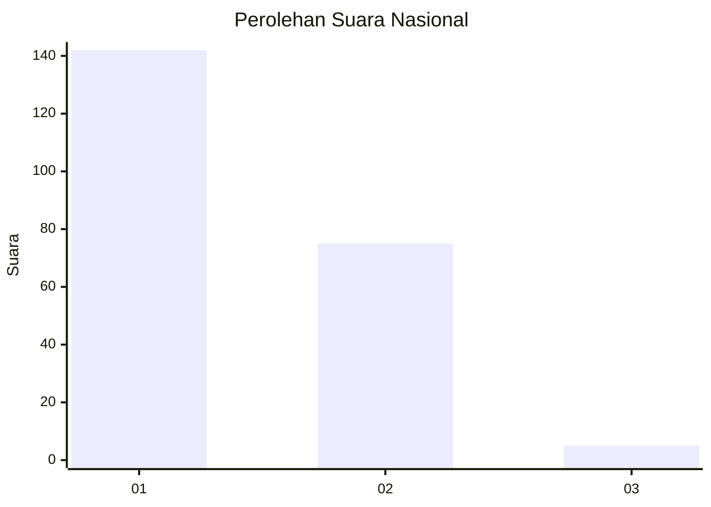
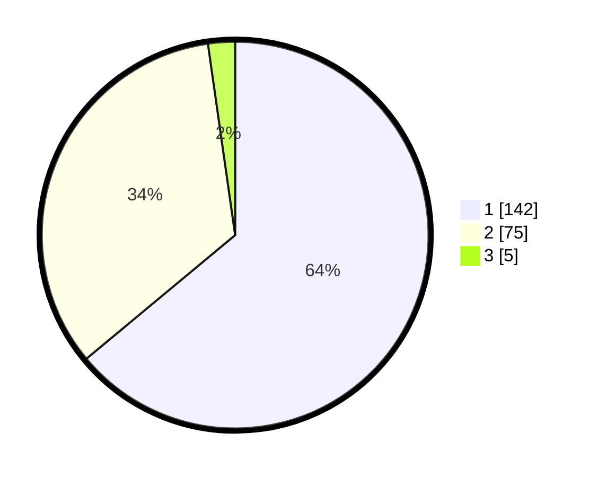

# Hasil

## Grafik

## Tabel

| No. | Nama Paslon    | Suara | Suara (raw) | Persentase |
|:--- |:-------------- | -----:| -----------:| ----------:|
| 1   | ANIES MUHAIMIN | 142   | [142][p-1]  | 63,96      |
| 2   | PRABOWO GIBRAN | 75    | [75][p-2]   | 33,78      |
| 3   | GANJAR MAHFUD  | 5     | [5][p-3]    | 2,25       |

[p-1]: https://github.com/gigit-pemilu/pemilu-2024/blob/main/pilpres/hitung-suara/sub/73-sulawesi-selatan/sub/06-gowa/sub/07-pallangga/sub/1015-mangalli/sub/004-tps/sub/paslon-1.txt
[p-2]: https://github.com/gigit-pemilu/pemilu-2024/blob/main/pilpres/hitung-suara/sub/73-sulawesi-selatan/sub/06-gowa/sub/07-pallangga/sub/1015-mangalli/sub/004-tps/sub/paslon-2.txt
[p-3]: https://github.com/gigit-pemilu/pemilu-2024/blob/main/pilpres/hitung-suara/sub/73-sulawesi-selatan/sub/06-gowa/sub/07-pallangga/sub/1015-mangalli/sub/004-tps/sub/paslon-3.txt

## Foto C Plano

https://sirekap-obj-formc.kpu.go.id/8282/pemilu/ppwp/73/06/07/10/15/7306071015004-20240214-223705--8259206c-20c3-41cd-b781-fc63ac65c52c.jpg

https://sirekap-obj-formc.kpu.go.id/8282/pemilu/ppwp/73/06/07/10/15/7306071015004-20240214-223616--1649d1f4-61f8-4b09-9aa0-9bf5f67e7ed3.jpg

https://sirekap-obj-formc.kpu.go.id/8282/pemilu/ppwp/73/06/07/10/15/7306071015004-20240214-231155--ae3c0b39-49dd-41ce-9756-925a9c6bb4aa.jpg

## Metadata

| Key        | Value               |
| ---------- | ------------------- |
| Time Stamp | 2024-02-15 15:00:29 |

