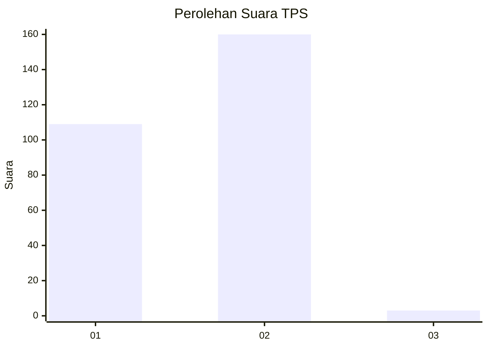
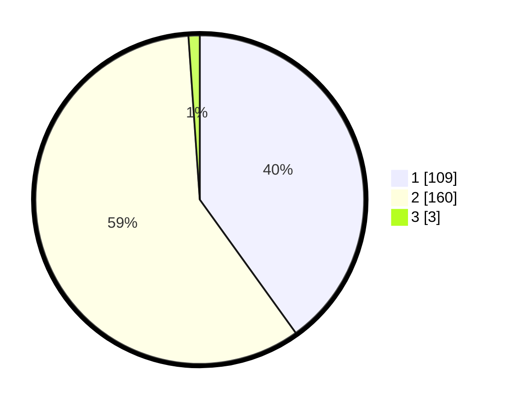

# Hasil

## Grafik

## Tabel

| No. | Nama Paslon    | Suara | Suara (raw) | Persentase |
|:--- |:-------------- | -----:| -----------:| ----------:|
| 1   | ANIES MUHAIMIN | 109   | [109][p-1]  | 40,07      |
| 2   | PRABOWO GIBRAN | 160   | [160][p-2]  | 58,82      |
| 3   | GANJAR MAHFUD  | 3     | [3][p-3]    | 1,10       |

[p-1]: https://github.com/gigit-pemilu/pemilu-2024-73-sulawesi-selatan/blob/main/pilpres/hitung-suara/sub/73-sulawesi-selatan/sub/06-gowa/sub/07-pallangga/sub/2005-pallangga/sub/013-tps/sub/paslon-1.txt
[p-2]: https://github.com/gigit-pemilu/pemilu-2024-73-sulawesi-selatan/blob/main/pilpres/hitung-suara/sub/73-sulawesi-selatan/sub/06-gowa/sub/07-pallangga/sub/2005-pallangga/sub/013-tps/sub/paslon-2.txt
[p-3]: https://github.com/gigit-pemilu/pemilu-2024-73-sulawesi-selatan/blob/main/pilpres/hitung-suara/sub/73-sulawesi-selatan/sub/06-gowa/sub/07-pallangga/sub/2005-pallangga/sub/013-tps/sub/paslon-3.txt

## Foto C Plano

https://sirekap-obj-formc.kpu.go.id/f772/pemilu/ppwp/73/06/07/20/05/7306072005013-20240214-205743--b7fb7a88-fd03-4905-a29b-051a8492f4de.jpg

https://sirekap-obj-formc.kpu.go.id/f772/pemilu/ppwp/73/06/07/20/05/7306072005013-20240214-205944--e6bbb604-4f8e-4d7f-92d9-00fff9b1b3d9.jpg

https://sirekap-obj-formc.kpu.go.id/f772/pemilu/ppwp/73/06/07/20/05/7306072005013-20240214-210114--58f2284e-9e80-4ba6-b57a-5bca98f31f47.jpg

## Metadata

| Key        | Value               |
| ---------- | ------------------- |
| Time Stamp | 2024-02-15 09:00:24 |

