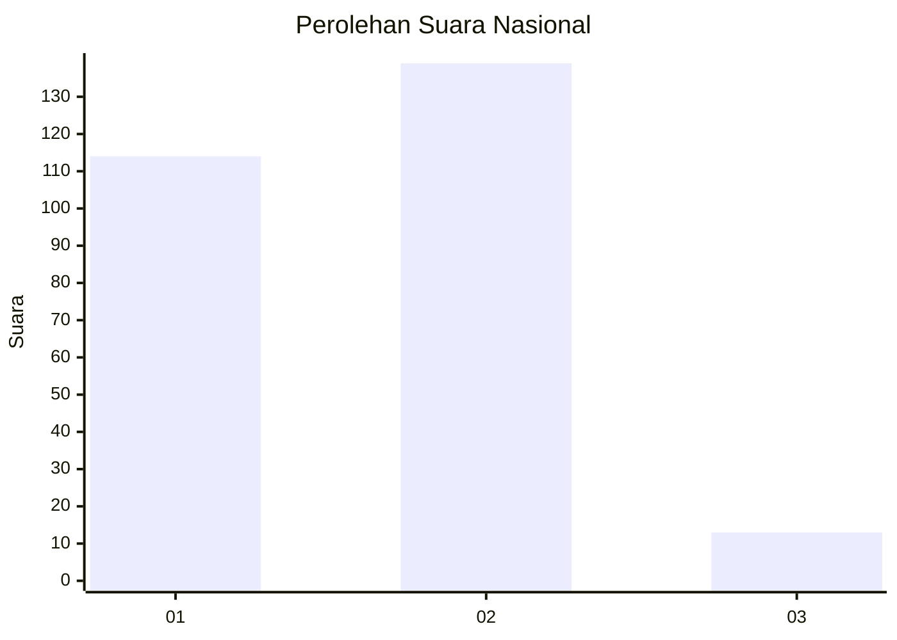
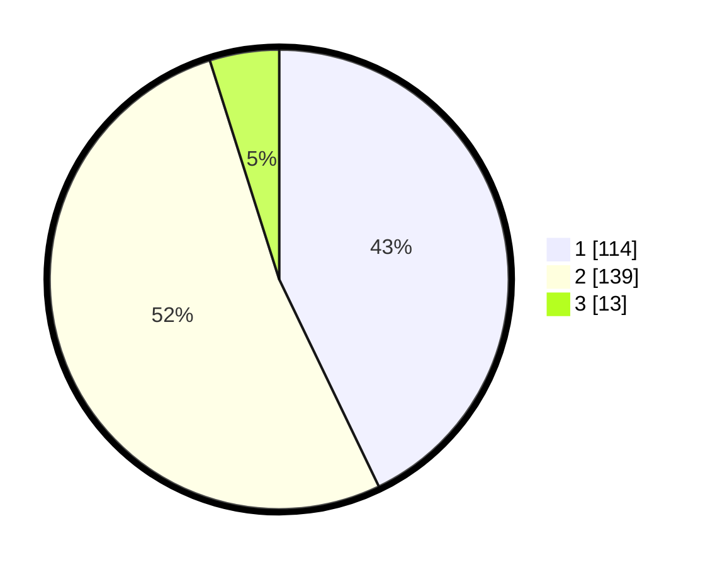

# Hasil

## Grafik

## Tabel

| No. | Nama Paslon    | Suara | Suara (raw) | Persentase |
|:--- |:-------------- | -----:| -----------:| ----------:|
| 1   | ANIES MUHAIMIN | 114   | [114][p-1]  | 42,86      |
| 2   | PRABOWO GIBRAN | 139   | [139][p-2]  | 52,26      |
| 3   | GANJAR MAHFUD  | 13    | [13][p-3]   | 4,89       |

[p-1]: https://github.com/gigit-pemilu/pemilu-2024/blob/main/pilpres/hitung-suara/sub/73-sulawesi-selatan/sub/06-gowa/sub/07-pallangga/sub/2007-kampili/sub/001-tps/sub/paslon-1.txt
[p-2]: https://github.com/gigit-pemilu/pemilu-2024/blob/main/pilpres/hitung-suara/sub/73-sulawesi-selatan/sub/06-gowa/sub/07-pallangga/sub/2007-kampili/sub/001-tps/sub/paslon-2.txt
[p-3]: https://github.com/gigit-pemilu/pemilu-2024/blob/main/pilpres/hitung-suara/sub/73-sulawesi-selatan/sub/06-gowa/sub/07-pallangga/sub/2007-kampili/sub/001-tps/sub/paslon-3.txt

## Foto C Plano

https://sirekap-obj-formc.kpu.go.id/aadd/pemilu/ppwp/73/06/07/20/07/7306072007001-20240215-005919--2c2aa125-9e57-467a-a24d-e4a6ee7208f0.jpg

https://sirekap-obj-formc.kpu.go.id/aadd/pemilu/ppwp/73/06/07/20/07/7306072007001-20240215-010110--17ad221f-c5c8-4c9b-b4b6-53b7842f4183.jpg

https://sirekap-obj-formc.kpu.go.id/aadd/pemilu/ppwp/73/06/07/20/07/7306072007001-20240215-010234--7481132a-0e1b-4159-a416-26417e0e1e69.jpg

## Metadata

| Key        | Value               |
| ---------- | ------------------- |
| Time Stamp | 2024-02-15 12:00:28 |

