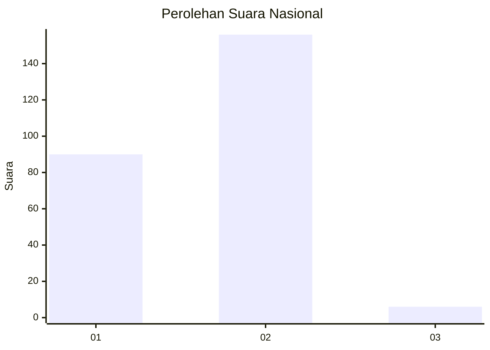
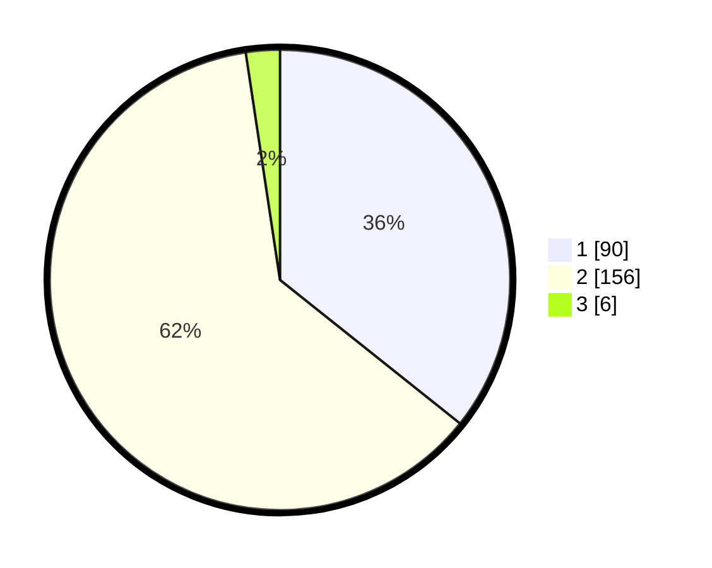

# Hasil

## Grafik

## Tabel

| No. | Nama Paslon    | Suara | Suara (raw) | Persentase |
|:--- |:-------------- | -----:| -----------:| ----------:|
| 1   | ANIES MUHAIMIN | 90    | [90][p-1]   | 35,71      |
| 2   | PRABOWO GIBRAN | 156   | [156][p-2]  | 61,90      |
| 3   | GANJAR MAHFUD  | 6     | [6][p-3]    | 2,38       |

[p-1]: https://github.com/gigit-pemilu/pemilu-2024/blob/main/pilpres/hitung-suara/sub/73-sulawesi-selatan/sub/06-gowa/sub/07-pallangga/sub/2009-bontoramba/sub/004-tps/sub/paslon-1.txt
[p-2]: https://github.com/gigit-pemilu/pemilu-2024/blob/main/pilpres/hitung-suara/sub/73-sulawesi-selatan/sub/06-gowa/sub/07-pallangga/sub/2009-bontoramba/sub/004-tps/sub/paslon-2.txt
[p-3]: https://github.com/gigit-pemilu/pemilu-2024/blob/main/pilpres/hitung-suara/sub/73-sulawesi-selatan/sub/06-gowa/sub/07-pallangga/sub/2009-bontoramba/sub/004-tps/sub/paslon-3.txt

## Foto C Plano

https://sirekap-obj-formc.kpu.go.id/0d0b/pemilu/ppwp/73/06/07/20/09/7306072009004-20240214-191056--eb14ba47-7ddf-4258-b253-3eae9b27177a.jpg

https://sirekap-obj-formc.kpu.go.id/0d0b/pemilu/ppwp/73/06/07/20/09/7306072009004-20240214-192113--dc86f774-d6a9-4706-b91b-0d5a6f84d675.jpg

https://sirekap-obj-formc.kpu.go.id/0d0b/pemilu/ppwp/73/06/07/20/09/7306072009004-20240214-193611--a7f1ce20-fb12-4859-b14e-84a55edc0021.jpg

## Metadata

| Key        | Value               |
| ---------- | ------------------- |
| Time Stamp | 2024-02-14 21:46:01 |

