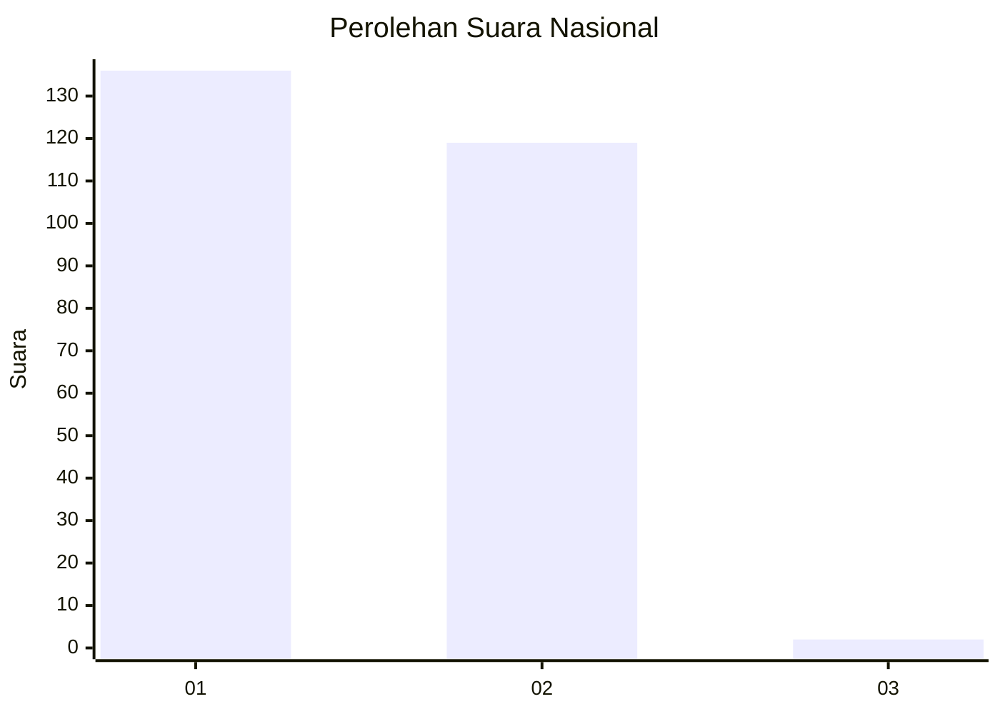
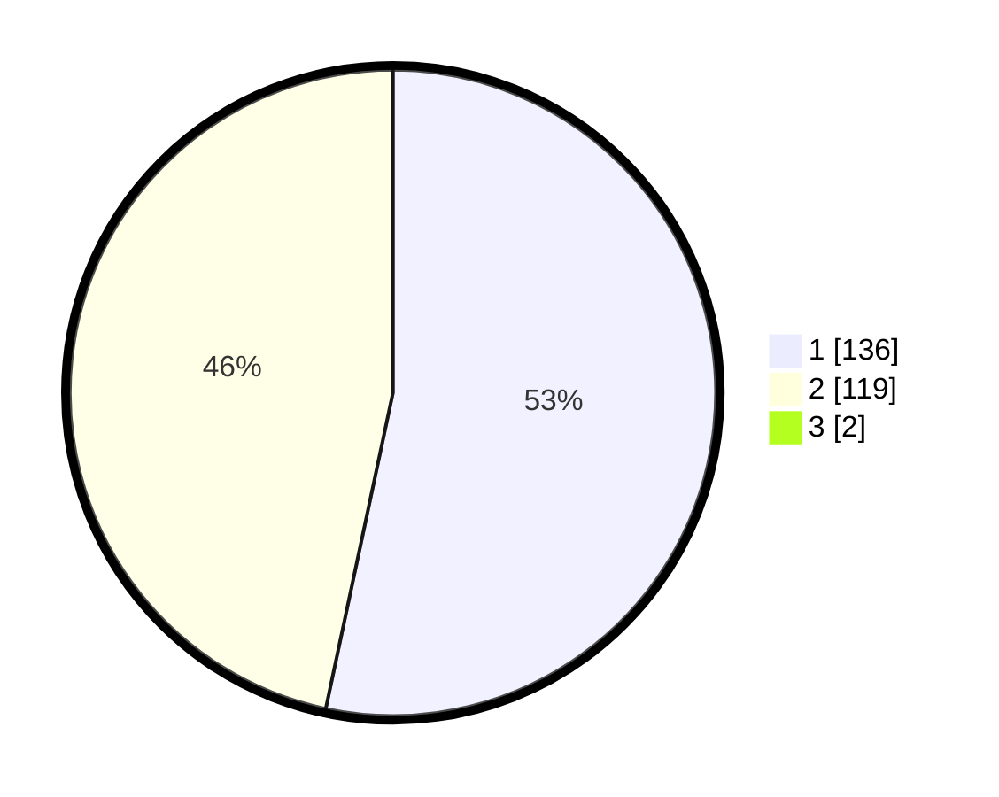

# Hasil

## Grafik

## Tabel

| No. | Nama Paslon    | Suara | Suara (raw) | Persentase |
|:--- |:-------------- | -----:| -----------:| ----------:|
| 1   | ANIES MUHAIMIN | 136   | [136][p-1]  | 52,92      |
| 2   | PRABOWO GIBRAN | 119   | [119][p-2]  | 46,30      |
| 3   | GANJAR MAHFUD  | 2     | [2][p-3]    | 0,78       |

[p-1]: https://github.com/gigit-pemilu/pemilu-2024/blob/main/pilpres/hitung-suara/sub/73-sulawesi-selatan/sub/06-gowa/sub/08-somba-opu/sub/1013-bontoramba/sub/005-tps/sub/paslon-1.txt
[p-2]: https://github.com/gigit-pemilu/pemilu-2024/blob/main/pilpres/hitung-suara/sub/73-sulawesi-selatan/sub/06-gowa/sub/08-somba-opu/sub/1013-bontoramba/sub/005-tps/sub/paslon-2.txt
[p-3]: https://github.com/gigit-pemilu/pemilu-2024/blob/main/pilpres/hitung-suara/sub/73-sulawesi-selatan/sub/06-gowa/sub/08-somba-opu/sub/1013-bontoramba/sub/005-tps/sub/paslon-3.txt

## Foto C Plano

https://sirekap-obj-formc.kpu.go.id/b848/pemilu/ppwp/73/06/08/10/13/7306081013005-20240227-151922--2ed4e551-733f-41f2-a2d8-6379d34b25bb.jpg

https://sirekap-obj-formc.kpu.go.id/b848/pemilu/ppwp/73/06/08/10/13/7306081013005-20240227-191114--c0606743-65bd-4b2a-9cd1-1ccb9eee63a6.jpg

https://sirekap-obj-formc.kpu.go.id/b848/pemilu/ppwp/73/06/08/10/13/7306081013005-20240227-151927--07edc90f-208a-4a4a-87c3-d50cde1c8fa7.jpg

## Metadata

| Key        | Value               |
| ---------- | ------------------- |
| Time Stamp | 2024-02-28 19:00:00 |

