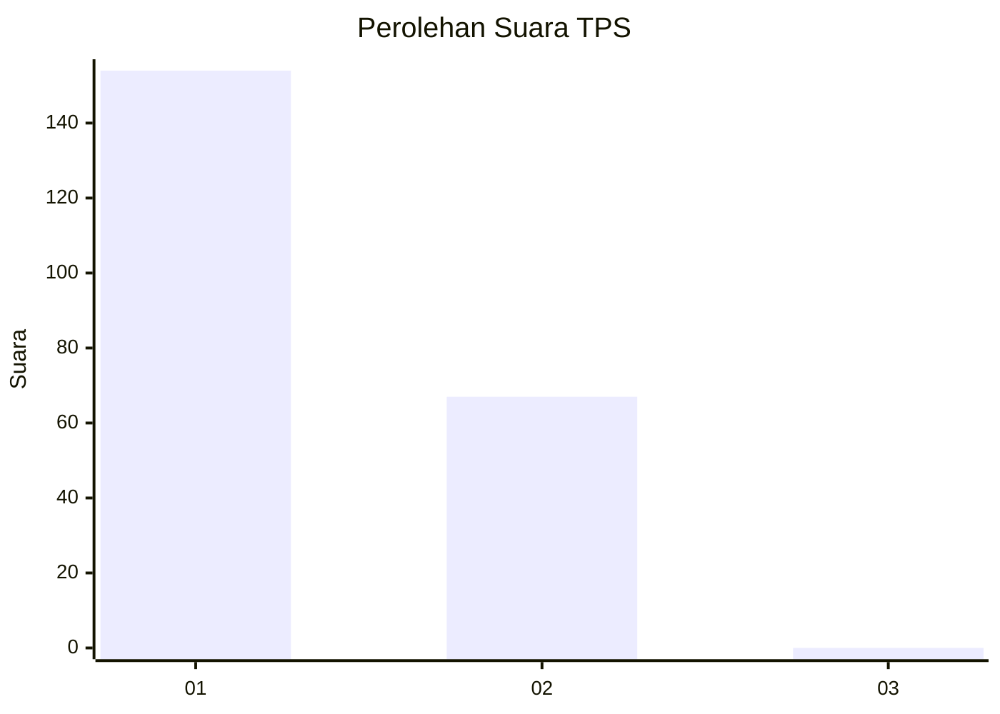
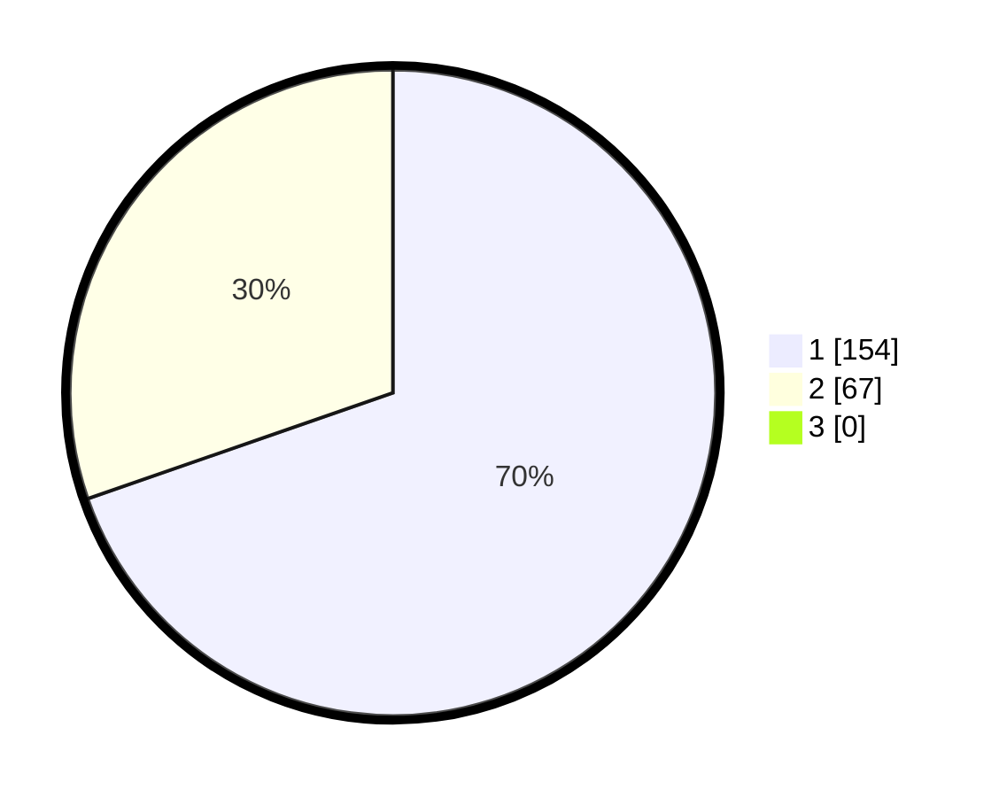

# Hasil

## Grafik

## Tabel

| No. | Nama Paslon    | Suara | Suara (raw) | Persentase |
|:--- |:-------------- | -----:| -----------:| ----------:|
| 1   | ANIES MUHAIMIN | 154   | [154][p-1]  | 69,68      |
| 2   | PRABOWO GIBRAN | 67    | [67][p-2]   | 30,32      |
| 3   | GANJAR MAHFUD  | 0     | [0][p-3]    | 0,00       |

[p-1]: https://github.com/gigit-pemilu/pemilu-2024-73-sulawesi-selatan/blob/main/pilpres/hitung-suara/sub/73-sulawesi-selatan/sub/06-gowa/sub/10-tombolopao/sub/1001-tamaona/sub/002-tps/sub/paslon-1.txt
[p-2]: https://github.com/gigit-pemilu/pemilu-2024-73-sulawesi-selatan/blob/main/pilpres/hitung-suara/sub/73-sulawesi-selatan/sub/06-gowa/sub/10-tombolopao/sub/1001-tamaona/sub/002-tps/sub/paslon-2.txt
[p-3]: https://github.com/gigit-pemilu/pemilu-2024-73-sulawesi-selatan/blob/main/pilpres/hitung-suara/sub/73-sulawesi-selatan/sub/06-gowa/sub/10-tombolopao/sub/1001-tamaona/sub/002-tps/sub/paslon-3.txt

## Foto C Plano

https://sirekap-obj-formc.kpu.go.id/5267/pemilu/ppwp/73/06/10/10/01/7306101001002-20240215-091732--b7cc994e-3d94-4a72-9ed7-8b8d2c8ab704.jpg

https://sirekap-obj-formc.kpu.go.id/5267/pemilu/ppwp/73/06/10/10/01/7306101001002-20240215-091853--b8fbcd8c-a907-4319-a14b-70ab4f071eb4.jpg

https://sirekap-obj-formc.kpu.go.id/5267/pemilu/ppwp/73/06/10/10/01/7306101001002-20240215-091924--003393dd-5bca-4858-b041-7c38ea50579a.jpg

## Metadata

| Key        | Value               |
| ---------- | ------------------- |
| Time Stamp | 2024-02-16 22:01:00 |

## DATA PEMILIH TETAP

Jumlah pemilih dalam DPT: **254**.
 * L: **178**.
 * P: **136**.

## DATA PENGGUNA HAK PILIH

Jumlah pengguna hak pilih dalam DPT: **216**.
 * L: **102**.
 * P: **114**.

Jumlah pengguna hak pilih dalam DPTb: **7**.
 * L: **4**.
 * P: **3**.

Jumlah pengguna hak pilih dalam DPK: **560**.
 * L: **695**.
 * P: **60**.

Jumlah pengguna hak pilih: **223**.
 * L: **106**.
 * P: **717**.

## JUMLAH SUARA SAH DAN TIDAK SAH

JUMLAH SELURUH SUARA SAH: **221**.

JUMLAH SUARA TIDAK SAH: **2**.

JUMLAH SELURUH SUARA SAH DAN SUARA TIDAK SAH: **223**.

