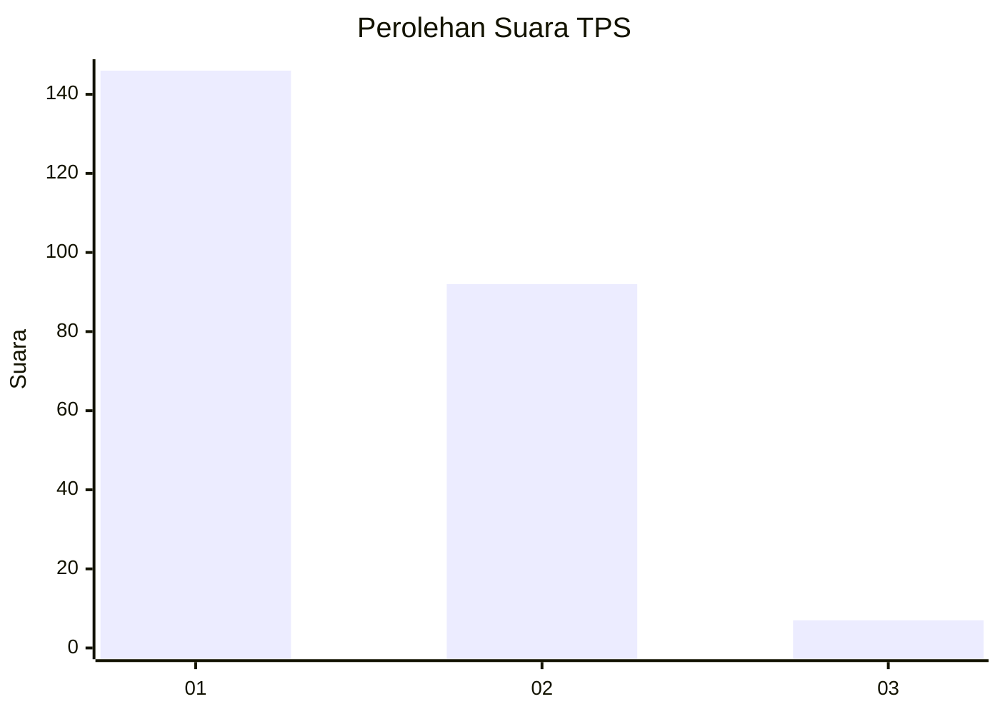
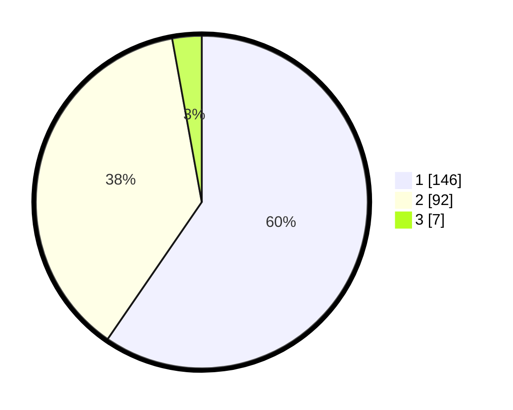

# Hasil

## Grafik

## Tabel

| No. | Nama Paslon    | Suara | Suara (raw) | Persentase |
|:--- |:-------------- | -----:| -----------:| ----------:|
| 1   | ANIES MUHAIMIN | 146   | [146][p-1]  | 59,59      |
| 2   | PRABOWO GIBRAN | 92    | [92][p-2]   | 37,55      |
| 3   | GANJAR MAHFUD  | 7     | [7][p-3]    | 2,86       |

[p-1]: https://github.com/gigit-pemilu/pemilu-2024-73-sulawesi-selatan/blob/main/pilpres/hitung-suara/sub/73-sulawesi-selatan/sub/06-gowa/sub/10-tombolopao/sub/1001-tamaona/sub/008-tps/sub/paslon-1.txt
[p-2]: https://github.com/gigit-pemilu/pemilu-2024-73-sulawesi-selatan/blob/main/pilpres/hitung-suara/sub/73-sulawesi-selatan/sub/06-gowa/sub/10-tombolopao/sub/1001-tamaona/sub/008-tps/sub/paslon-2.txt
[p-3]: https://github.com/gigit-pemilu/pemilu-2024-73-sulawesi-selatan/blob/main/pilpres/hitung-suara/sub/73-sulawesi-selatan/sub/06-gowa/sub/10-tombolopao/sub/1001-tamaona/sub/008-tps/sub/paslon-3.txt

## Foto C Plano

https://sirekap-obj-formc.kpu.go.id/0fae/pemilu/ppwp/73/06/10/10/01/7306101001008-20240222-133638--10e8d546-6637-4cb1-99d0-c477245ab00a.jpg

https://sirekap-obj-formc.kpu.go.id/0fae/pemilu/ppwp/73/06/10/10/01/7306101001008-20240215-031102--4b11a658-444f-43fb-adc3-abc4bd4e4a42.jpg

https://sirekap-obj-formc.kpu.go.id/0fae/pemilu/ppwp/73/06/10/10/01/7306101001008-20240215-030733--0d9d91e5-b4cf-40b6-a32f-a41235446693.jpg

## Metadata

| Key        | Value               |
| ---------- | ------------------- |
| Time Stamp | 2024-02-22 14:00:00 |

