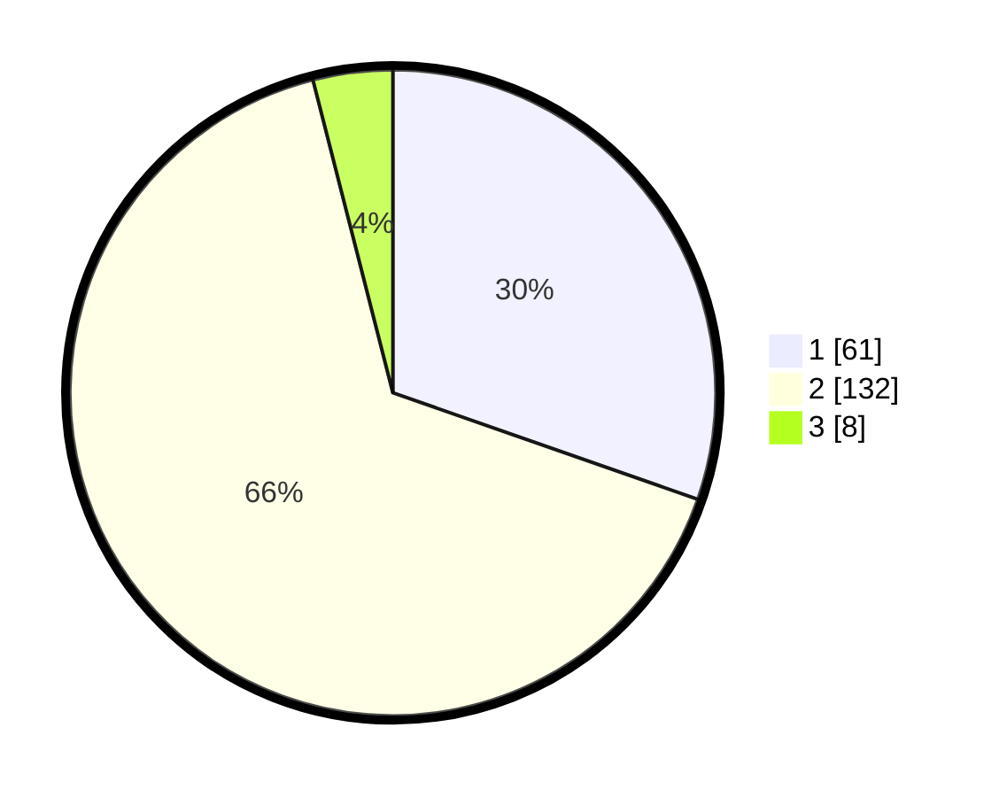

# Hasil

## Grafik

## Tabel

| No. | Nama Paslon    | Suara | Suara (raw) | Persentase |
|:--- |:-------------- | -----:| -----------:| ----------:|
| 1   | ANIES MUHAIMIN | 61    | [61][p-1]   | 30,35      |
| 2   | PRABOWO GIBRAN | 132   | [132][p-2]  | 65,67      |
| 3   | GANJAR MAHFUD  | 8     | [8][p-3]    | 3,98       |

[p-1]: https://github.com/gigit-pemilu/pemilu-2024-73-sulawesi-selatan/blob/main/pilpres/hitung-suara/sub/73-sulawesi-selatan/sub/06-gowa/sub/10-tombolopao/sub/2002-ta'binjai/sub/007-tps/sub/paslon-1.txt
[p-2]: https://github.com/gigit-pemilu/pemilu-2024-73-sulawesi-selatan/blob/main/pilpres/hitung-suara/sub/73-sulawesi-selatan/sub/06-gowa/sub/10-tombolopao/sub/2002-ta'binjai/sub/007-tps/sub/paslon-2.txt
[p-3]: https://github.com/gigit-pemilu/pemilu-2024-73-sulawesi-selatan/blob/main/pilpres/hitung-suara/sub/73-sulawesi-selatan/sub/06-gowa/sub/10-tombolopao/sub/2002-ta'binjai/sub/007-tps/sub/paslon-3.txt

## Foto C Plano

https://sirekap-obj-formc.kpu.go.id/b062/pemilu/ppwp/73/06/10/20/02/7306102002007-20240214-233154--46c4daed-6ea3-4514-aade-3c6444d18a1a.jpg

https://sirekap-obj-formc.kpu.go.id/b062/pemilu/ppwp/73/06/10/20/02/7306102002007-20240215-013433--3f320e69-1a28-4ee7-9d33-7fb92d376aba.jpg

https://sirekap-obj-formc.kpu.go.id/b062/pemilu/ppwp/73/06/10/20/02/7306102002007-20240214-233315--7ecc65ec-6f0f-4da1-a329-a047445d1251.jpg

## Metadata

| Key        | Value               |
| ---------- | ------------------- |
| Time Stamp | 2024-02-15 18:30:25 |

## DATA PEMILIH TETAP

Jumlah pemilih dalam DPT: **503**.
 * L: **303**.
 * P: **86**.

## DATA PENGGUNA HAK PILIH

Jumlah pengguna hak pilih dalam DPT: **284**.
 * L: **607**.
 * P: **94**.

Jumlah pengguna hak pilih dalam DPTb: **2**.
 * L: **77**.
 * P: **0**.

Jumlah pengguna hak pilih dalam DPK: **2**.
 * L: **802**.
 * P: **83**.

Jumlah pengguna hak pilih: **806**.
 * L: **608**.
 * P: **528**.

## JUMLAH SUARA SAH DAN TIDAK SAH

JUMLAH SELURUH SUARA SAH: **200**.

JUMLAH SUARA TIDAK SAH: **6**.

JUMLAH SELURUH SUARA SAH DAN SUARA TIDAK SAH: **206**.

