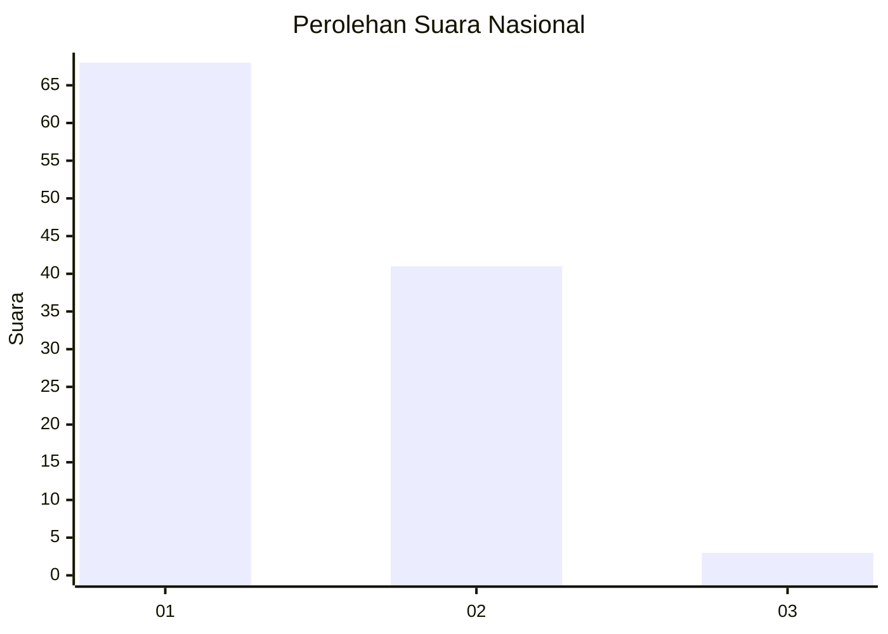
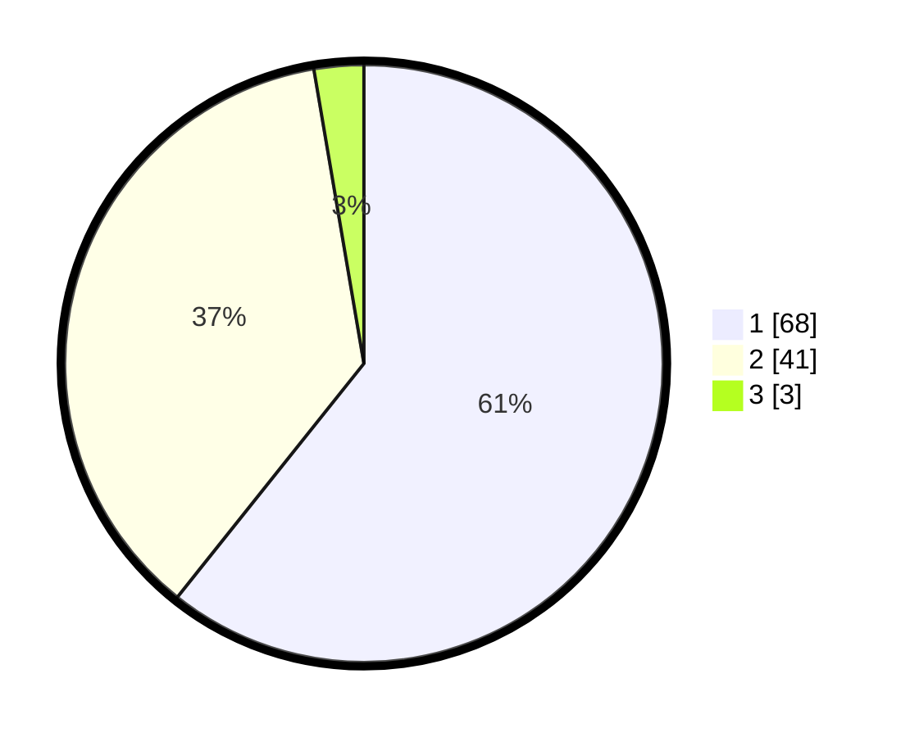

# Hasil

## Grafik

## Tabel

| No. | Nama Paslon    | Suara | Suara (raw) | Persentase |
|:--- |:-------------- | -----:| -----------:| ----------:|
| 1   | ANIES MUHAIMIN | 68    | [68][p-1]   | 60,71      |
| 2   | PRABOWO GIBRAN | 41    | [41][p-2]   | 36,61      |
| 3   | GANJAR MAHFUD  | 3     | [3][p-3]    | 2,68       |

[p-1]: https://github.com/gigit-pemilu/pemilu-2024/blob/main/pilpres/hitung-suara/sub/73-sulawesi-selatan/sub/06-gowa/sub/10-tombolopao/sub/2005-pao/sub/001-tps/sub/paslon-1.txt
[p-2]: https://github.com/gigit-pemilu/pemilu-2024/blob/main/pilpres/hitung-suara/sub/73-sulawesi-selatan/sub/06-gowa/sub/10-tombolopao/sub/2005-pao/sub/001-tps/sub/paslon-2.txt
[p-3]: https://github.com/gigit-pemilu/pemilu-2024/blob/main/pilpres/hitung-suara/sub/73-sulawesi-selatan/sub/06-gowa/sub/10-tombolopao/sub/2005-pao/sub/001-tps/sub/paslon-3.txt

## Foto C Plano

https://sirekap-obj-formc.kpu.go.id/f5c2/pemilu/ppwp/73/06/10/20/05/7306102005001-20240215-170920--60115a42-6f55-4ddd-92cc-e7b3f5d8a001.jpg

https://sirekap-obj-formc.kpu.go.id/f5c2/pemilu/ppwp/73/06/10/20/05/7306102005001-20240214-140936--88c990d6-847e-4098-bc0b-37862963a571.jpg

https://sirekap-obj-formc.kpu.go.id/f5c2/pemilu/ppwp/73/06/10/20/05/7306102005001-20240214-141114--0cb802ba-79a1-46af-ab24-41bcd66dcd16.jpg

## Metadata

| Key        | Value               |
| ---------- | ------------------- |
| Time Stamp | 2024-02-15 21:30:27 |

