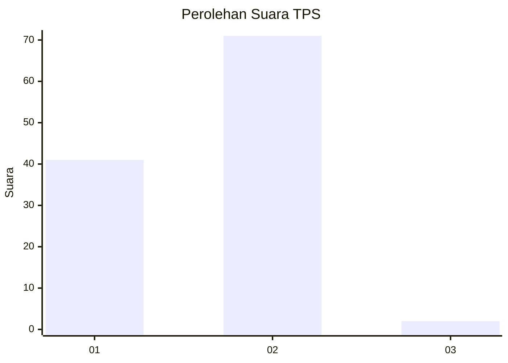
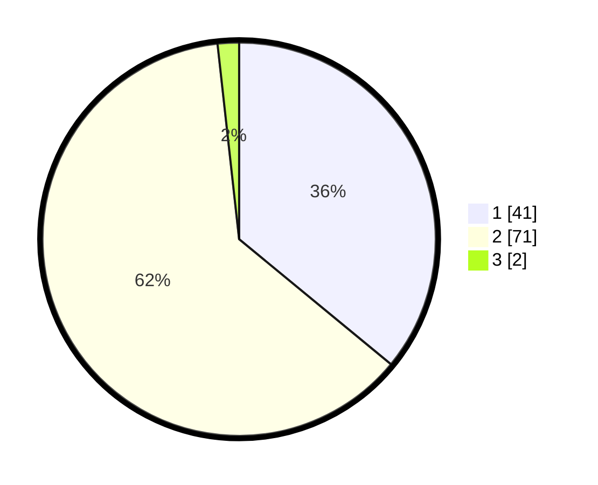

# Hasil

## Grafik

## Tabel

| No. | Nama Paslon    | Suara | Suara (raw) | Persentase |
|:--- |:-------------- | -----:| -----------:| ----------:|
| 1   | ANIES MUHAIMIN | 41    | [41][p-1]   | 35,96      |
| 2   | PRABOWO GIBRAN | 71    | [71][p-2]   | 62,28      |
| 3   | GANJAR MAHFUD  | 2     | [2][p-3]    | 1,75       |

[p-1]: https://github.com/gigit-pemilu/pemilu-2024-73-sulawesi-selatan/blob/main/pilpres/hitung-suara/sub/73-sulawesi-selatan/sub/06-gowa/sub/11-biringbulu/sub/2001-taring/sub/010-tps/sub/paslon-1.txt
[p-2]: https://github.com/gigit-pemilu/pemilu-2024-73-sulawesi-selatan/blob/main/pilpres/hitung-suara/sub/73-sulawesi-selatan/sub/06-gowa/sub/11-biringbulu/sub/2001-taring/sub/010-tps/sub/paslon-2.txt
[p-3]: https://github.com/gigit-pemilu/pemilu-2024-73-sulawesi-selatan/blob/main/pilpres/hitung-suara/sub/73-sulawesi-selatan/sub/06-gowa/sub/11-biringbulu/sub/2001-taring/sub/010-tps/sub/paslon-3.txt

## Foto C Plano

https://sirekap-obj-formc.kpu.go.id/1ae1/pemilu/ppwp/73/06/11/20/01/7306112001010-20240215-143642--09c54010-1396-4148-b8d1-eb8b3fa474ef.jpg

https://sirekap-obj-formc.kpu.go.id/1ae1/pemilu/ppwp/73/06/11/20/01/7306112001010-20240214-213922--f400f32c-d82e-4350-9e4e-cf3cb5d78bd4.jpg

https://sirekap-obj-formc.kpu.go.id/1ae1/pemilu/ppwp/73/06/11/20/01/7306112001010-20240215-144059--b6583534-4e2d-41a3-b4c4-219f03330d7d.jpg

## Metadata

| Key        | Value               |
| ---------- | ------------------- |
| Time Stamp | 2024-02-19 06:16:00 |

