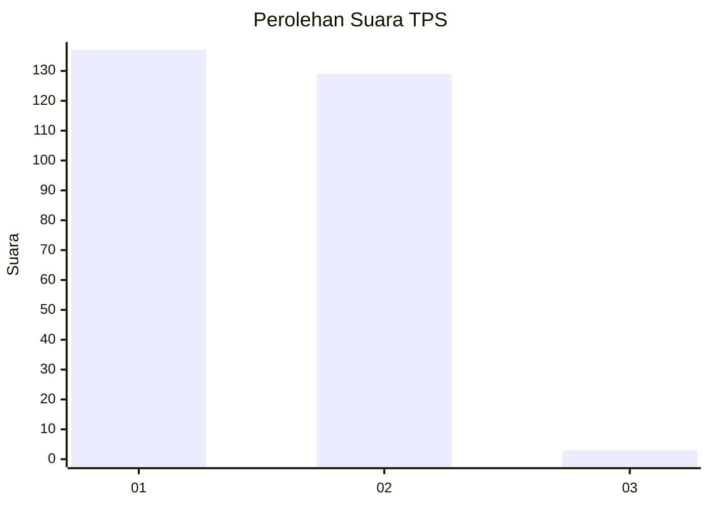
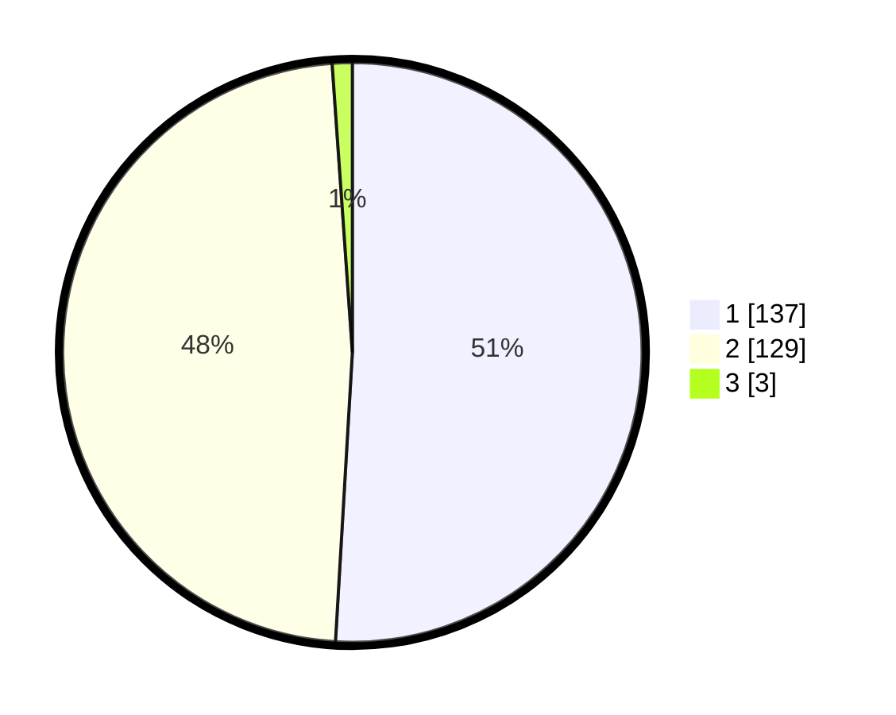

# Hasil

## Grafik

## Tabel

| No. | Nama Paslon    | Suara | Suara (raw) | Persentase |
|:--- |:-------------- | -----:| -----------:| ----------:|
| 1   | ANIES MUHAIMIN | 137   | [137][p-1]  | 50,93      |
| 2   | PRABOWO GIBRAN | 129   | [129][p-2]  | 47,96      |
| 3   | GANJAR MAHFUD  | 3     | [3][p-3]    | 1,12       |

[p-1]: https://github.com/gigit-pemilu/pemilu-2024-73-sulawesi-selatan/blob/main/pilpres/hitung-suara/sub/73-sulawesi-selatan/sub/06-gowa/sub/13-pattallasang/sub/2006-je'nemadinging/sub/001-tps/sub/paslon-1.txt
[p-2]: https://github.com/gigit-pemilu/pemilu-2024-73-sulawesi-selatan/blob/main/pilpres/hitung-suara/sub/73-sulawesi-selatan/sub/06-gowa/sub/13-pattallasang/sub/2006-je'nemadinging/sub/001-tps/sub/paslon-2.txt
[p-3]: https://github.com/gigit-pemilu/pemilu-2024-73-sulawesi-selatan/blob/main/pilpres/hitung-suara/sub/73-sulawesi-selatan/sub/06-gowa/sub/13-pattallasang/sub/2006-je'nemadinging/sub/001-tps/sub/paslon-3.txt

## Foto C Plano

https://sirekap-obj-formc.kpu.go.id/90c3/pemilu/ppwp/73/06/13/20/06/7306132006001-20240214-222048--07af3187-67c4-47bb-a3c2-a9013483883e.jpg

https://sirekap-obj-formc.kpu.go.id/90c3/pemilu/ppwp/73/06/13/20/06/7306132006001-20240215-021234--b4b9d307-2e0b-4249-90e3-1087b6c16f42.jpg

https://sirekap-obj-formc.kpu.go.id/90c3/pemilu/ppwp/73/06/13/20/06/7306132006001-20240214-222534--046d91a8-ade4-4270-bbd9-b44ce0750df6.jpg

## Metadata

| Key        | Value               |
| ---------- | ------------------- |
| Time Stamp | 2024-02-21 12:00:00 |

