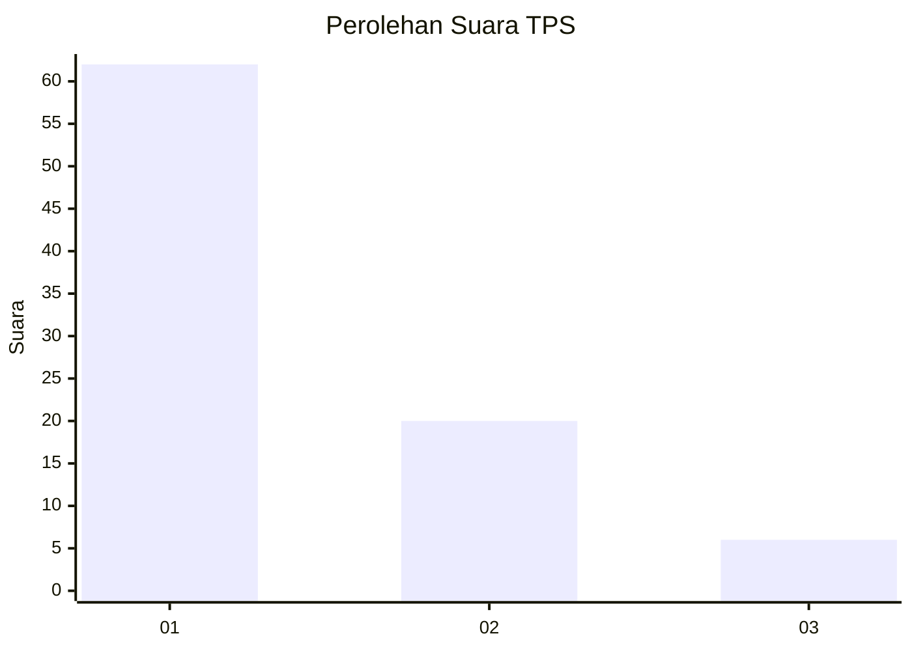
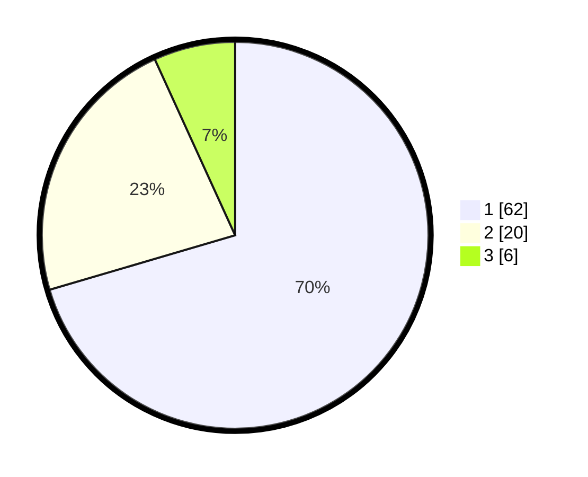

# Hasil

## Grafik

## Tabel

| No. | Nama Paslon    | Suara | Suara (raw) | Persentase |
|:--- |:-------------- | -----:| -----------:| ----------:|
| 1   | ANIES MUHAIMIN | 62    | [62][p-1]   | 70,45      |
| 2   | PRABOWO GIBRAN | 20    | [20][p-2]   | 22,73      |
| 3   | GANJAR MAHFUD  | 6     | [6][p-3]    | 6,82       |

[p-1]: https://github.com/gigit-pemilu/pemilu-2024-73-sulawesi-selatan/blob/main/pilpres/hitung-suara/sub/73-sulawesi-selatan/sub/06-gowa/sub/16-bontonompo-selatan/sub/1009-bontoramba/sub/002-tps/sub/paslon-1.txt
[p-2]: https://github.com/gigit-pemilu/pemilu-2024-73-sulawesi-selatan/blob/main/pilpres/hitung-suara/sub/73-sulawesi-selatan/sub/06-gowa/sub/16-bontonompo-selatan/sub/1009-bontoramba/sub/002-tps/sub/paslon-2.txt
[p-3]: https://github.com/gigit-pemilu/pemilu-2024-73-sulawesi-selatan/blob/main/pilpres/hitung-suara/sub/73-sulawesi-selatan/sub/06-gowa/sub/16-bontonompo-selatan/sub/1009-bontoramba/sub/002-tps/sub/paslon-3.txt

## Foto C Plano

https://sirekap-obj-formc.kpu.go.id/af5b/pemilu/ppwp/73/06/16/10/09/7306161009002-20240220-101234--98a2ce0f-1c45-4fdf-b223-f90064f3096f.jpg

https://sirekap-obj-formc.kpu.go.id/af5b/pemilu/ppwp/73/06/16/10/09/7306161009002-20240220-101623--74d600ec-d511-4449-acb3-297ff19aab64.jpg

https://sirekap-obj-formc.kpu.go.id/af5b/pemilu/ppwp/73/06/16/10/09/7306161009002-20240220-100952--f6f5f787-9200-44f6-baca-af7295b8cca0.jpg

## Metadata

| Key        | Value               |
| ---------- | ------------------- |
| Time Stamp | 2024-02-20 11:00:00 |

