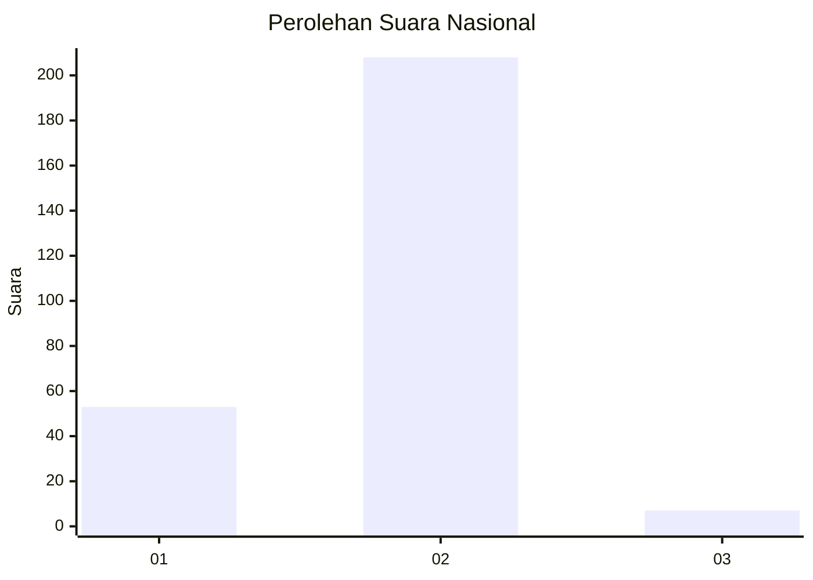
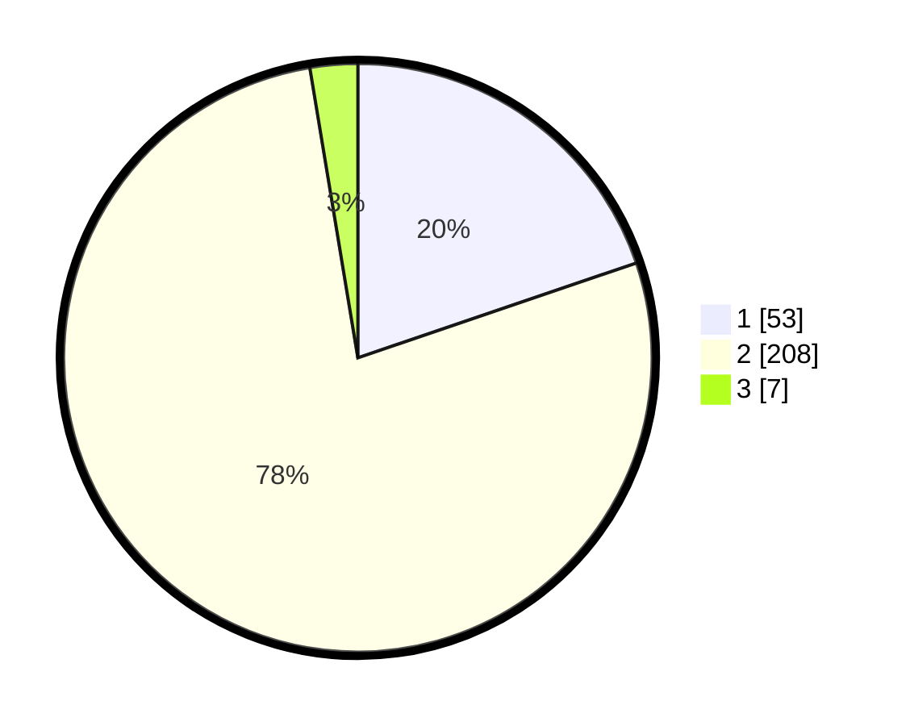

# Hasil

## Grafik

## Tabel

| No. | Nama Paslon    | Suara | Suara (raw) | Persentase |
|:--- |:-------------- | -----:| -----------:| ----------:|
| 1   | ANIES MUHAIMIN | 53    | [53][p-1]   | 19,78      |
| 2   | PRABOWO GIBRAN | 208   | [208][p-2]  | 77,61      |
| 3   | GANJAR MAHFUD  | 7     | [7][p-3]    | 2,61       |

[p-1]: https://github.com/gigit-pemilu/pemilu-2024/blob/main/pilpres/hitung-suara/sub/73-sulawesi-selatan/sub/06-gowa/sub/16-bontonompo-selatan/sub/2002-tanrara/sub/001-tps/sub/paslon-1.txt
[p-2]: https://github.com/gigit-pemilu/pemilu-2024/blob/main/pilpres/hitung-suara/sub/73-sulawesi-selatan/sub/06-gowa/sub/16-bontonompo-selatan/sub/2002-tanrara/sub/001-tps/sub/paslon-2.txt
[p-3]: https://github.com/gigit-pemilu/pemilu-2024/blob/main/pilpres/hitung-suara/sub/73-sulawesi-selatan/sub/06-gowa/sub/16-bontonompo-selatan/sub/2002-tanrara/sub/001-tps/sub/paslon-3.txt

## Foto C Plano

https://sirekap-obj-formc.kpu.go.id/8e1c/pemilu/ppwp/73/06/16/20/02/7306162002001-20240215-011947--cb9d7e7d-10fa-4ac2-b594-def0849f51b3.jpg

https://sirekap-obj-formc.kpu.go.id/8e1c/pemilu/ppwp/73/06/16/20/02/7306162002001-20240215-012517--d462d8e5-6419-45a2-a0f5-3d675fa38d8f.jpg

https://sirekap-obj-formc.kpu.go.id/8e1c/pemilu/ppwp/73/06/16/20/02/7306162002001-20240215-013008--96110ae9-f5de-4fbe-b84b-503d934bc0d3.jpg

## Metadata

| Key        | Value               |
| ---------- | ------------------- |
| Time Stamp | 2024-02-15 12:00:28 |

