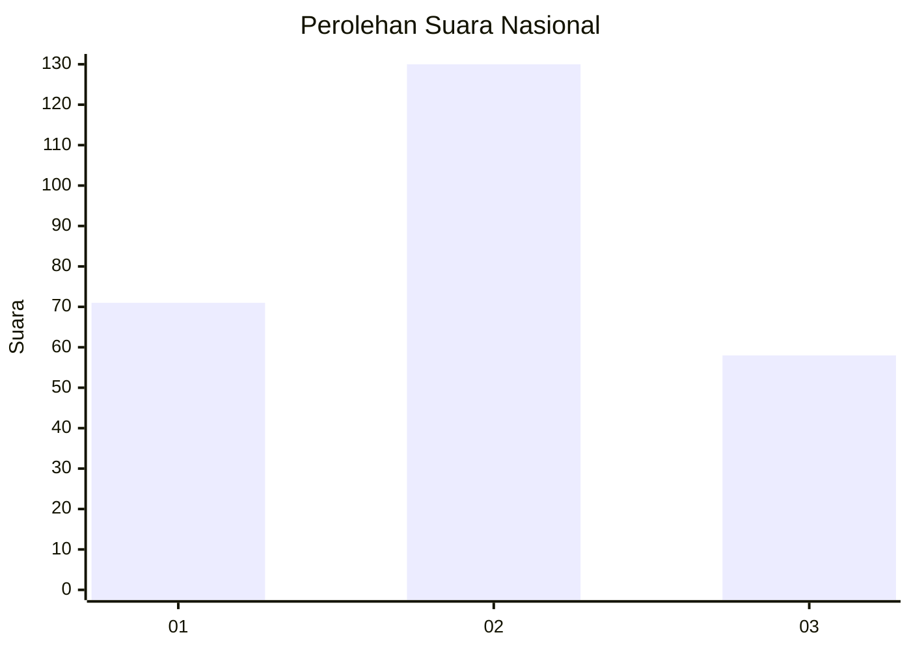
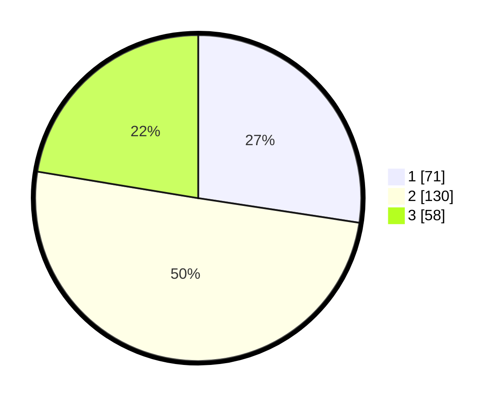

# Hasil

## Grafik

## Tabel

| No. | Nama Paslon    | Suara | Suara (raw) | Persentase |
|:--- |:-------------- | -----:| -----------:| ----------:|
| 1   | ANIES MUHAIMIN | 71    | [71][p-1]   | 27,41      |
| 2   | PRABOWO GIBRAN | 130   | [130][p-2]  | 50,19      |
| 3   | GANJAR MAHFUD  | 58    | [58][p-3]   | 22,39      |

[p-1]: https://github.com/gigit-pemilu/pemilu-2024/blob/main/pilpres/hitung-suara/sub/73-sulawesi-selatan/sub/06-gowa/sub/16-bontonompo-selatan/sub/2002-tanrara/sub/008-tps/sub/paslon-1.txt
[p-2]: https://github.com/gigit-pemilu/pemilu-2024/blob/main/pilpres/hitung-suara/sub/73-sulawesi-selatan/sub/06-gowa/sub/16-bontonompo-selatan/sub/2002-tanrara/sub/008-tps/sub/paslon-2.txt
[p-3]: https://github.com/gigit-pemilu/pemilu-2024/blob/main/pilpres/hitung-suara/sub/73-sulawesi-selatan/sub/06-gowa/sub/16-bontonompo-selatan/sub/2002-tanrara/sub/008-tps/sub/paslon-3.txt

## Foto C Plano

https://sirekap-obj-formc.kpu.go.id/31e0/pemilu/ppwp/73/06/16/20/02/7306162002008-20240222-193104--561ec149-4d49-4fde-9dc3-70b8018e4dae.jpg

https://sirekap-obj-formc.kpu.go.id/31e0/pemilu/ppwp/73/06/16/20/02/7306162002008-20240222-173024--a2625b77-3fcb-4474-bc8c-79632251fd6d.jpg

https://sirekap-obj-formc.kpu.go.id/31e0/pemilu/ppwp/73/06/16/20/02/7306162002008-20240222-173121--59f64623-7b90-4cf3-b026-21550ef86e70.jpg

## Metadata

| Key        | Value               |
| ---------- | ------------------- |
| Time Stamp | 2024-02-22 20:00:00 |

## DATA PEMILIH TETAP

Jumlah pemilih dalam DPT: **212**.
 * L: **105**.
 * P: **197**.

## DATA PENGGUNA HAK PILIH

Jumlah pengguna hak pilih dalam DPT: **261**.
 * L: **100**.
 * P: **151**.

Jumlah pengguna hak pilih dalam DPTb: **1**.
 * L: **91**.
 * P: **0**.

Jumlah pengguna hak pilih dalam DPK: **95**.
 * L: **3**.
 * P: **902**.

Jumlah pengguna hak pilih: **207**.
 * L: **199**.
 * P: **193**.

## JUMLAH SUARA SAH DAN TIDAK SAH

JUMLAH SELURUH SUARA SAH: **361**.

JUMLAH SUARA TIDAK SAH: **6**.

JUMLAH SELURUH SUARA SAH DAN SUARA TIDAK SAH: **293**.

