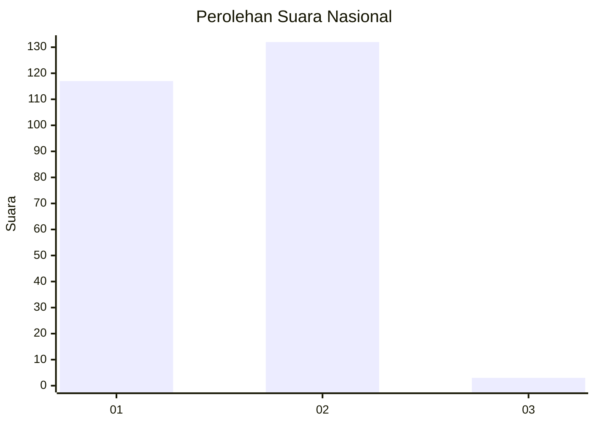
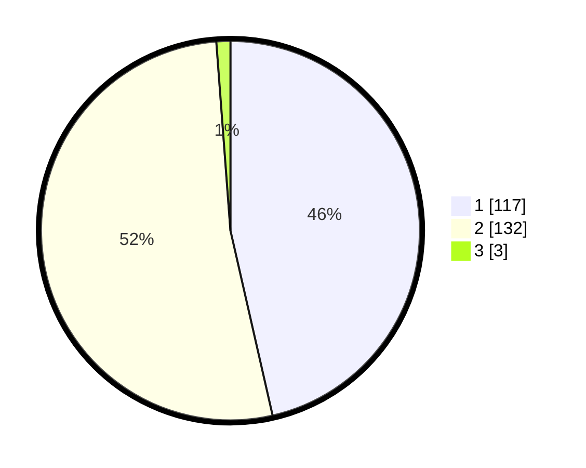

# Hasil

## Grafik

## Tabel

| No. | Nama Paslon    | Suara | Suara (raw) | Persentase |
|:--- |:-------------- | -----:| -----------:| ----------:|
| 1   | ANIES MUHAIMIN | 117   | [117][p-1]  | 46,43      |
| 2   | PRABOWO GIBRAN | 132   | [132][p-2]  | 52,38      |
| 3   | GANJAR MAHFUD  | 3     | [3][p-3]    | 1,19       |

[p-1]: https://github.com/gigit-pemilu/pemilu-2024/blob/main/pilpres/hitung-suara/sub/73-sulawesi-selatan/sub/06-gowa/sub/16-bontonompo-selatan/sub/2003-tindang/sub/001-tps/sub/paslon-1.txt
[p-2]: https://github.com/gigit-pemilu/pemilu-2024/blob/main/pilpres/hitung-suara/sub/73-sulawesi-selatan/sub/06-gowa/sub/16-bontonompo-selatan/sub/2003-tindang/sub/001-tps/sub/paslon-2.txt
[p-3]: https://github.com/gigit-pemilu/pemilu-2024/blob/main/pilpres/hitung-suara/sub/73-sulawesi-selatan/sub/06-gowa/sub/16-bontonompo-selatan/sub/2003-tindang/sub/001-tps/sub/paslon-3.txt

## Foto C Plano

https://sirekap-obj-formc.kpu.go.id/cbe3/pemilu/ppwp/73/06/16/20/03/7306162003001-20240223-151158--a87f5844-23d8-41f7-ba9c-ce0723cb9785.jpg

https://sirekap-obj-formc.kpu.go.id/cbe3/pemilu/ppwp/73/06/16/20/03/7306162003001-20240223-151331--40eb7c8e-ece2-41b0-a1db-62135e8e56b5.jpg

https://sirekap-obj-formc.kpu.go.id/cbe3/pemilu/ppwp/73/06/16/20/03/7306162003001-20240223-151431--258f03f7-2620-43fd-92c9-26f360df0fa5.jpg

## Metadata

| Key        | Value               |
| ---------- | ------------------- |
| Time Stamp | 2024-02-24 22:31:28 |

## DATA PEMILIH TETAP

Jumlah pemilih dalam DPT: **0**.
 * L: **135**.
 * P: **149**.

## DATA PENGGUNA HAK PILIH

Jumlah pengguna hak pilih dalam DPT: **0**.
 * L: **119**.
 * P: **120**.

Jumlah pengguna hak pilih dalam DPTb: **5**.
 * L: **55**.
 * P: **200**.

Jumlah pengguna hak pilih dalam DPK: **2**.
 * L: **4**.
 * P: **0**.

Jumlah pengguna hak pilih: **0**.
 * L: **123**.
 * P: **100**.

## JUMLAH SUARA SAH DAN TIDAK SAH

JUMLAH SELURUH SUARA SAH: **252**.

JUMLAH SUARA TIDAK SAH: **81**.

JUMLAH SELURUH SUARA SAH DAN SUARA TIDAK SAH: **253**.

