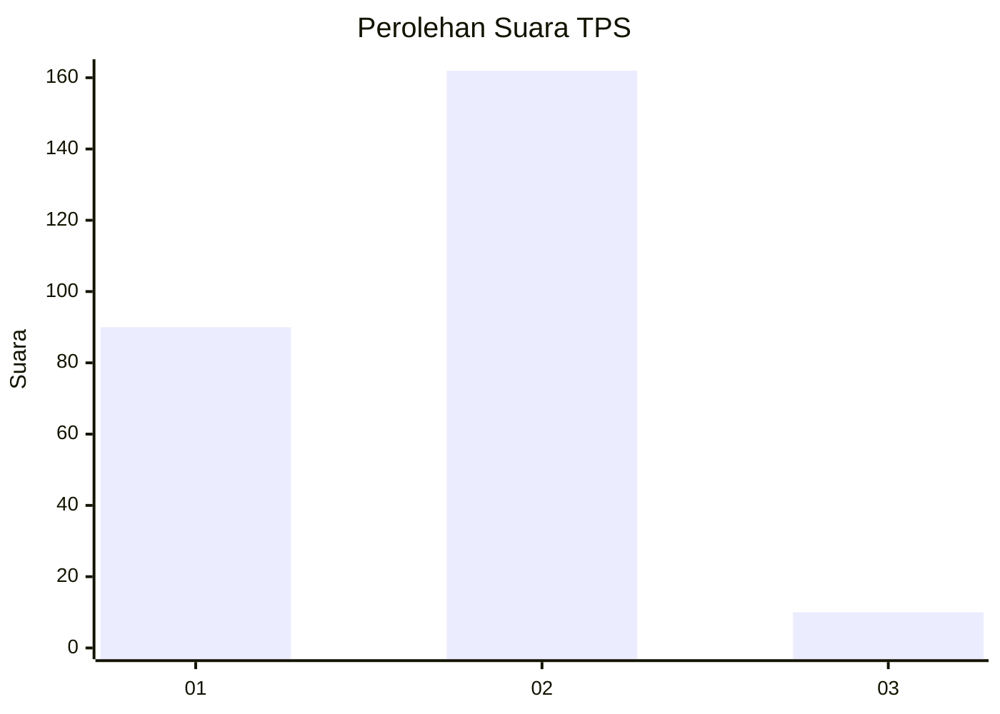
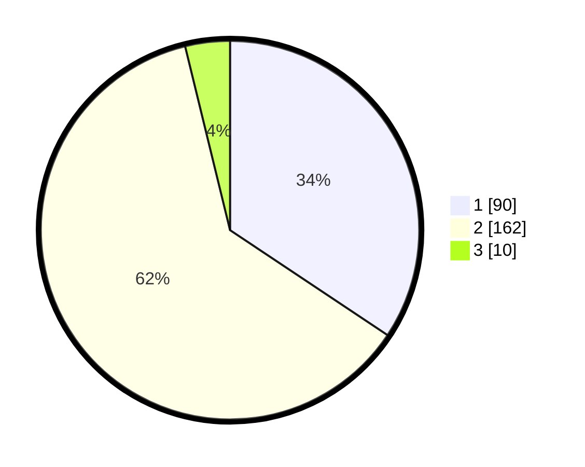

# Hasil

## Grafik

## Tabel

| No. | Nama Paslon    | Suara | Suara (raw) | Persentase |
|:--- |:-------------- | -----:| -----------:| ----------:|
| 1   | ANIES MUHAIMIN | 90    | [90][p-1]   | 34,35      |
| 2   | PRABOWO GIBRAN | 162   | [162][p-2]  | 61,83      |
| 3   | GANJAR MAHFUD  | 10    | [10][p-3]   | 3,82       |

[p-1]: https://github.com/gigit-pemilu/pemilu-2024-73-sulawesi-selatan/blob/main/pilpres/hitung-suara/sub/73-sulawesi-selatan/sub/06-gowa/sub/16-bontonompo-selatan/sub/2004-pa'bundukang/sub/004-tps/sub/paslon-1.txt
[p-2]: https://github.com/gigit-pemilu/pemilu-2024-73-sulawesi-selatan/blob/main/pilpres/hitung-suara/sub/73-sulawesi-selatan/sub/06-gowa/sub/16-bontonompo-selatan/sub/2004-pa'bundukang/sub/004-tps/sub/paslon-2.txt
[p-3]: https://github.com/gigit-pemilu/pemilu-2024-73-sulawesi-selatan/blob/main/pilpres/hitung-suara/sub/73-sulawesi-selatan/sub/06-gowa/sub/16-bontonompo-selatan/sub/2004-pa'bundukang/sub/004-tps/sub/paslon-3.txt

## Foto C Plano

https://sirekap-obj-formc.kpu.go.id/0e3d/pemilu/ppwp/73/06/16/20/04/7306162004004-20240214-185851--b9817b63-e17a-43c3-a915-eacad8cce0a1.jpg

https://sirekap-obj-formc.kpu.go.id/0e3d/pemilu/ppwp/73/06/16/20/04/7306162004004-20240214-231345--2a688def-65bb-4ad8-8990-41d8fa902328.jpg

https://sirekap-obj-formc.kpu.go.id/0e3d/pemilu/ppwp/73/06/16/20/04/7306162004004-20240214-231849--b9291ac7-abc4-4cb9-a25d-a51a73b0d1fa.jpg

## Metadata

| Key        | Value               |
| ---------- | ------------------- |
| Time Stamp | 2024-02-15 15:00:29 |

