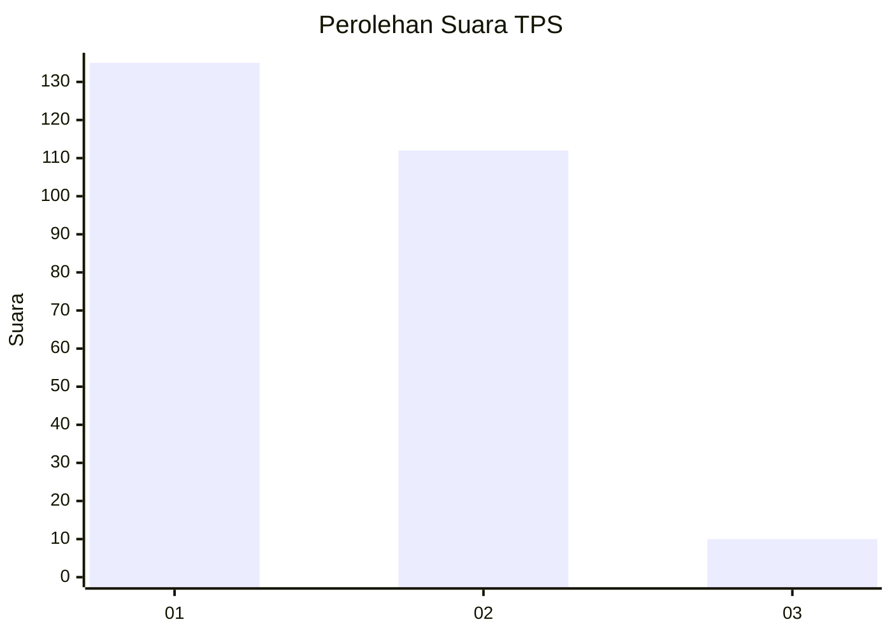
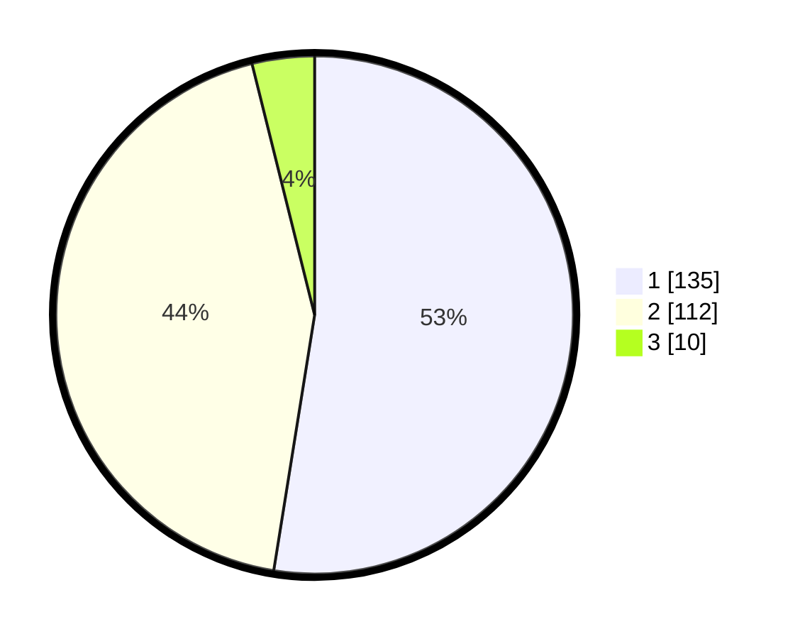

# Hasil

## Grafik

## Tabel

| No. | Nama Paslon    | Suara | Suara (raw) | Persentase |
|:--- |:-------------- | -----:| -----------:| ----------:|
| 1   | ANIES MUHAIMIN | 135   | [135][p-1]  | 52,53      |
| 2   | PRABOWO GIBRAN | 112   | [112][p-2]  | 43,58      |
| 3   | GANJAR MAHFUD  | 10    | [10][p-3]   | 3,89       |

[p-1]: https://github.com/gigit-pemilu/pemilu-2024-73-sulawesi-selatan/blob/main/pilpres/hitung-suara/sub/73-sulawesi-selatan/sub/06-gowa/sub/16-bontonompo-selatan/sub/2004-pa'bundukang/sub/006-tps/sub/paslon-1.txt
[p-2]: https://github.com/gigit-pemilu/pemilu-2024-73-sulawesi-selatan/blob/main/pilpres/hitung-suara/sub/73-sulawesi-selatan/sub/06-gowa/sub/16-bontonompo-selatan/sub/2004-pa'bundukang/sub/006-tps/sub/paslon-2.txt
[p-3]: https://github.com/gigit-pemilu/pemilu-2024-73-sulawesi-selatan/blob/main/pilpres/hitung-suara/sub/73-sulawesi-selatan/sub/06-gowa/sub/16-bontonompo-selatan/sub/2004-pa'bundukang/sub/006-tps/sub/paslon-3.txt

## Foto C Plano

https://sirekap-obj-formc.kpu.go.id/b9d7/pemilu/ppwp/73/06/16/20/04/7306162004006-20240214-193026--41646295-cfe4-4b2e-a0ee-8dd8f51fb3de.jpg

https://sirekap-obj-formc.kpu.go.id/b9d7/pemilu/ppwp/73/06/16/20/04/7306162004006-20240214-193104--14ccaddb-d538-4ce8-a34d-08fee1df1500.jpg

https://sirekap-obj-formc.kpu.go.id/b9d7/pemilu/ppwp/73/06/16/20/04/7306162004006-20240214-193139--f23ee6ba-f22e-4a75-92ee-da7d3ba65c30.jpg

## Metadata

| Key        | Value               |
| ---------- | ------------------- |
| Time Stamp | 2024-02-14 21:46:01 |

