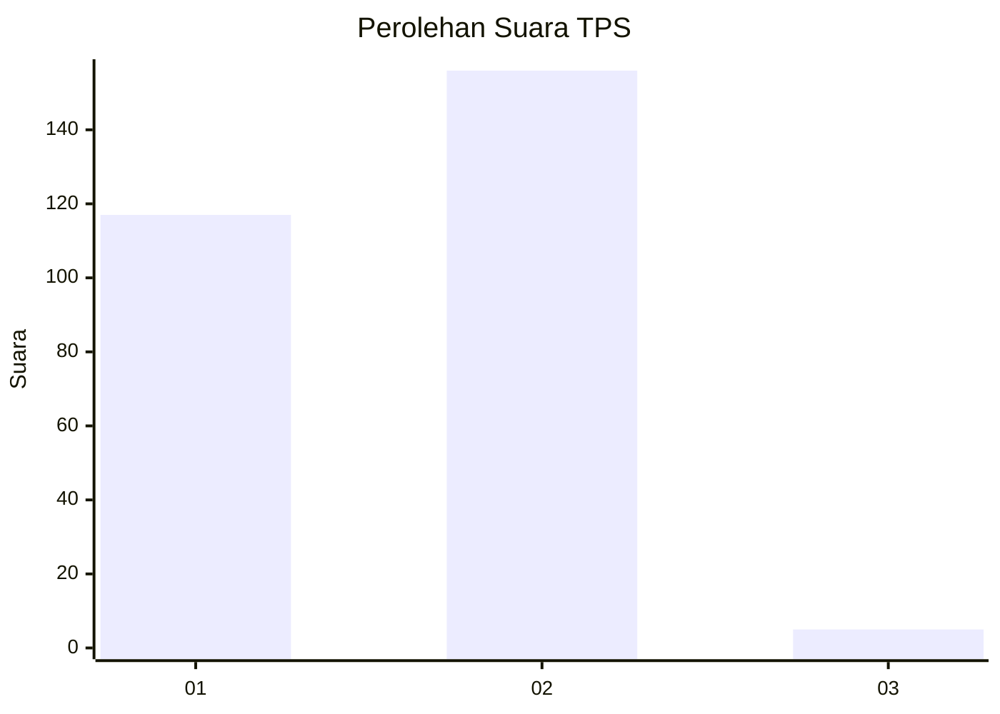
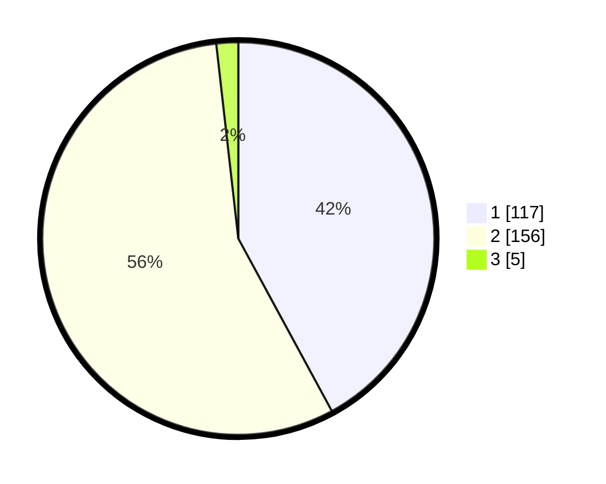

# Hasil

## Grafik

## Tabel

| No. | Nama Paslon    | Suara | Suara (raw) | Persentase |
|:--- |:-------------- | -----:| -----------:| ----------:|
| 1   | ANIES MUHAIMIN | 117   | [117][p-1]  | 42,09      |
| 2   | PRABOWO GIBRAN | 156   | [156][p-2]  | 56,12      |
| 3   | GANJAR MAHFUD  | 5     | [5][p-3]    | 1,80       |

[p-1]: https://github.com/gigit-pemilu/pemilu-2024-73-sulawesi-selatan/blob/main/pilpres/hitung-suara/sub/73-sulawesi-selatan/sub/06-gowa/sub/18-bajeng-barat/sub/2004-gentungang/sub/013-tps/sub/paslon-1.txt
[p-2]: https://github.com/gigit-pemilu/pemilu-2024-73-sulawesi-selatan/blob/main/pilpres/hitung-suara/sub/73-sulawesi-selatan/sub/06-gowa/sub/18-bajeng-barat/sub/2004-gentungang/sub/013-tps/sub/paslon-2.txt
[p-3]: https://github.com/gigit-pemilu/pemilu-2024-73-sulawesi-selatan/blob/main/pilpres/hitung-suara/sub/73-sulawesi-selatan/sub/06-gowa/sub/18-bajeng-barat/sub/2004-gentungang/sub/013-tps/sub/paslon-3.txt

## Foto C Plano

https://sirekap-obj-formc.kpu.go.id/8283/pemilu/ppwp/73/06/18/20/04/7306182004013-20240215-060904--141c36f3-dc1b-4387-8ee0-5cee19177771.jpg

https://sirekap-obj-formc.kpu.go.id/8283/pemilu/ppwp/73/06/18/20/04/7306182004013-20240215-041125--d37495f3-c896-40b1-af7c-c153e9433339.jpg

https://sirekap-obj-formc.kpu.go.id/8283/pemilu/ppwp/73/06/18/20/04/7306182004013-20240215-061357--16501daf-c025-4619-8370-a218f6cf71fa.jpg

## Metadata

| Key        | Value               |
| ---------- | ------------------- |
| Time Stamp | 2024-02-15 16:00:26 |

