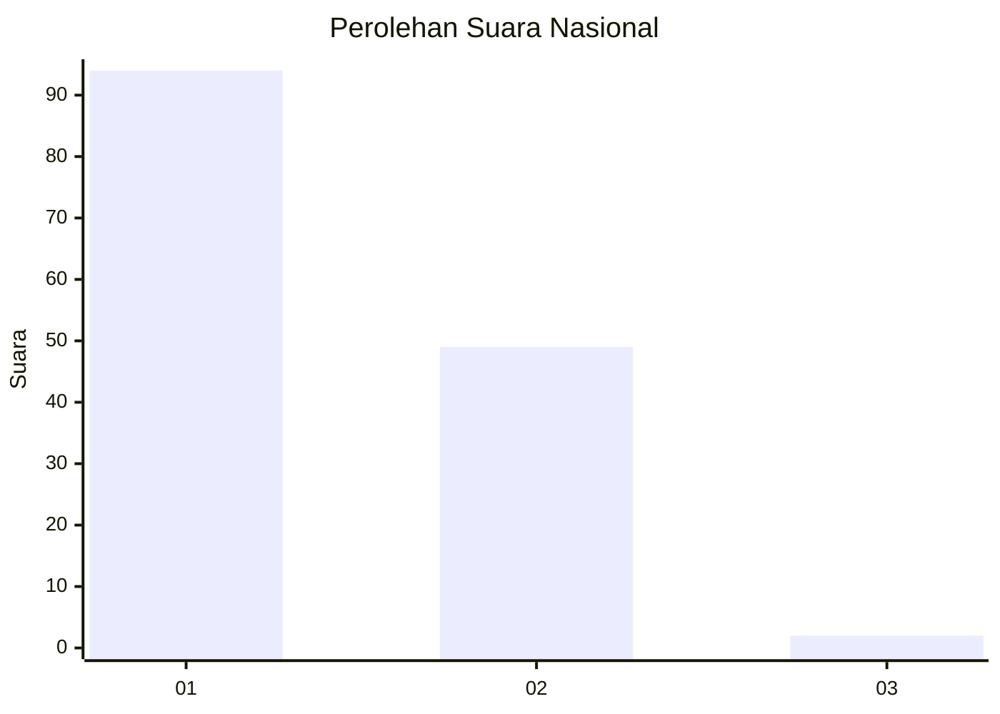
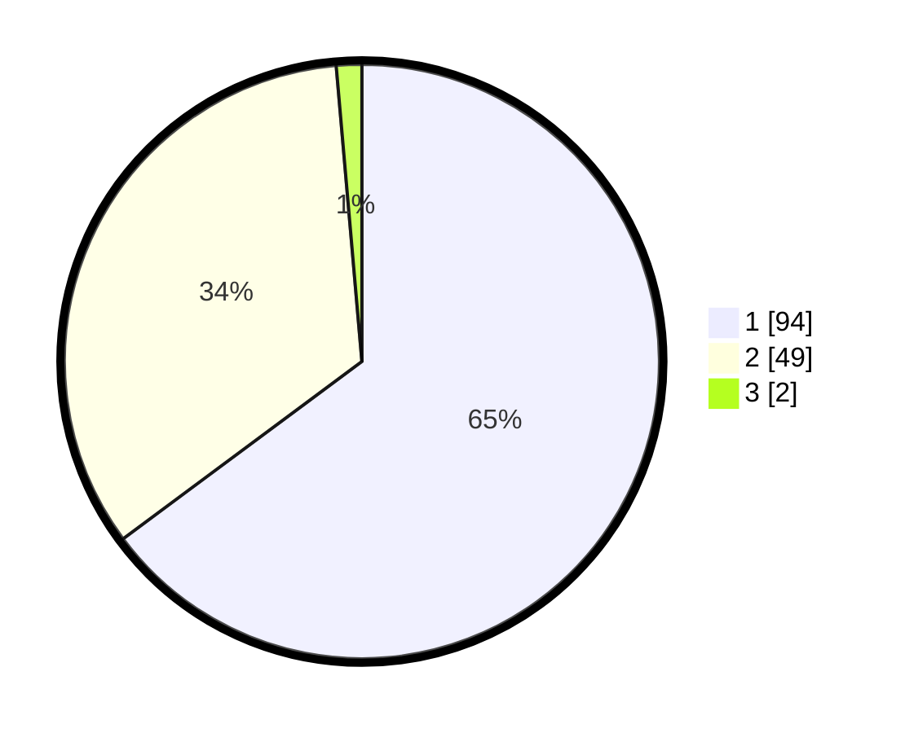

# Hasil

## Grafik

## Tabel

| No. | Nama Paslon    | Suara | Suara (raw) | Persentase |
|:--- |:-------------- | -----:| -----------:| ----------:|
| 1   | ANIES MUHAIMIN | 94    | [94][p-1]   | 64,83      |
| 2   | PRABOWO GIBRAN | 49    | [49][p-2]   | 33,79      |
| 3   | GANJAR MAHFUD  | 2     | [2][p-3]    | 1,38       |

[p-1]: https://github.com/gigit-pemilu/pemilu-2024/blob/main/pilpres/hitung-suara/sub/73-sulawesi-selatan/sub/07-sinjai/sub/01-sinjai-barat/sub/1001-tassililu/sub/004-tps/sub/paslon-1.txt
[p-2]: https://github.com/gigit-pemilu/pemilu-2024/blob/main/pilpres/hitung-suara/sub/73-sulawesi-selatan/sub/07-sinjai/sub/01-sinjai-barat/sub/1001-tassililu/sub/004-tps/sub/paslon-2.txt
[p-3]: https://github.com/gigit-pemilu/pemilu-2024/blob/main/pilpres/hitung-suara/sub/73-sulawesi-selatan/sub/07-sinjai/sub/01-sinjai-barat/sub/1001-tassililu/sub/004-tps/sub/paslon-3.txt

## Foto C Plano

https://sirekap-obj-formc.kpu.go.id/e02c/pemilu/ppwp/73/07/01/10/01/7307011001004-20240221-193647--f2829e2a-dcea-4d54-b75d-6996f8d8e8d6.jpg

https://sirekap-obj-formc.kpu.go.id/e02c/pemilu/ppwp/73/07/01/10/01/7307011001004-20240221-124224--67f62d3a-8f7e-4a1d-9e71-54acc93a99f9.jpg

## Metadata

| Key        | Value               |
| ---------- | ------------------- |
| Time Stamp | 2024-02-21 20:00:00 |

