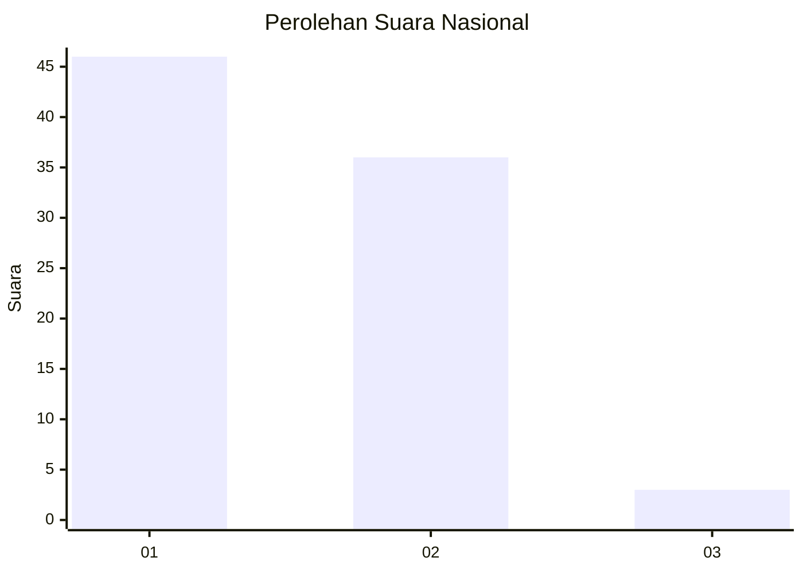
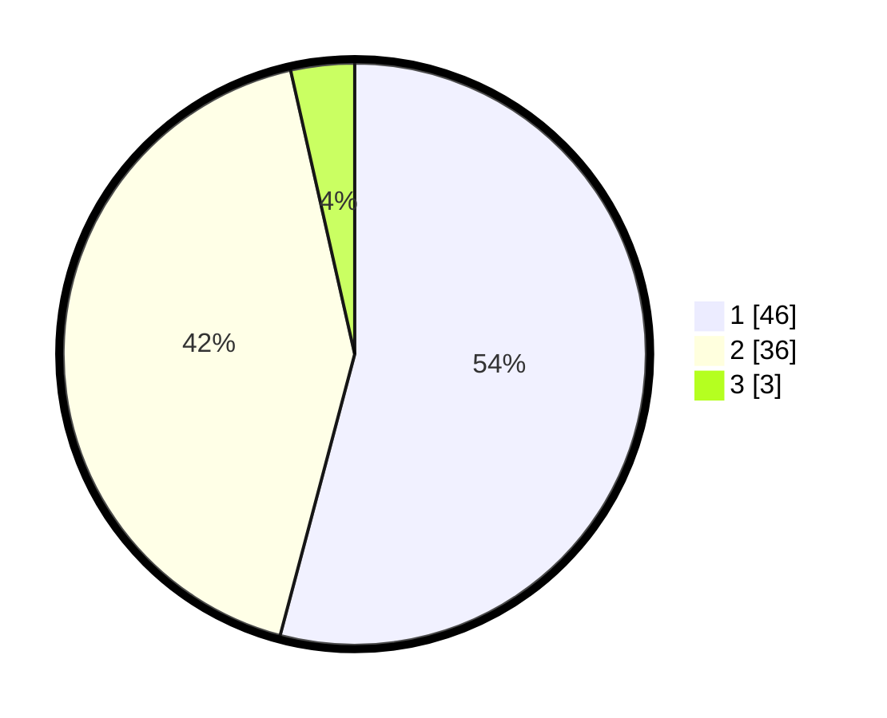

# Hasil

## Grafik

## Tabel

| No. | Nama Paslon    | Suara | Suara (raw) | Persentase |
|:--- |:-------------- | -----:| -----------:| ----------:|
| 1   | ANIES MUHAIMIN | 46    | [46][p-1]   | 54,12      |
| 2   | PRABOWO GIBRAN | 36    | [36][p-2]   | 42,35      |
| 3   | GANJAR MAHFUD  | 3     | [3][p-3]    | 3,53       |

[p-1]: https://github.com/gigit-pemilu/pemilu-2024/blob/main/pilpres/hitung-suara/sub/73-sulawesi-selatan/sub/07-sinjai/sub/04-sinjai-tengah/sub/2006-saotengnga/sub/012-tps/sub/paslon-1.txt
[p-2]: https://github.com/gigit-pemilu/pemilu-2024/blob/main/pilpres/hitung-suara/sub/73-sulawesi-selatan/sub/07-sinjai/sub/04-sinjai-tengah/sub/2006-saotengnga/sub/012-tps/sub/paslon-2.txt
[p-3]: https://github.com/gigit-pemilu/pemilu-2024/blob/main/pilpres/hitung-suara/sub/73-sulawesi-selatan/sub/07-sinjai/sub/04-sinjai-tengah/sub/2006-saotengnga/sub/012-tps/sub/paslon-3.txt

## Foto C Plano

https://sirekap-obj-formc.kpu.go.id/77ed/pemilu/ppwp/73/07/04/20/06/7307042006012-20240214-155810--7188ed4b-28f0-4753-a073-064867396b3c.jpg

https://sirekap-obj-formc.kpu.go.id/77ed/pemilu/ppwp/73/07/04/20/06/7307042006012-20240214-155749--4639b96c-d9e1-4a85-af2d-15cca75c041f.jpg

https://sirekap-obj-formc.kpu.go.id/77ed/pemilu/ppwp/73/07/04/20/06/7307042006012-20240214-141932--1acb068d-bfff-473d-8889-09edc9d1de90.jpg

## Metadata

| Key        | Value               |
| ---------- | ------------------- |
| Time Stamp | 2024-02-16 00:00:26 |

