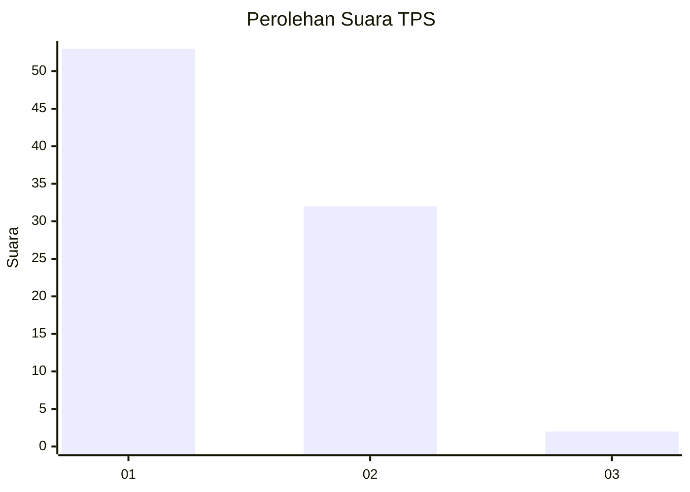
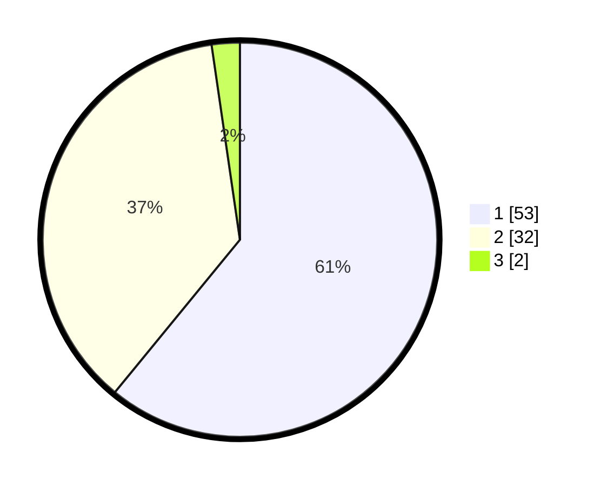

# Hasil

## Grafik

## Tabel

| No. | Nama Paslon    | Suara | Suara (raw) | Persentase |
|:--- |:-------------- | -----:| -----------:| ----------:|
| 1   | ANIES MUHAIMIN | 53    | [53][p-1]   | 60,92      |
| 2   | PRABOWO GIBRAN | 32    | [32][p-2]   | 36,78      |
| 3   | GANJAR MAHFUD  | 2     | [2][p-3]    | 2,30       |

[p-1]: https://github.com/gigit-pemilu/pemilu-2024-73-sulawesi-selatan/blob/main/pilpres/hitung-suara/sub/73-sulawesi-selatan/sub/07-sinjai/sub/05-sinjai-utara/sub/1001-biringere/sub/018-tps/sub/paslon-1.txt
[p-2]: https://github.com/gigit-pemilu/pemilu-2024-73-sulawesi-selatan/blob/main/pilpres/hitung-suara/sub/73-sulawesi-selatan/sub/07-sinjai/sub/05-sinjai-utara/sub/1001-biringere/sub/018-tps/sub/paslon-2.txt
[p-3]: https://github.com/gigit-pemilu/pemilu-2024-73-sulawesi-selatan/blob/main/pilpres/hitung-suara/sub/73-sulawesi-selatan/sub/07-sinjai/sub/05-sinjai-utara/sub/1001-biringere/sub/018-tps/sub/paslon-3.txt

## Foto C Plano

https://sirekap-obj-formc.kpu.go.id/89fa/pemilu/ppwp/73/07/05/10/01/7307051001018-20240224-130251--100931cc-3e97-4ff1-8ee0-abc4e86381e6.jpg

https://sirekap-obj-formc.kpu.go.id/89fa/pemilu/ppwp/73/07/05/10/01/7307051001018-20240224-131038--e46a0fca-d39f-4890-b06a-96b458fbbf18.jpg

https://sirekap-obj-formc.kpu.go.id/89fa/pemilu/ppwp/73/07/05/10/01/7307051001018-20240224-131625--59c9f5ac-b8dd-4c07-bb18-86478183aa71.jpg

## Metadata

| Key        | Value               |
| ---------- | ------------------- |
| Time Stamp | 2024-02-24 22:31:28 |

