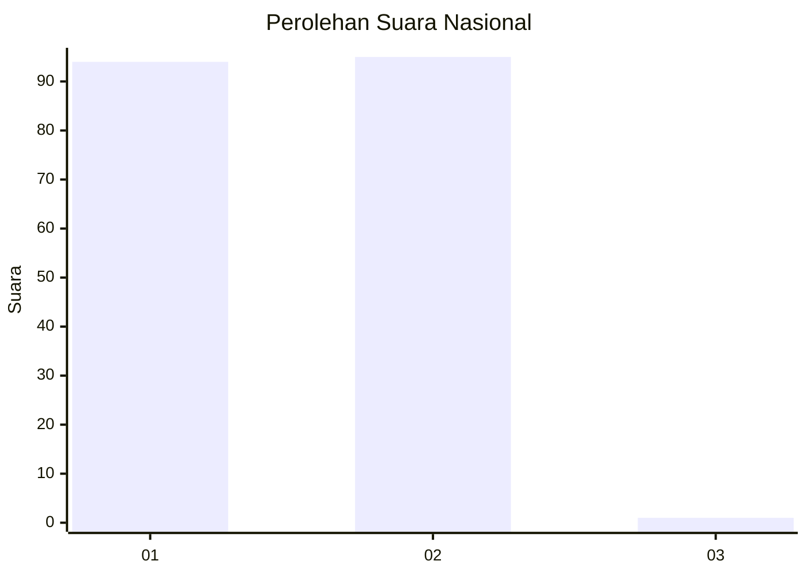
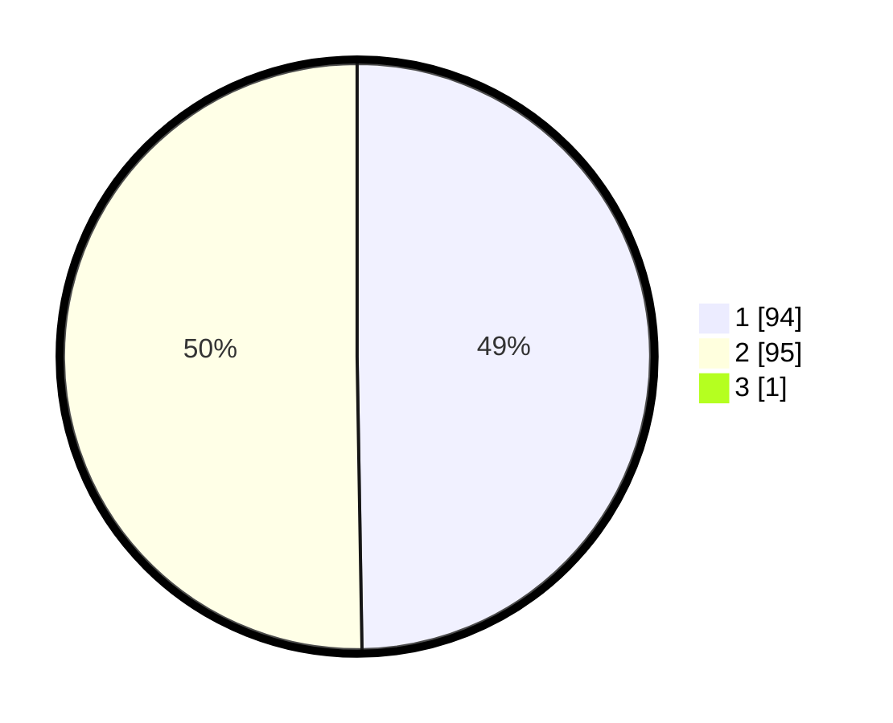

# Hasil

## Grafik

## Tabel

| No. | Nama Paslon    | Suara | Suara (raw) | Persentase |
|:--- |:-------------- | -----:| -----------:| ----------:|
| 1   | ANIES MUHAIMIN | 94    | [94][p-1]   | 49,47      |
| 2   | PRABOWO GIBRAN | 95    | [95][p-2]   | 50,00      |
| 3   | GANJAR MAHFUD  | 1     | [1][p-3]    | 0,53       |

[p-1]: https://github.com/gigit-pemilu/pemilu-2024/blob/main/pilpres/hitung-suara/sub/73-sulawesi-selatan/sub/07-sinjai/sub/09-pulau-sembilan/sub/2001-pulau-harapan/sub/005-tps/sub/paslon-1.txt
[p-2]: https://github.com/gigit-pemilu/pemilu-2024/blob/main/pilpres/hitung-suara/sub/73-sulawesi-selatan/sub/07-sinjai/sub/09-pulau-sembilan/sub/2001-pulau-harapan/sub/005-tps/sub/paslon-2.txt
[p-3]: https://github.com/gigit-pemilu/pemilu-2024/blob/main/pilpres/hitung-suara/sub/73-sulawesi-selatan/sub/07-sinjai/sub/09-pulau-sembilan/sub/2001-pulau-harapan/sub/005-tps/sub/paslon-3.txt

## Foto C Plano

https://sirekap-obj-formc.kpu.go.id/8ee3/pemilu/ppwp/73/07/09/20/01/7307092001005-20240215-133455--f0d1505e-96b8-468f-8605-f3aa40293e98.jpg

https://sirekap-obj-formc.kpu.go.id/8ee3/pemilu/ppwp/73/07/09/20/01/7307092001005-20240215-133646--762d5986-0622-4bb6-8995-937a1ed52c3f.jpg

https://sirekap-obj-formc.kpu.go.id/8ee3/pemilu/ppwp/73/07/09/20/01/7307092001005-20240215-133805--44b2a851-234f-489d-a342-d5c54bfdafaa.jpg

## Metadata

| Key        | Value               |
| ---------- | ------------------- |
| Time Stamp | 2024-02-16 21:01:00 |

