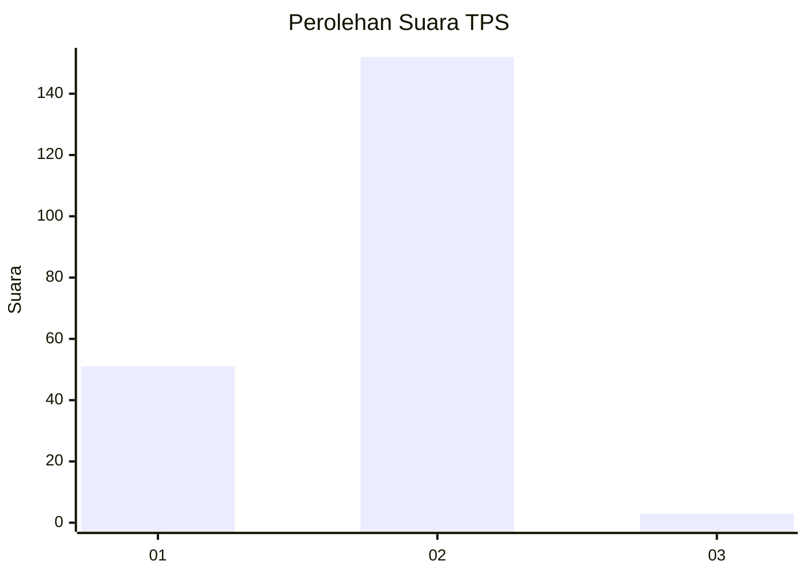
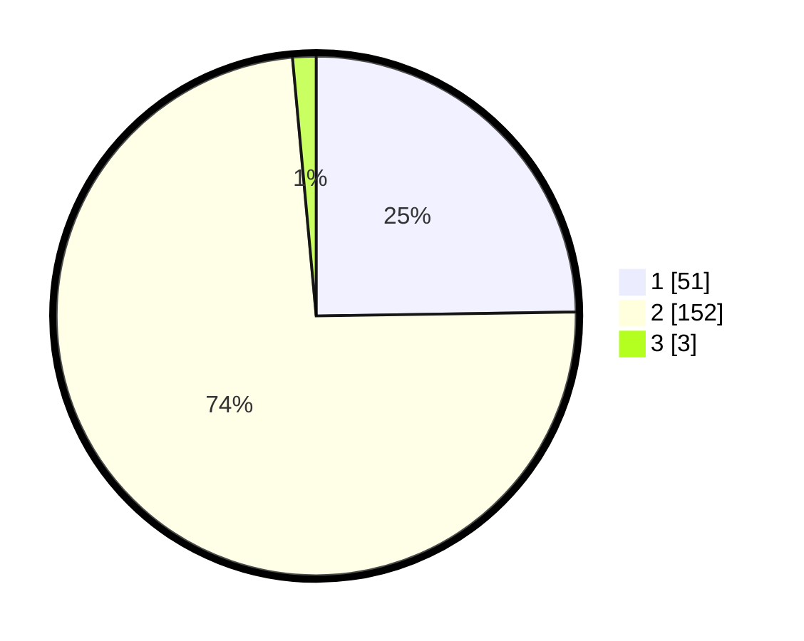

# Hasil

## Grafik

## Tabel

| No. | Nama Paslon    | Suara | Suara (raw) | Persentase |
|:--- |:-------------- | -----:| -----------:| ----------:|
| 1   | ANIES MUHAIMIN | 51    | [51][p-1]   | 24,76      |
| 2   | PRABOWO GIBRAN | 152   | [152][p-2]  | 73,79      |
| 3   | GANJAR MAHFUD  | 3     | [3][p-3]    | 1,46       |

[p-1]: https://github.com/gigit-pemilu/pemilu-2024-73-sulawesi-selatan/blob/main/pilpres/hitung-suara/sub/73-sulawesi-selatan/sub/08-bone/sub/06-libureng/sub/1001-tanah-batue/sub/006-tps/sub/paslon-1.txt
[p-2]: https://github.com/gigit-pemilu/pemilu-2024-73-sulawesi-selatan/blob/main/pilpres/hitung-suara/sub/73-sulawesi-selatan/sub/08-bone/sub/06-libureng/sub/1001-tanah-batue/sub/006-tps/sub/paslon-2.txt
[p-3]: https://github.com/gigit-pemilu/pemilu-2024-73-sulawesi-selatan/blob/main/pilpres/hitung-suara/sub/73-sulawesi-selatan/sub/08-bone/sub/06-libureng/sub/1001-tanah-batue/sub/006-tps/sub/paslon-3.txt

## Foto C Plano

https://sirekap-obj-formc.kpu.go.id/6f2d/pemilu/ppwp/73/08/06/10/01/7308061001006-20240223-214412--9776445e-b639-40e4-8a1a-a94ef1dbeead.jpg

https://sirekap-obj-formc.kpu.go.id/6f2d/pemilu/ppwp/73/08/06/10/01/7308061001006-20240223-214531--ba96fe7c-ffd5-4760-bdd6-8d29af9e9475.jpg

https://sirekap-obj-formc.kpu.go.id/6f2d/pemilu/ppwp/73/08/06/10/01/7308061001006-20240223-214608--813861e3-98fc-4abe-afee-7a42d0e602eb.jpg

## Metadata

| Key        | Value               |
| ---------- | ------------------- |
| Time Stamp | 2024-02-24 22:31:28 |

