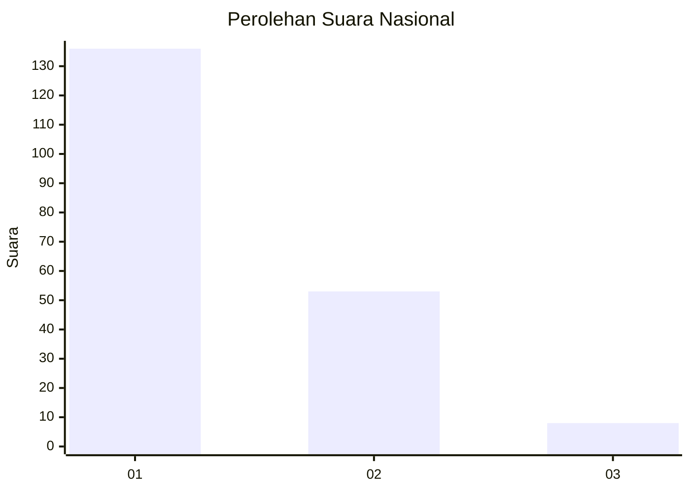
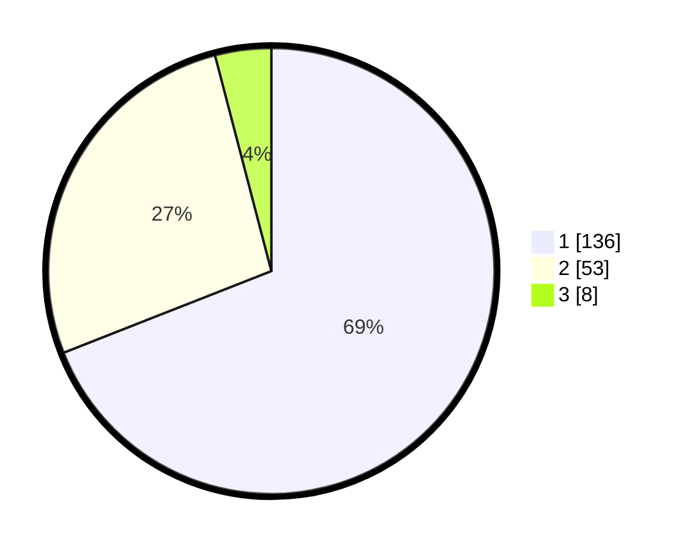

# Hasil

## Grafik

## Tabel

| No. | Nama Paslon    | Suara | Suara (raw) | Persentase |
|:--- |:-------------- | -----:| -----------:| ----------:|
| 1   | ANIES MUHAIMIN | 136   | [136][p-1]  | 69,04      |
| 2   | PRABOWO GIBRAN | 53    | [53][p-2]   | 26,90      |
| 3   | GANJAR MAHFUD  | 8     | [8][p-3]    | 4,06       |

[p-1]: https://github.com/gigit-pemilu/pemilu-2024/blob/main/pilpres/hitung-suara/sub/73-sulawesi-selatan/sub/08-bone/sub/13-lamuru/sub/1001-lalebata/sub/005-tps/sub/paslon-1.txt
[p-2]: https://github.com/gigit-pemilu/pemilu-2024/blob/main/pilpres/hitung-suara/sub/73-sulawesi-selatan/sub/08-bone/sub/13-lamuru/sub/1001-lalebata/sub/005-tps/sub/paslon-2.txt
[p-3]: https://github.com/gigit-pemilu/pemilu-2024/blob/main/pilpres/hitung-suara/sub/73-sulawesi-selatan/sub/08-bone/sub/13-lamuru/sub/1001-lalebata/sub/005-tps/sub/paslon-3.txt

## Foto C Plano

https://sirekap-obj-formc.kpu.go.id/4525/pemilu/ppwp/73/08/13/10/01/7308131001005-20240214-223222--a5f9b718-0b37-4771-8f5d-fb3173ee6056.jpg

https://sirekap-obj-formc.kpu.go.id/4525/pemilu/ppwp/73/08/13/10/01/7308131001005-20240214-223329--b3004157-0dac-439f-a270-f11df7eac62a.jpg

https://sirekap-obj-formc.kpu.go.id/4525/pemilu/ppwp/73/08/13/10/01/7308131001005-20240214-223612--b9a8a347-ff38-442d-b5bf-b1578491f0d6.jpg

## Metadata

| Key        | Value               |
| ---------- | ------------------- |
| Time Stamp | 2024-02-15 12:00:28 |

