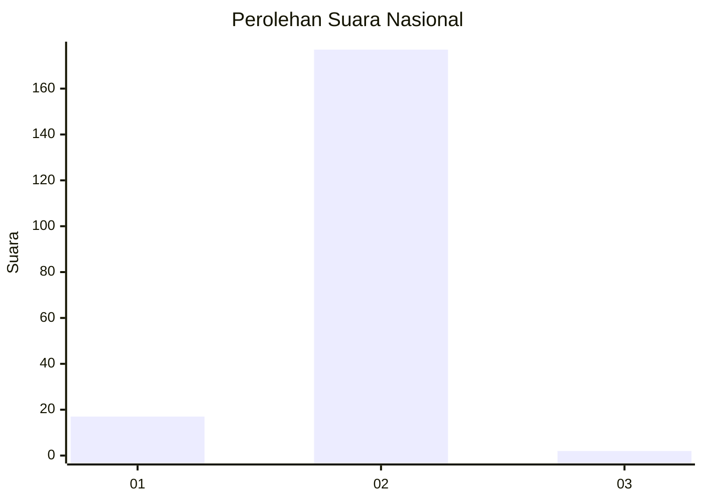
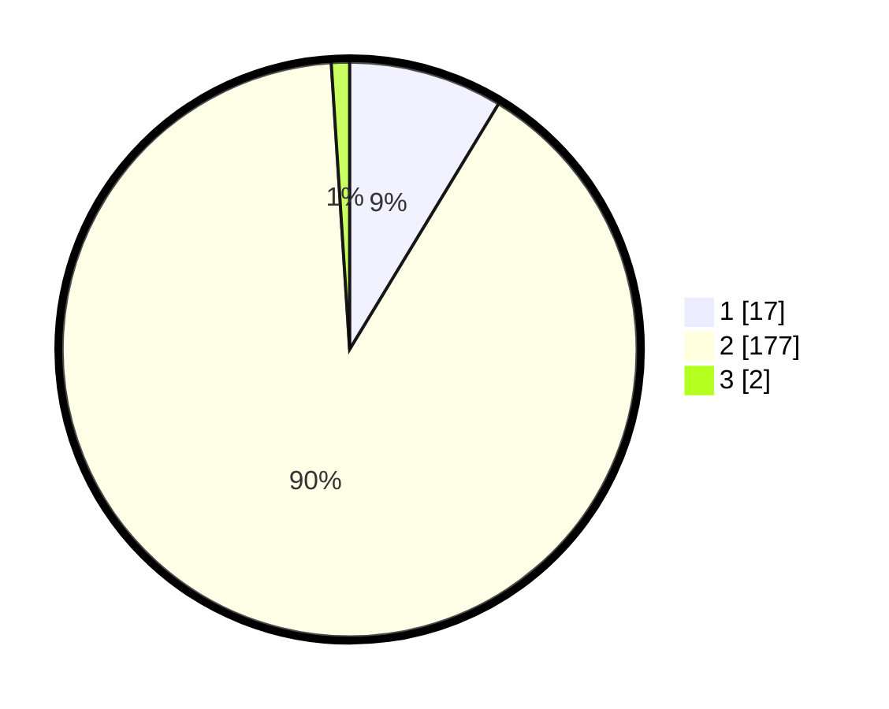

# Hasil

## Grafik

## Tabel

| No. | Nama Paslon    | Suara | Suara (raw) | Persentase |
|:--- |:-------------- | -----:| -----------:| ----------:|
| 1   | ANIES MUHAIMIN | 17    | [17][p-1]   | 8,67       |
| 2   | PRABOWO GIBRAN | 177   | [177][p-2]  | 90,31      |
| 3   | GANJAR MAHFUD  | 2     | [2][p-3]    | 1,02       |

[p-1]: https://github.com/gigit-pemilu/pemilu-2024/blob/main/pilpres/hitung-suara/sub/73-sulawesi-selatan/sub/08-bone/sub/14-ulaweng/sub/2002-lilina-ajangale/sub/002-tps/sub/paslon-1.txt
[p-2]: https://github.com/gigit-pemilu/pemilu-2024/blob/main/pilpres/hitung-suara/sub/73-sulawesi-selatan/sub/08-bone/sub/14-ulaweng/sub/2002-lilina-ajangale/sub/002-tps/sub/paslon-2.txt
[p-3]: https://github.com/gigit-pemilu/pemilu-2024/blob/main/pilpres/hitung-suara/sub/73-sulawesi-selatan/sub/08-bone/sub/14-ulaweng/sub/2002-lilina-ajangale/sub/002-tps/sub/paslon-3.txt

## Foto C Plano

https://sirekap-obj-formc.kpu.go.id/ceee/pemilu/ppwp/73/08/14/20/02/7308142002002-20240215-010337--c7adf8e1-324c-4600-bf9e-d2044f3ba24f.jpg

https://sirekap-obj-formc.kpu.go.id/ceee/pemilu/ppwp/73/08/14/20/02/7308142002002-20240215-011111--029dcd42-2d0b-4954-adee-b7a5feab04fa.jpg

https://sirekap-obj-formc.kpu.go.id/ceee/pemilu/ppwp/73/08/14/20/02/7308142002002-20240215-011249--bea58d91-dfea-4216-afdf-0f6fa7b0a3d9.jpg

## Metadata

| Key        | Value               |
| ---------- | ------------------- |
| Time Stamp | 2024-02-16 12:51:22 |

