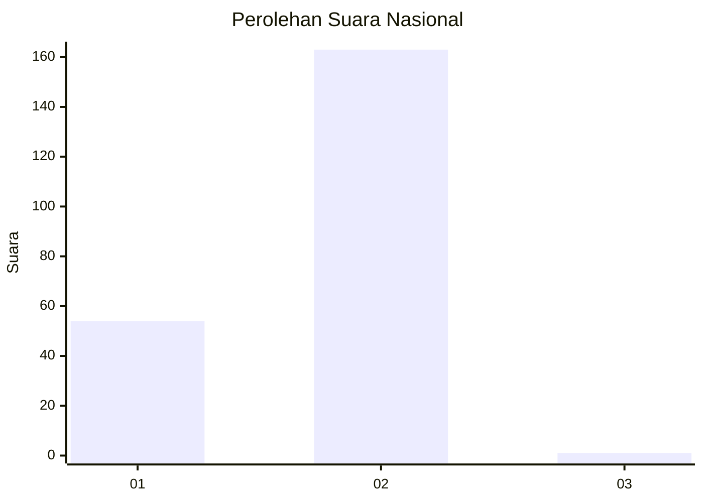
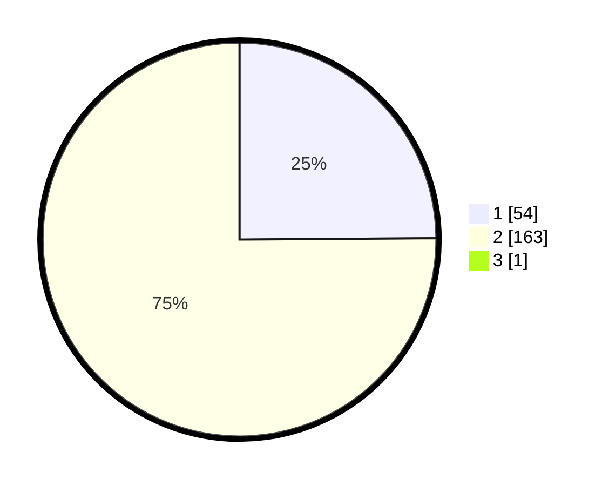

# Hasil

## Grafik

## Tabel

| No. | Nama Paslon    | Suara | Suara (raw) | Persentase |
|:--- |:-------------- | -----:| -----------:| ----------:|
| 1   | ANIES MUHAIMIN | 54    | [54][p-1]   | 24,77      |
| 2   | PRABOWO GIBRAN | 163   | [163][p-2]  | 74,77      |
| 3   | GANJAR MAHFUD  | 1     | [1][p-3]    | 0,46       |

[p-1]: https://github.com/gigit-pemilu/pemilu-2024/blob/main/pilpres/hitung-suara/sub/73-sulawesi-selatan/sub/08-bone/sub/15-palakka/sub/2011-mattanete-bua/sub/004-tps/sub/paslon-1.txt
[p-2]: https://github.com/gigit-pemilu/pemilu-2024/blob/main/pilpres/hitung-suara/sub/73-sulawesi-selatan/sub/08-bone/sub/15-palakka/sub/2011-mattanete-bua/sub/004-tps/sub/paslon-2.txt
[p-3]: https://github.com/gigit-pemilu/pemilu-2024/blob/main/pilpres/hitung-suara/sub/73-sulawesi-selatan/sub/08-bone/sub/15-palakka/sub/2011-mattanete-bua/sub/004-tps/sub/paslon-3.txt

## Foto C Plano

https://sirekap-obj-formc.kpu.go.id/c7b5/pemilu/ppwp/73/08/15/20/11/7308152011004-20240214-191648--f9724a13-300e-4f08-b970-9d517d4db379.jpg

https://sirekap-obj-formc.kpu.go.id/c7b5/pemilu/ppwp/73/08/15/20/11/7308152011004-20240214-192057--6ec011ba-858b-4599-bc45-068c4e259d75.jpg

https://sirekap-obj-formc.kpu.go.id/c7b5/pemilu/ppwp/73/08/15/20/11/7308152011004-20240214-192809--93c81f02-85dd-4f66-907f-ed402407e45c.jpg

## Metadata

| Key        | Value               |
| ---------- | ------------------- |
| Time Stamp | 2024-02-14 21:46:01 |

