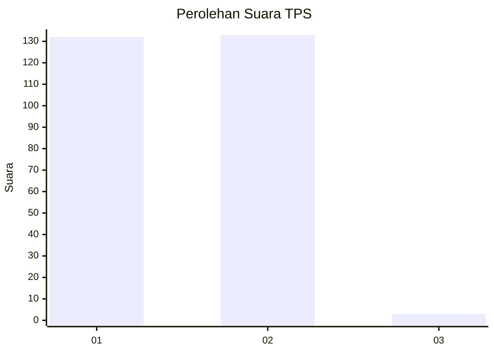
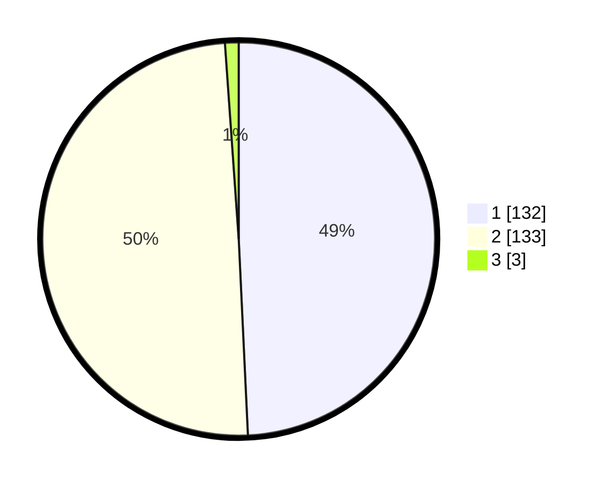

# Hasil

## Grafik

## Tabel

| No. | Nama Paslon    | Suara | Suara (raw) | Persentase |
|:--- |:-------------- | -----:| -----------:| ----------:|
| 1   | ANIES MUHAIMIN | 132   | [132][p-1]  | 49,25      |
| 2   | PRABOWO GIBRAN | 133   | [133][p-2]  | 49,63      |
| 3   | GANJAR MAHFUD  | 3     | [3][p-3]    | 1,12       |

[p-1]: https://github.com/gigit-pemilu/pemilu-2024-73-sulawesi-selatan/blob/main/pilpres/hitung-suara/sub/73-sulawesi-selatan/sub/08-bone/sub/16-awangpone/sub/2009-mallari/sub/002-tps/sub/paslon-1.txt
[p-2]: https://github.com/gigit-pemilu/pemilu-2024-73-sulawesi-selatan/blob/main/pilpres/hitung-suara/sub/73-sulawesi-selatan/sub/08-bone/sub/16-awangpone/sub/2009-mallari/sub/002-tps/sub/paslon-2.txt
[p-3]: https://github.com/gigit-pemilu/pemilu-2024-73-sulawesi-selatan/blob/main/pilpres/hitung-suara/sub/73-sulawesi-selatan/sub/08-bone/sub/16-awangpone/sub/2009-mallari/sub/002-tps/sub/paslon-3.txt

## Foto C Plano

https://sirekap-obj-formc.kpu.go.id/d9b6/pemilu/ppwp/73/08/16/20/09/7308162009002-20240218-114742--2b0206b0-13ad-4624-956d-2416892e7f34.jpg

https://sirekap-obj-formc.kpu.go.id/d9b6/pemilu/ppwp/73/08/16/20/09/7308162009002-20240215-024909--9bcc5aeb-468f-45ab-a1a1-5f2572ff60ab.jpg

https://sirekap-obj-formc.kpu.go.id/d9b6/pemilu/ppwp/73/08/16/20/09/7308162009002-20240215-025001--4512757d-b11f-4add-92c9-87ab86248e39.jpg

## Metadata

| Key        | Value               |
| ---------- | ------------------- |
| Time Stamp | 2024-02-19 06:16:00 |

