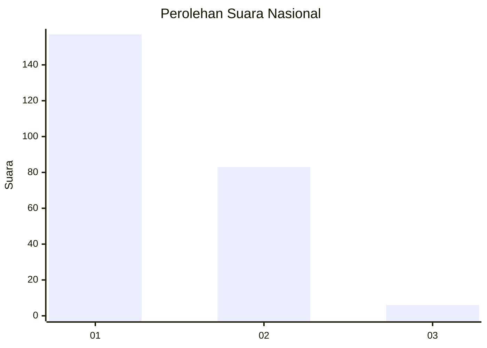
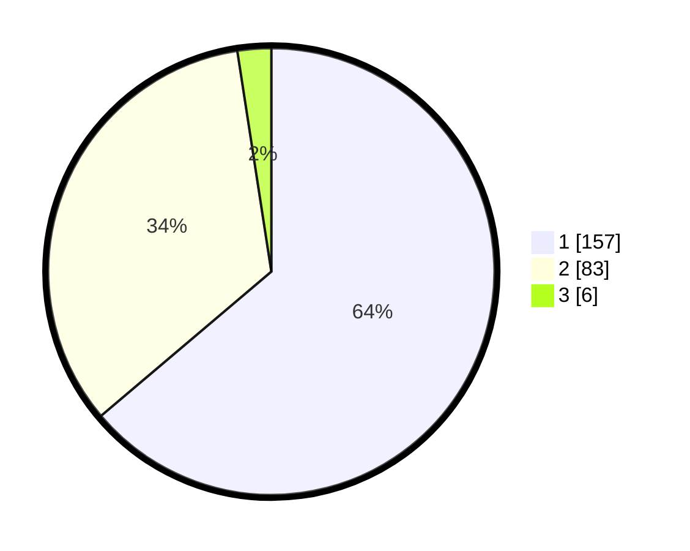

# Hasil

## Grafik

## Tabel

| No. | Nama Paslon    | Suara | Suara (raw) | Persentase |
|:--- |:-------------- | -----:| -----------:| ----------:|
| 1   | ANIES MUHAIMIN | 157   | [157][p-1]  | 63,82      |
| 2   | PRABOWO GIBRAN | 83    | [83][p-2]   | 33,74      |
| 3   | GANJAR MAHFUD  | 6     | [6][p-3]    | 2,44       |

[p-1]: https://github.com/gigit-pemilu/pemilu-2024/blob/main/pilpres/hitung-suara/sub/73-sulawesi-selatan/sub/08-bone/sub/16-awangpone/sub/2010-kajuara/sub/004-tps/sub/paslon-1.txt
[p-2]: https://github.com/gigit-pemilu/pemilu-2024/blob/main/pilpres/hitung-suara/sub/73-sulawesi-selatan/sub/08-bone/sub/16-awangpone/sub/2010-kajuara/sub/004-tps/sub/paslon-2.txt
[p-3]: https://github.com/gigit-pemilu/pemilu-2024/blob/main/pilpres/hitung-suara/sub/73-sulawesi-selatan/sub/08-bone/sub/16-awangpone/sub/2010-kajuara/sub/004-tps/sub/paslon-3.txt

## Foto C Plano

https://sirekap-obj-formc.kpu.go.id/eb79/pemilu/ppwp/73/08/16/20/10/7308162010004-20240220-153040--f06d4336-f5d9-4fb3-b820-80f7b351b3c3.jpg

https://sirekap-obj-formc.kpu.go.id/eb79/pemilu/ppwp/73/08/16/20/10/7308162010004-20240220-190915--4ebb4f08-fb9f-4551-967a-bc23e4405dc1.jpg

https://sirekap-obj-formc.kpu.go.id/eb79/pemilu/ppwp/73/08/16/20/10/7308162010004-20240220-190914--fe27c1e2-62da-457a-917d-4c82b690f259.jpg

## Metadata

| Key        | Value               |
| ---------- | ------------------- |
| Time Stamp | 2024-02-21 12:00:00 |

