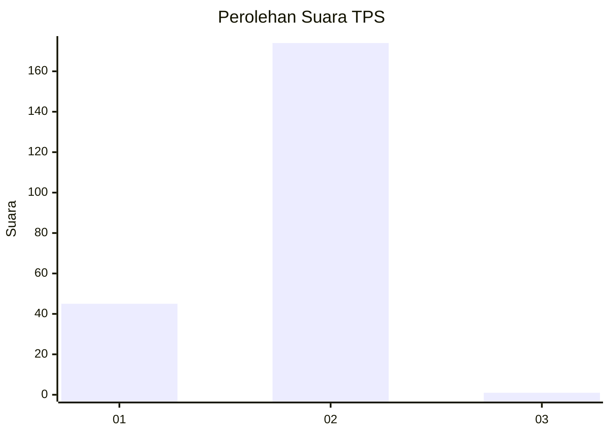
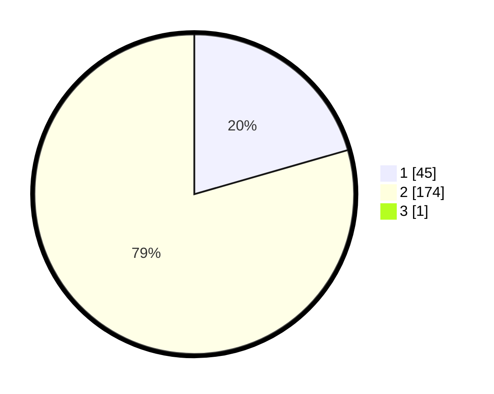

# Hasil

## Grafik

## Tabel

| No. | Nama Paslon    | Suara | Suara (raw) | Persentase |
|:--- |:-------------- | -----:| -----------:| ----------:|
| 1   | ANIES MUHAIMIN | 45    | [45][p-1]   | 20,45      |
| 2   | PRABOWO GIBRAN | 174   | [174][p-2]  | 79,09      |
| 3   | GANJAR MAHFUD  | 1     | [1][p-3]    | 0,45       |

[p-1]: https://github.com/gigit-pemilu/pemilu-2024-73-sulawesi-selatan/blob/main/pilpres/hitung-suara/sub/73-sulawesi-selatan/sub/08-bone/sub/19-dua-boccoe/sub/1001-unyi/sub/001-tps/sub/paslon-1.txt
[p-2]: https://github.com/gigit-pemilu/pemilu-2024-73-sulawesi-selatan/blob/main/pilpres/hitung-suara/sub/73-sulawesi-selatan/sub/08-bone/sub/19-dua-boccoe/sub/1001-unyi/sub/001-tps/sub/paslon-2.txt
[p-3]: https://github.com/gigit-pemilu/pemilu-2024-73-sulawesi-selatan/blob/main/pilpres/hitung-suara/sub/73-sulawesi-selatan/sub/08-bone/sub/19-dua-boccoe/sub/1001-unyi/sub/001-tps/sub/paslon-3.txt

## Foto C Plano

https://sirekap-obj-formc.kpu.go.id/4511/pemilu/ppwp/73/08/19/10/01/7308191001001-20240217-194949--b296e93d-913f-44d8-91d2-90b281434a4b.jpg

https://sirekap-obj-formc.kpu.go.id/4511/pemilu/ppwp/73/08/19/10/01/7308191001001-20240217-193847--b971f820-1902-46e4-93cf-8f713cc07fe9.jpg

https://sirekap-obj-formc.kpu.go.id/4511/pemilu/ppwp/73/08/19/10/01/7308191001001-20240217-193731--220fca87-5af3-42e3-8aad-6f8234bec4bd.jpg

## Metadata

| Key        | Value               |
| ---------- | ------------------- |
| Time Stamp | 2024-02-20 12:00:00 |

