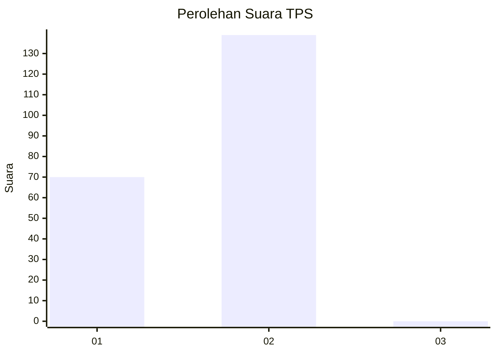
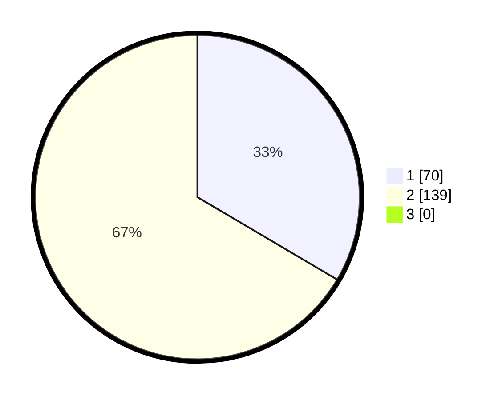

# Hasil

## Grafik

## Tabel

| No. | Nama Paslon    | Suara | Suara (raw) | Persentase |
|:--- |:-------------- | -----:| -----------:| ----------:|
| 1   | ANIES MUHAIMIN | 70    | [70][p-1]   | 33,49      |
| 2   | PRABOWO GIBRAN | 139   | [139][p-2]  | 66,51      |
| 3   | GANJAR MAHFUD  | 0     | [0][p-3]    | 0,00       |

[p-1]: https://github.com/gigit-pemilu/pemilu-2024-73-sulawesi-selatan/blob/main/pilpres/hitung-suara/sub/73-sulawesi-selatan/sub/08-bone/sub/19-dua-boccoe/sub/1001-unyi/sub/003-tps/sub/paslon-1.txt
[p-2]: https://github.com/gigit-pemilu/pemilu-2024-73-sulawesi-selatan/blob/main/pilpres/hitung-suara/sub/73-sulawesi-selatan/sub/08-bone/sub/19-dua-boccoe/sub/1001-unyi/sub/003-tps/sub/paslon-2.txt
[p-3]: https://github.com/gigit-pemilu/pemilu-2024-73-sulawesi-selatan/blob/main/pilpres/hitung-suara/sub/73-sulawesi-selatan/sub/08-bone/sub/19-dua-boccoe/sub/1001-unyi/sub/003-tps/sub/paslon-3.txt

## Foto C Plano

https://sirekap-obj-formc.kpu.go.id/8aa8/pemilu/ppwp/73/08/19/10/01/7308191001003-20240217-154041--5a661cb0-e88e-4af0-aef5-fe85040eecea.jpg

https://sirekap-obj-formc.kpu.go.id/8aa8/pemilu/ppwp/73/08/19/10/01/7308191001003-20240217-154935--c55cfcde-1e13-4805-8f55-fd770d0fe5b8.jpg

https://sirekap-obj-formc.kpu.go.id/8aa8/pemilu/ppwp/73/08/19/10/01/7308191001003-20240217-155621--665044b2-3853-4174-ad81-230c98a26580.jpg

## Metadata

| Key        | Value               |
| ---------- | ------------------- |
| Time Stamp | 2024-02-17 16:00:02 |

