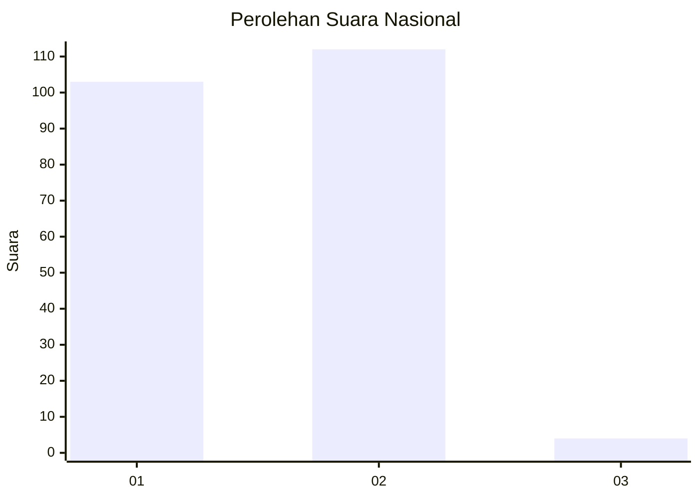
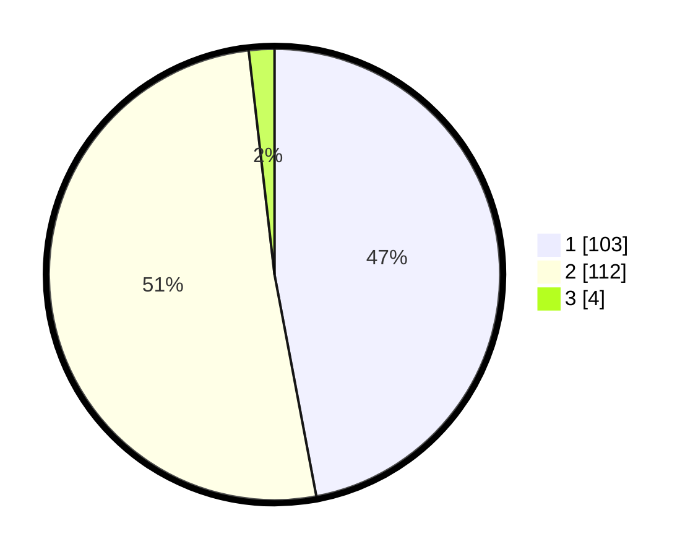

# Hasil

## Grafik

## Tabel

| No. | Nama Paslon    | Suara | Suara (raw) | Persentase |
|:--- |:-------------- | -----:| -----------:| ----------:|
| 1   | ANIES MUHAIMIN | 103   | [103][p-1]  | 47,03      |
| 2   | PRABOWO GIBRAN | 112   | [112][p-2]  | 51,14      |
| 3   | GANJAR MAHFUD  | 4     | [4][p-3]    | 1,83       |

[p-1]: https://github.com/gigit-pemilu/pemilu-2024/blob/main/pilpres/hitung-suara/sub/73-sulawesi-selatan/sub/08-bone/sub/20-cenrana/sub/2011-awang-cenrana/sub/001-tps/sub/paslon-1.txt
[p-2]: https://github.com/gigit-pemilu/pemilu-2024/blob/main/pilpres/hitung-suara/sub/73-sulawesi-selatan/sub/08-bone/sub/20-cenrana/sub/2011-awang-cenrana/sub/001-tps/sub/paslon-2.txt
[p-3]: https://github.com/gigit-pemilu/pemilu-2024/blob/main/pilpres/hitung-suara/sub/73-sulawesi-selatan/sub/08-bone/sub/20-cenrana/sub/2011-awang-cenrana/sub/001-tps/sub/paslon-3.txt

## Foto C Plano

https://sirekap-obj-formc.kpu.go.id/dc5d/pemilu/ppwp/73/08/20/20/11/7308202011001-20240217-205052--aa276ab2-b2be-4454-a180-c2d8b44ba5b3.jpg

https://sirekap-obj-formc.kpu.go.id/dc5d/pemilu/ppwp/73/08/20/20/11/7308202011001-20240217-205200--ce403c34-8c66-4ea3-a434-d60469b77a8d.jpg

https://sirekap-obj-formc.kpu.go.id/dc5d/pemilu/ppwp/73/08/20/20/11/7308202011001-20240217-205551--fc276e83-0761-448e-a5af-e7b951452a87.jpg

## Metadata

| Key        | Value               |
| ---------- | ------------------- |
| Time Stamp | 2024-02-20 12:00:00 |

