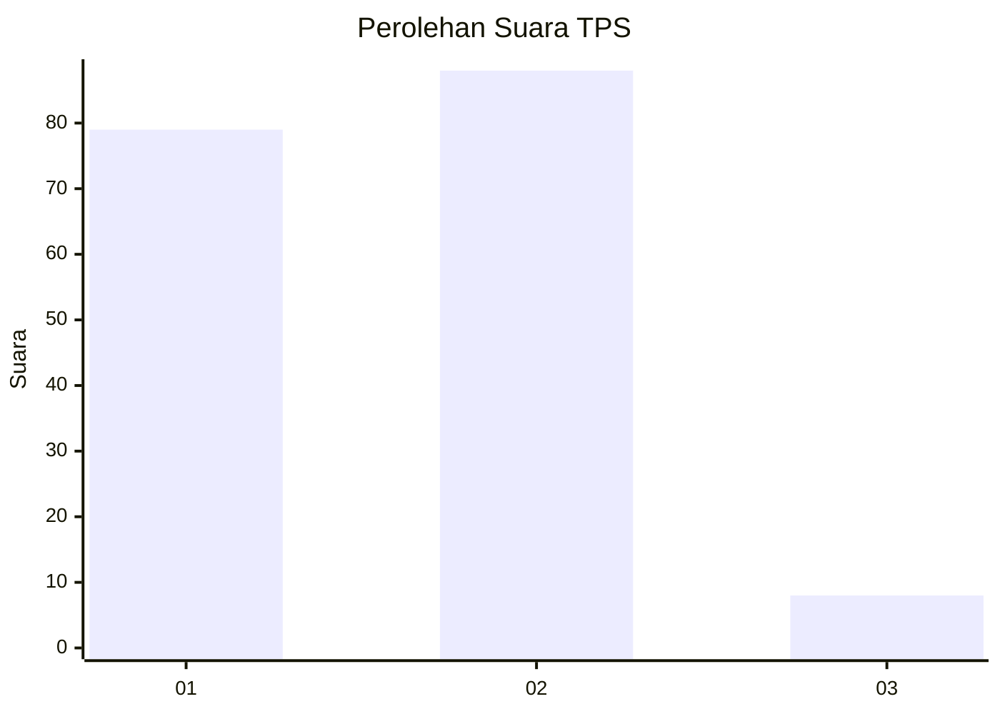
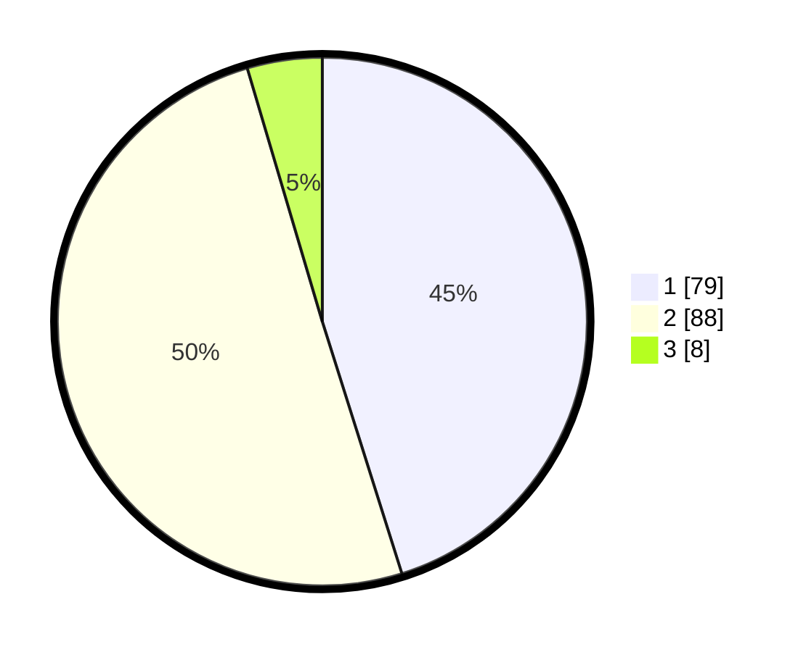

# Hasil

## Grafik

## Tabel

| No. | Nama Paslon    | Suara | Suara (raw) | Persentase |
|:--- |:-------------- | -----:| -----------:| ----------:|
| 1   | ANIES MUHAIMIN | 79    | [79][p-1]   | 45,14      |
| 2   | PRABOWO GIBRAN | 88    | [88][p-2]   | 50,29      |
| 3   | GANJAR MAHFUD  | 8     | [8][p-3]    | 4,57       |

[p-1]: https://github.com/gigit-pemilu/pemilu-2024-73-sulawesi-selatan/blob/main/pilpres/hitung-suara/sub/73-sulawesi-selatan/sub/08-bone/sub/22-tanete-riattang-barat/sub/1001-macege/sub/002-tps/sub/paslon-1.txt
[p-2]: https://github.com/gigit-pemilu/pemilu-2024-73-sulawesi-selatan/blob/main/pilpres/hitung-suara/sub/73-sulawesi-selatan/sub/08-bone/sub/22-tanete-riattang-barat/sub/1001-macege/sub/002-tps/sub/paslon-2.txt
[p-3]: https://github.com/gigit-pemilu/pemilu-2024-73-sulawesi-selatan/blob/main/pilpres/hitung-suara/sub/73-sulawesi-selatan/sub/08-bone/sub/22-tanete-riattang-barat/sub/1001-macege/sub/002-tps/sub/paslon-3.txt

## Foto C Plano

https://sirekap-obj-formc.kpu.go.id/fe68/pemilu/ppwp/73/08/22/10/01/7308221001002-20240215-093427--f2448fed-f3f6-40e6-8f70-c7d86e899244.jpg

https://sirekap-obj-formc.kpu.go.id/fe68/pemilu/ppwp/73/08/22/10/01/7308221001002-20240215-093710--43d32c57-8c40-4b72-bac7-ba3d9f1b2a7b.jpg

https://sirekap-obj-formc.kpu.go.id/fe68/pemilu/ppwp/73/08/22/10/01/7308221001002-20240215-093912--6c611127-9a3b-4748-aa6f-5773b842decd.jpg

## Metadata

| Key        | Value               |
| ---------- | ------------------- |
| Time Stamp | 2024-02-16 14:30:33 |

