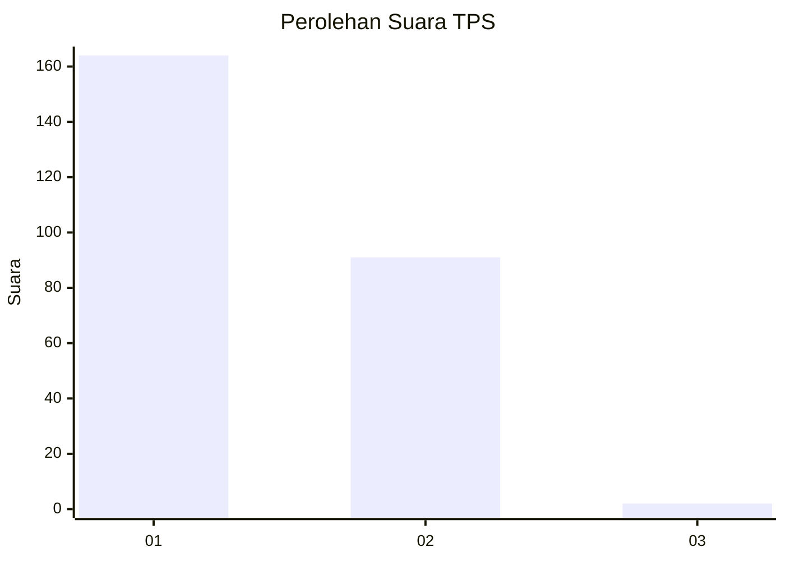
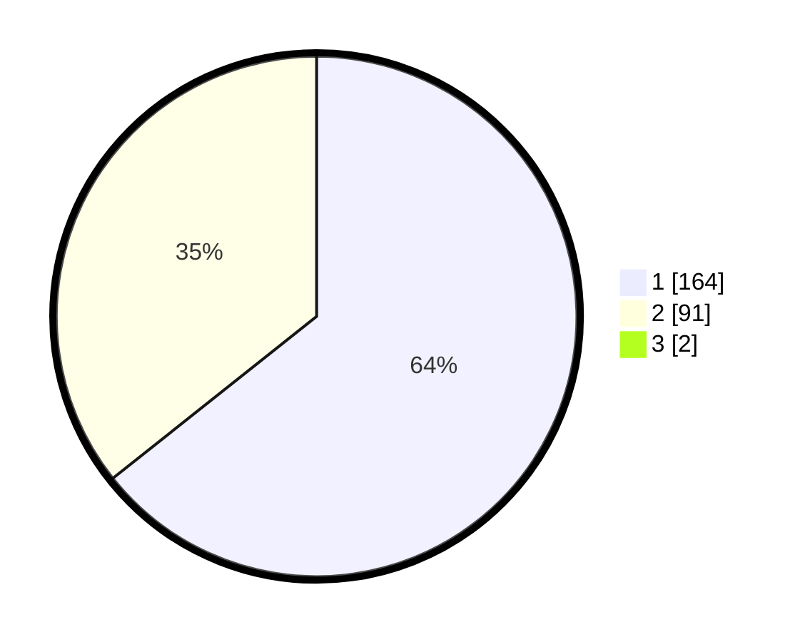

# Hasil

## Grafik

## Tabel

| No. | Nama Paslon    | Suara | Suara (raw) | Persentase |
|:--- |:-------------- | -----:| -----------:| ----------:|
| 1   | ANIES MUHAIMIN | 164   | [164][p-1]  | 63,81      |
| 2   | PRABOWO GIBRAN | 91    | [91][p-2]   | 35,41      |
| 3   | GANJAR MAHFUD  | 2     | [2][p-3]    | 0,78       |

[p-1]: https://github.com/gigit-pemilu/pemilu-2024-73-sulawesi-selatan/blob/main/pilpres/hitung-suara/sub/73-sulawesi-selatan/sub/08-bone/sub/23-tanete-riattang-timur/sub/1003-panyula/sub/001-tps/sub/paslon-1.txt
[p-2]: https://github.com/gigit-pemilu/pemilu-2024-73-sulawesi-selatan/blob/main/pilpres/hitung-suara/sub/73-sulawesi-selatan/sub/08-bone/sub/23-tanete-riattang-timur/sub/1003-panyula/sub/001-tps/sub/paslon-2.txt
[p-3]: https://github.com/gigit-pemilu/pemilu-2024-73-sulawesi-selatan/blob/main/pilpres/hitung-suara/sub/73-sulawesi-selatan/sub/08-bone/sub/23-tanete-riattang-timur/sub/1003-panyula/sub/001-tps/sub/paslon-3.txt

## Foto C Plano

https://sirekap-obj-formc.kpu.go.id/c805/pemilu/ppwp/73/08/23/10/03/7308231003001-20240215-002357--94c0c492-8e62-4585-b14e-0ac69f5a63ec.jpg

https://sirekap-obj-formc.kpu.go.id/c805/pemilu/ppwp/73/08/23/10/03/7308231003001-20240215-002534--f1d1a789-ed40-4f60-88d7-4d05e5d8e6ef.jpg

https://sirekap-obj-formc.kpu.go.id/c805/pemilu/ppwp/73/08/23/10/03/7308231003001-20240215-002635--2128d795-0ada-4907-bec6-1a7c1cf8923b.jpg

## Metadata

| Key        | Value               |
| ---------- | ------------------- |
| Time Stamp | 2024-02-16 14:30:33 |

