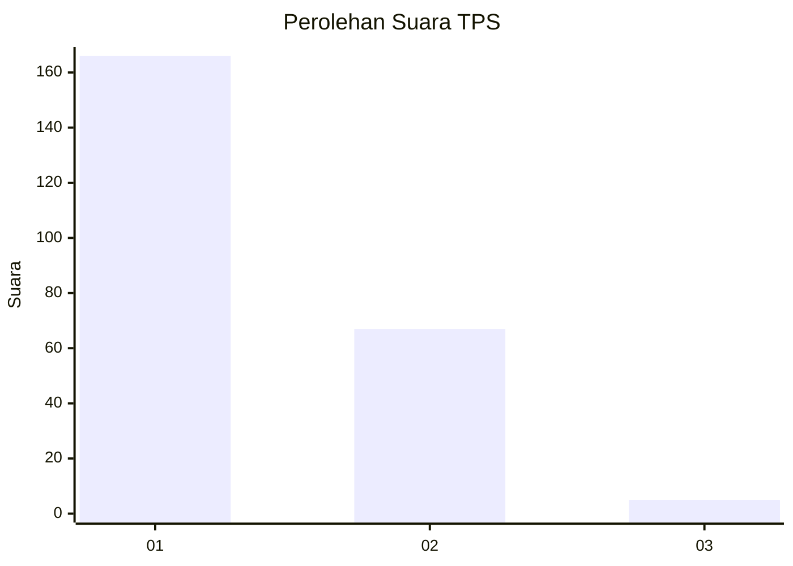
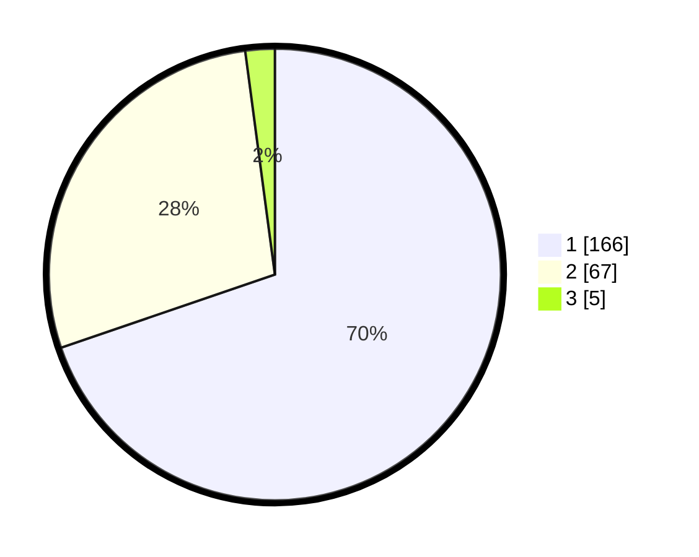

# Hasil

## Grafik

## Tabel

| No. | Nama Paslon    | Suara | Suara (raw) | Persentase |
|:--- |:-------------- | -----:| -----------:| ----------:|
| 1   | ANIES MUHAIMIN | 166   | [166][p-1]  | 69,75      |
| 2   | PRABOWO GIBRAN | 67    | [67][p-2]   | 28,15      |
| 3   | GANJAR MAHFUD  | 5     | [5][p-3]    | 2,10       |

[p-1]: https://github.com/gigit-pemilu/pemilu-2024-73-sulawesi-selatan/blob/main/pilpres/hitung-suara/sub/73-sulawesi-selatan/sub/08-bone/sub/24-amali/sub/1015-mampotu/sub/002-tps/sub/paslon-1.txt
[p-2]: https://github.com/gigit-pemilu/pemilu-2024-73-sulawesi-selatan/blob/main/pilpres/hitung-suara/sub/73-sulawesi-selatan/sub/08-bone/sub/24-amali/sub/1015-mampotu/sub/002-tps/sub/paslon-2.txt
[p-3]: https://github.com/gigit-pemilu/pemilu-2024-73-sulawesi-selatan/blob/main/pilpres/hitung-suara/sub/73-sulawesi-selatan/sub/08-bone/sub/24-amali/sub/1015-mampotu/sub/002-tps/sub/paslon-3.txt

## Foto C Plano

https://sirekap-obj-formc.kpu.go.id/7d91/pemilu/ppwp/73/08/24/10/15/7308241015002-20240215-020441--da6f3e62-9bb4-4faa-9ece-28d10864e570.jpg

https://sirekap-obj-formc.kpu.go.id/7d91/pemilu/ppwp/73/08/24/10/15/7308241015002-20240214-230059--0112431f-c51a-4a87-b5b9-967840b09fbe.jpg

https://sirekap-obj-formc.kpu.go.id/7d91/pemilu/ppwp/73/08/24/10/15/7308241015002-20240214-230234--387d743f-2171-4cdf-8c51-c0cd8a38a6c7.jpg

## Metadata

| Key        | Value               |
| ---------- | ------------------- |
| Time Stamp | 2024-02-16 16:25:10 |

