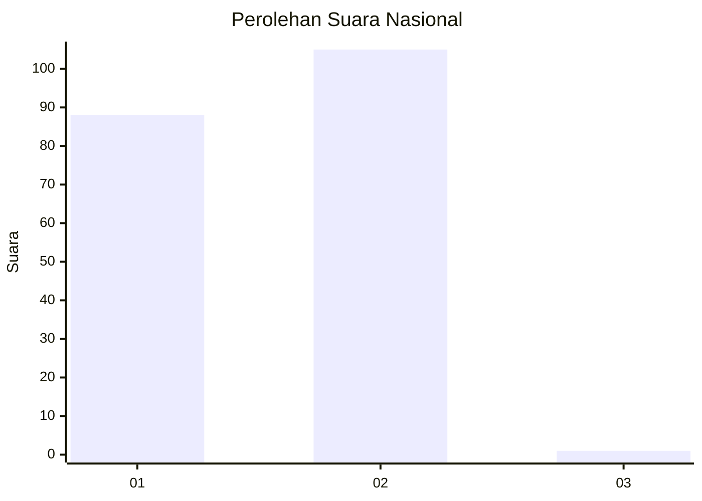
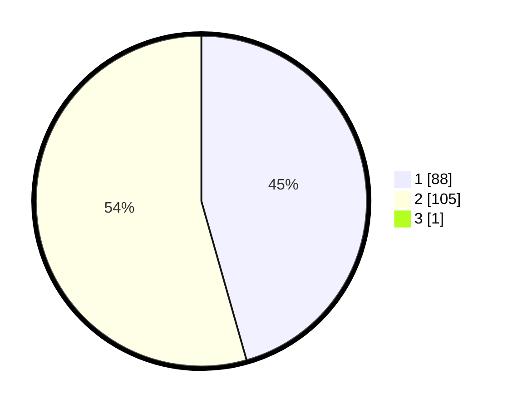

# Hasil

## Grafik

## Tabel

| No. | Nama Paslon    | Suara | Suara (raw) | Persentase |
|:--- |:-------------- | -----:| -----------:| ----------:|
| 1   | ANIES MUHAIMIN | 88    | [88][p-1]   | 45,36      |
| 2   | PRABOWO GIBRAN | 105   | [105][p-2]  | 54,12      |
| 3   | GANJAR MAHFUD  | 1     | [1][p-3]    | 0,52       |

[p-1]: https://github.com/gigit-pemilu/pemilu-2024/blob/main/pilpres/hitung-suara/sub/73-sulawesi-selatan/sub/08-bone/sub/24-amali/sub/1015-mampotu/sub/005-tps/sub/paslon-1.txt
[p-2]: https://github.com/gigit-pemilu/pemilu-2024/blob/main/pilpres/hitung-suara/sub/73-sulawesi-selatan/sub/08-bone/sub/24-amali/sub/1015-mampotu/sub/005-tps/sub/paslon-2.txt
[p-3]: https://github.com/gigit-pemilu/pemilu-2024/blob/main/pilpres/hitung-suara/sub/73-sulawesi-selatan/sub/08-bone/sub/24-amali/sub/1015-mampotu/sub/005-tps/sub/paslon-3.txt

## Foto C Plano

https://sirekap-obj-formc.kpu.go.id/7033/pemilu/ppwp/73/08/24/10/15/7308241015005-20240214-215723--0730d079-7659-4b84-a491-24f15fe17e26.jpg

https://sirekap-obj-formc.kpu.go.id/7033/pemilu/ppwp/73/08/24/10/15/7308241015005-20240214-220045--1d33954f-6823-45e2-907e-bd60dd1d9e0e.jpg

https://sirekap-obj-formc.kpu.go.id/7033/pemilu/ppwp/73/08/24/10/15/7308241015005-20240215-045211--da562a47-d2eb-44bb-a4fb-ef9be6a517e1.jpg

## Metadata

| Key        | Value               |
| ---------- | ------------------- |
| Time Stamp | 2024-02-15 05:00:24 |

