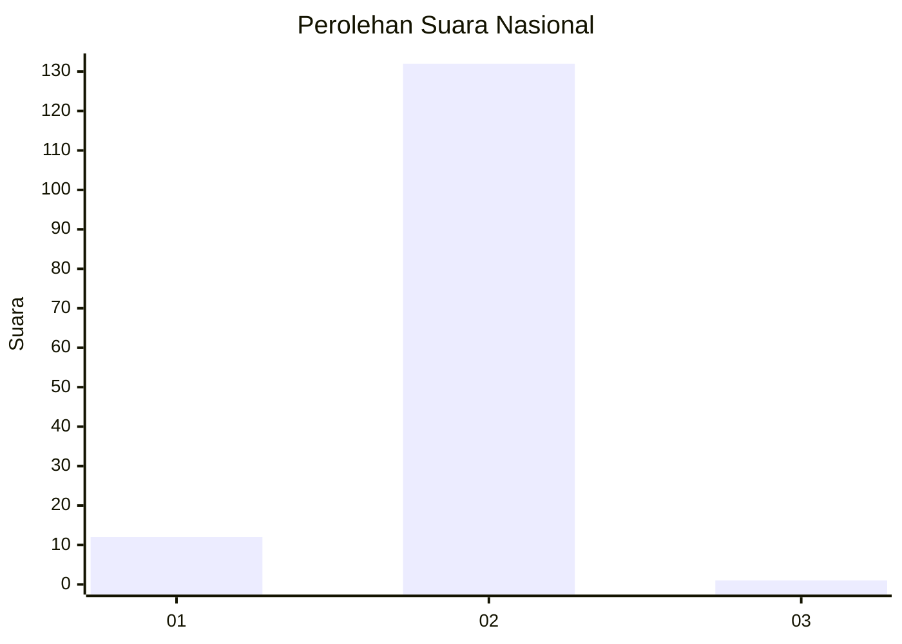
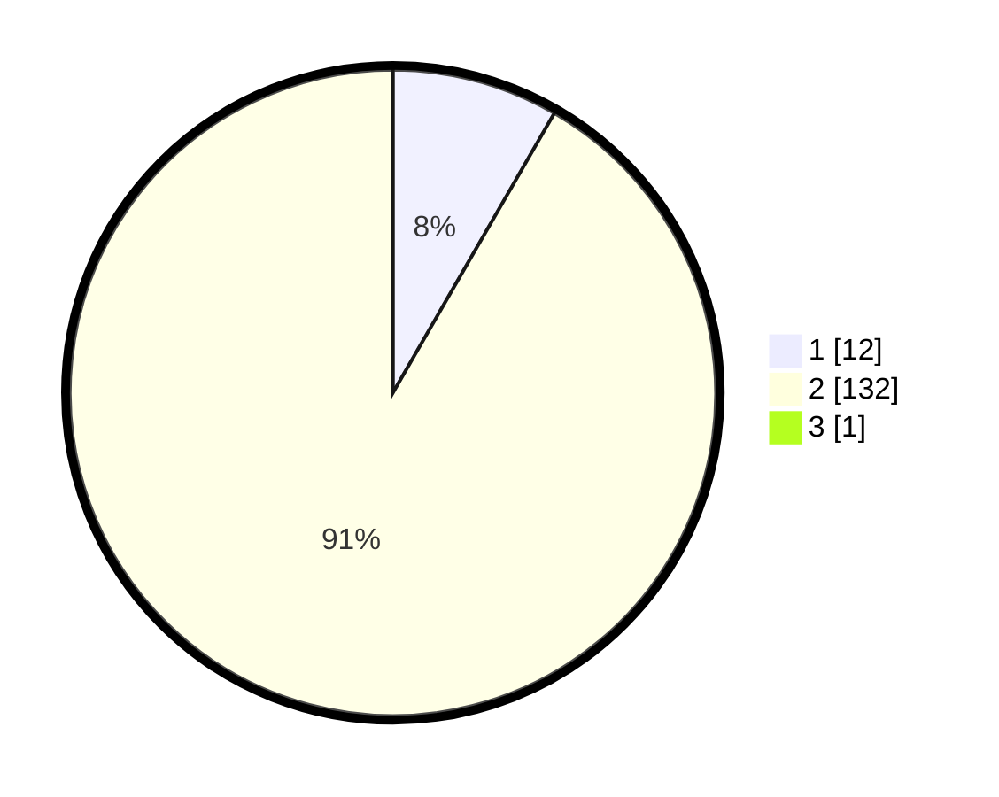

# Hasil

## Grafik

## Tabel

| No. | Nama Paslon    | Suara | Suara (raw) | Persentase |
|:--- |:-------------- | -----:| -----------:| ----------:|
| 1   | ANIES MUHAIMIN | 12    | [12][p-1]   | 8,28       |
| 2   | PRABOWO GIBRAN | 132   | [132][p-2]  | 91,03      |
| 3   | GANJAR MAHFUD  | 1     | [1][p-3]    | 0,69       |

[p-1]: https://github.com/gigit-pemilu/pemilu-2024/blob/main/pilpres/hitung-suara/sub/73-sulawesi-selatan/sub/08-bone/sub/27-patimpeng/sub/2010-bulu-ulaweng/sub/001-tps/sub/paslon-1.txt
[p-2]: https://github.com/gigit-pemilu/pemilu-2024/blob/main/pilpres/hitung-suara/sub/73-sulawesi-selatan/sub/08-bone/sub/27-patimpeng/sub/2010-bulu-ulaweng/sub/001-tps/sub/paslon-2.txt
[p-3]: https://github.com/gigit-pemilu/pemilu-2024/blob/main/pilpres/hitung-suara/sub/73-sulawesi-selatan/sub/08-bone/sub/27-patimpeng/sub/2010-bulu-ulaweng/sub/001-tps/sub/paslon-3.txt

## Foto C Plano

https://sirekap-obj-formc.kpu.go.id/5aef/pemilu/ppwp/73/08/27/20/10/7308272010001-20240215-053825--f23997c2-9656-4f5d-86a1-7f8863938956.jpg

https://sirekap-obj-formc.kpu.go.id/5aef/pemilu/ppwp/73/08/27/20/10/7308272010001-20240214-214633--3174a7aa-f15d-45ae-a1f7-3fb0e94d9e05.jpg

https://sirekap-obj-formc.kpu.go.id/5aef/pemilu/ppwp/73/08/27/20/10/7308272010001-20240215-054034--f854cb02-6ac5-458f-a44b-1a5609ae9580.jpg

## Metadata

| Key        | Value               |
| ---------- | ------------------- |
| Time Stamp | 2024-02-16 16:25:10 |

