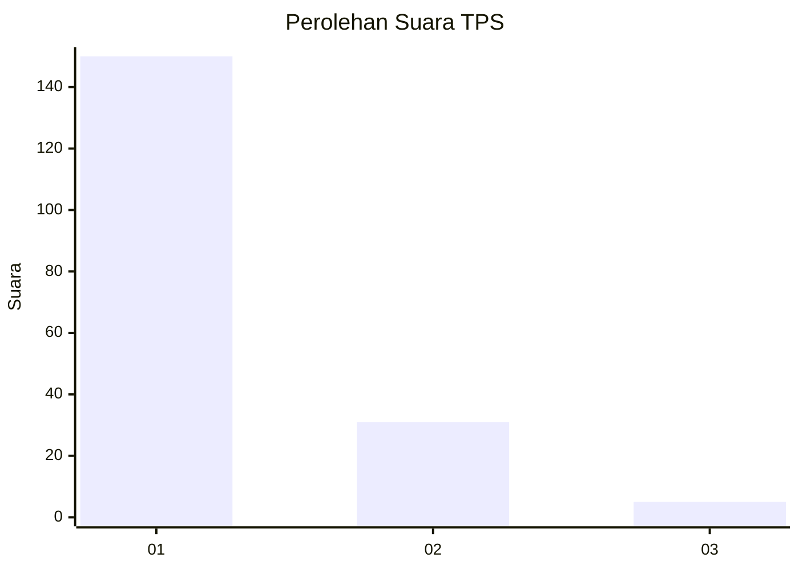
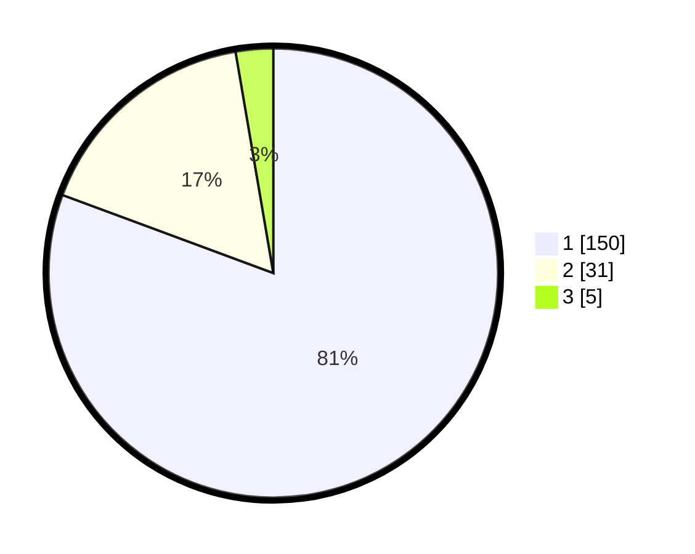

# Hasil

## Grafik

## Tabel

| No. | Nama Paslon    | Suara | Suara (raw) | Persentase |
|:--- |:-------------- | -----:| -----------:| ----------:|
| 1   | ANIES MUHAIMIN | 150   | [150][p-1]  | 80,65      |
| 2   | PRABOWO GIBRAN | 31    | [31][p-2]   | 16,67      |
| 3   | GANJAR MAHFUD  | 5     | [5][p-3]    | 2,69       |

[p-1]: https://github.com/gigit-pemilu/pemilu-2024-73-sulawesi-selatan/blob/main/pilpres/hitung-suara/sub/73-sulawesi-selatan/sub/09-maros/sub/01-mandai/sub/1002-bontoa/sub/045-tps/sub/paslon-1.txt
[p-2]: https://github.com/gigit-pemilu/pemilu-2024-73-sulawesi-selatan/blob/main/pilpres/hitung-suara/sub/73-sulawesi-selatan/sub/09-maros/sub/01-mandai/sub/1002-bontoa/sub/045-tps/sub/paslon-2.txt
[p-3]: https://github.com/gigit-pemilu/pemilu-2024-73-sulawesi-selatan/blob/main/pilpres/hitung-suara/sub/73-sulawesi-selatan/sub/09-maros/sub/01-mandai/sub/1002-bontoa/sub/045-tps/sub/paslon-3.txt

## Foto C Plano

https://sirekap-obj-formc.kpu.go.id/b24b/pemilu/ppwp/73/09/01/10/02/7309011002045-20240215-124925--8adf17cf-5175-4b9f-ad72-4d00aa3e6860.jpg

https://sirekap-obj-formc.kpu.go.id/b24b/pemilu/ppwp/73/09/01/10/02/7309011002045-20240215-125017--b7524832-b230-4dc1-8707-eda50a19ce6a.jpg

https://sirekap-obj-formc.kpu.go.id/b24b/pemilu/ppwp/73/09/01/10/02/7309011002045-20240215-125100--e9448868-c22b-4b07-9360-faa66d959c11.jpg

## Metadata

| Key        | Value               |
| ---------- | ------------------- |
| Time Stamp | 2024-02-19 06:16:00 |

