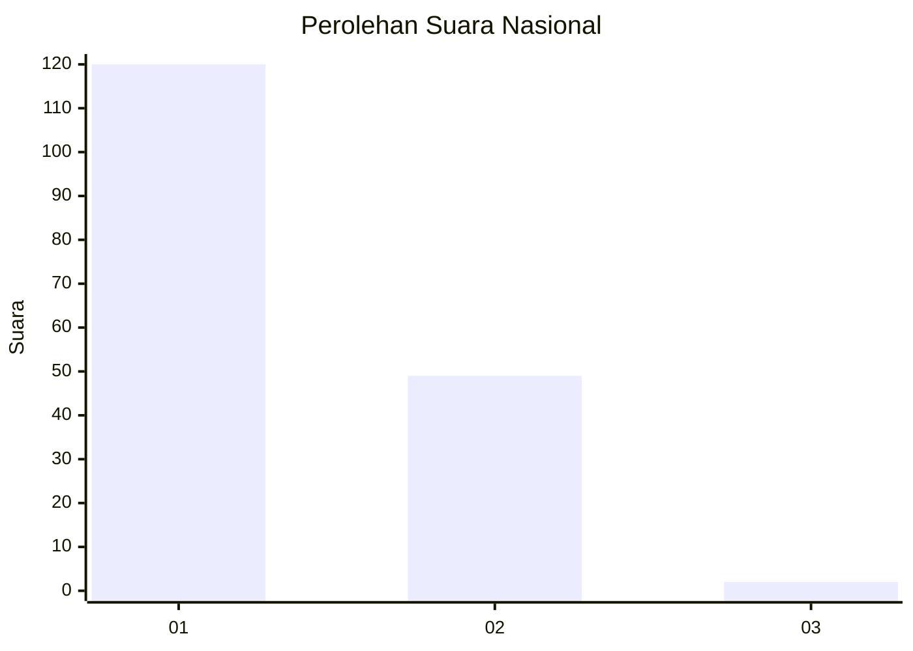
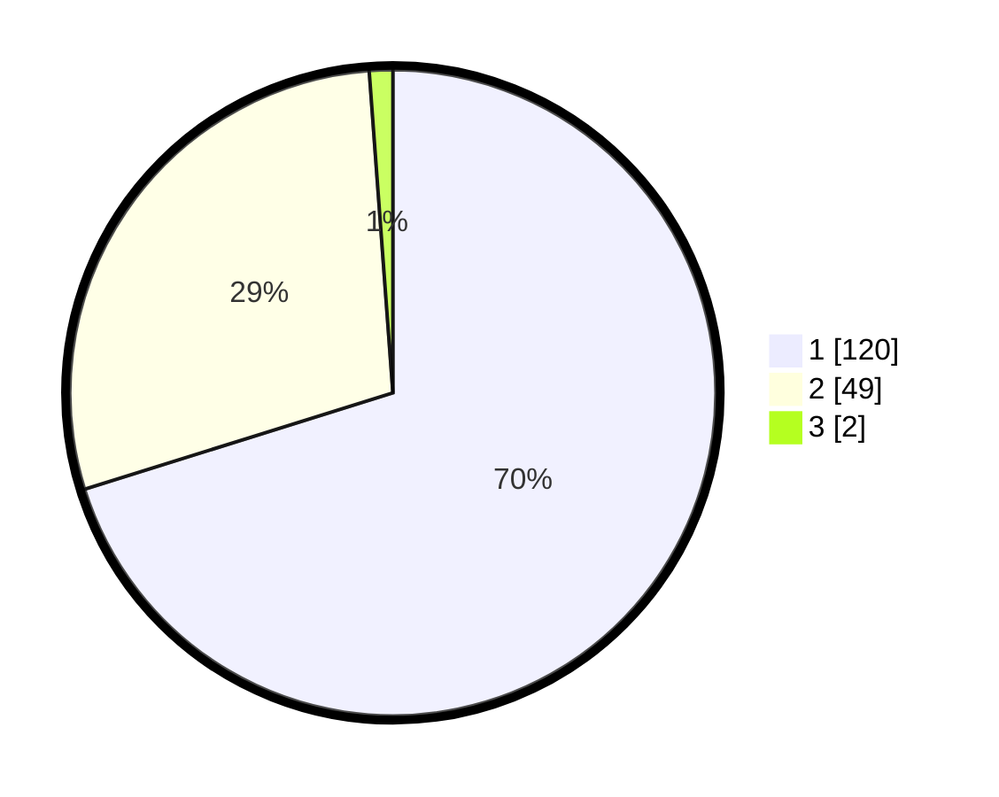

# Hasil

## Grafik

## Tabel

| No. | Nama Paslon    | Suara | Suara (raw) | Persentase |
|:--- |:-------------- | -----:| -----------:| ----------:|
| 1   | ANIES MUHAIMIN | 120   | [120][p-1]  | 70,18      |
| 2   | PRABOWO GIBRAN | 49    | [49][p-2]   | 28,65      |
| 3   | GANJAR MAHFUD  | 2     | [2][p-3]    | 1,17       |

[p-1]: https://github.com/gigit-pemilu/pemilu-2024/blob/main/pilpres/hitung-suara/sub/73-sulawesi-selatan/sub/09-maros/sub/02-camba/sub/1001-cempaniga/sub/002-tps/sub/paslon-1.txt
[p-2]: https://github.com/gigit-pemilu/pemilu-2024/blob/main/pilpres/hitung-suara/sub/73-sulawesi-selatan/sub/09-maros/sub/02-camba/sub/1001-cempaniga/sub/002-tps/sub/paslon-2.txt
[p-3]: https://github.com/gigit-pemilu/pemilu-2024/blob/main/pilpres/hitung-suara/sub/73-sulawesi-selatan/sub/09-maros/sub/02-camba/sub/1001-cempaniga/sub/002-tps/sub/paslon-3.txt

## Foto C Plano

https://sirekap-obj-formc.kpu.go.id/1ad7/pemilu/ppwp/73/09/02/10/01/7309021001002-20240214-203424--1b88a4e1-9f89-4b25-9ad7-72014dd2384d.jpg

https://sirekap-obj-formc.kpu.go.id/1ad7/pemilu/ppwp/73/09/02/10/01/7309021001002-20240214-203548--b5f07252-1470-4fa0-a1b3-d7d0265dbed0.jpg

https://sirekap-obj-formc.kpu.go.id/1ad7/pemilu/ppwp/73/09/02/10/01/7309021001002-20240214-203705--8f51b7b2-5838-4abf-843c-faa451f8f25b.jpg

## Metadata

| Key        | Value               |
| ---------- | ------------------- |
| Time Stamp | 2024-02-17 17:30:00 |

