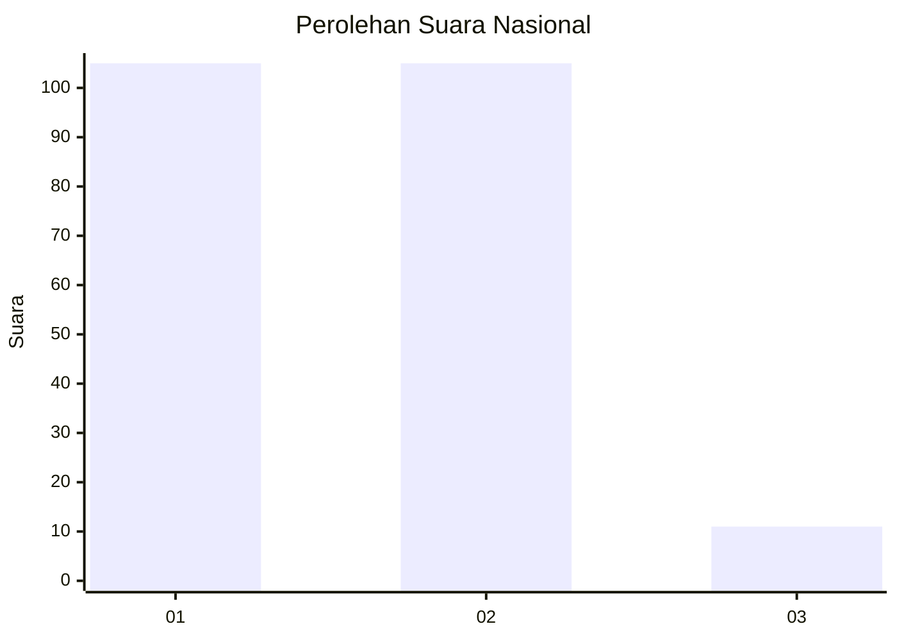
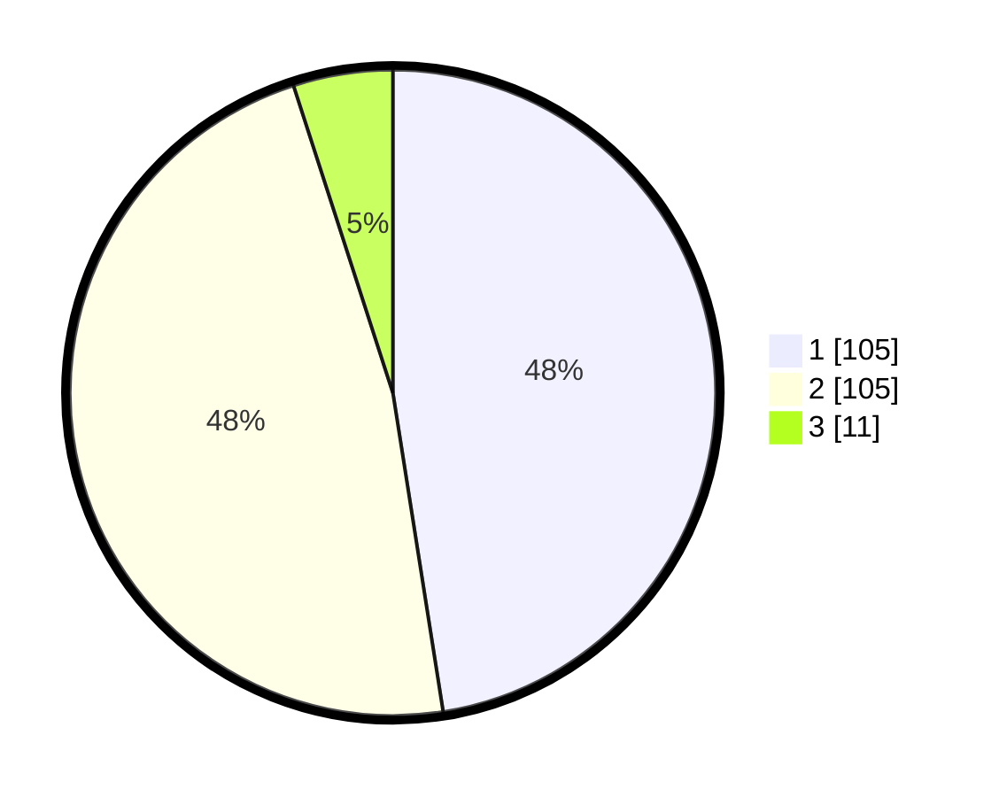

# Hasil

## Grafik

## Tabel

| No. | Nama Paslon    | Suara | Suara (raw) | Persentase |
|:--- |:-------------- | -----:| -----------:| ----------:|
| 1   | ANIES MUHAIMIN | 105   | [105][p-1]  | 47,51      |
| 2   | PRABOWO GIBRAN | 105   | [105][p-2]  | 47,51      |
| 3   | GANJAR MAHFUD  | 11    | [11][p-3]   | 4,98       |

[p-1]: https://github.com/gigit-pemilu/pemilu-2024/blob/main/pilpres/hitung-suara/sub/73-sulawesi-selatan/sub/09-maros/sub/04-maros-baru/sub/1001-baji-pa'mai/sub/006-tps/sub/paslon-1.txt
[p-2]: https://github.com/gigit-pemilu/pemilu-2024/blob/main/pilpres/hitung-suara/sub/73-sulawesi-selatan/sub/09-maros/sub/04-maros-baru/sub/1001-baji-pa'mai/sub/006-tps/sub/paslon-2.txt
[p-3]: https://github.com/gigit-pemilu/pemilu-2024/blob/main/pilpres/hitung-suara/sub/73-sulawesi-selatan/sub/09-maros/sub/04-maros-baru/sub/1001-baji-pa'mai/sub/006-tps/sub/paslon-3.txt

## Foto C Plano

https://sirekap-obj-formc.kpu.go.id/c0f4/pemilu/ppwp/73/09/04/10/01/7309041001006-20240214-222235--175bd5f9-2289-477e-af81-0d71f1307b3f.jpg

https://sirekap-obj-formc.kpu.go.id/c0f4/pemilu/ppwp/73/09/04/10/01/7309041001006-20240214-222521--4b237f80-ee64-4455-88e9-6575f117dee5.jpg

https://sirekap-obj-formc.kpu.go.id/c0f4/pemilu/ppwp/73/09/04/10/01/7309041001006-20240214-222613--2247a044-6a66-46d4-9f89-1a3d046f3f8f.jpg

## Metadata

| Key        | Value               |
| ---------- | ------------------- |
| Time Stamp | 2024-02-21 12:00:00 |

