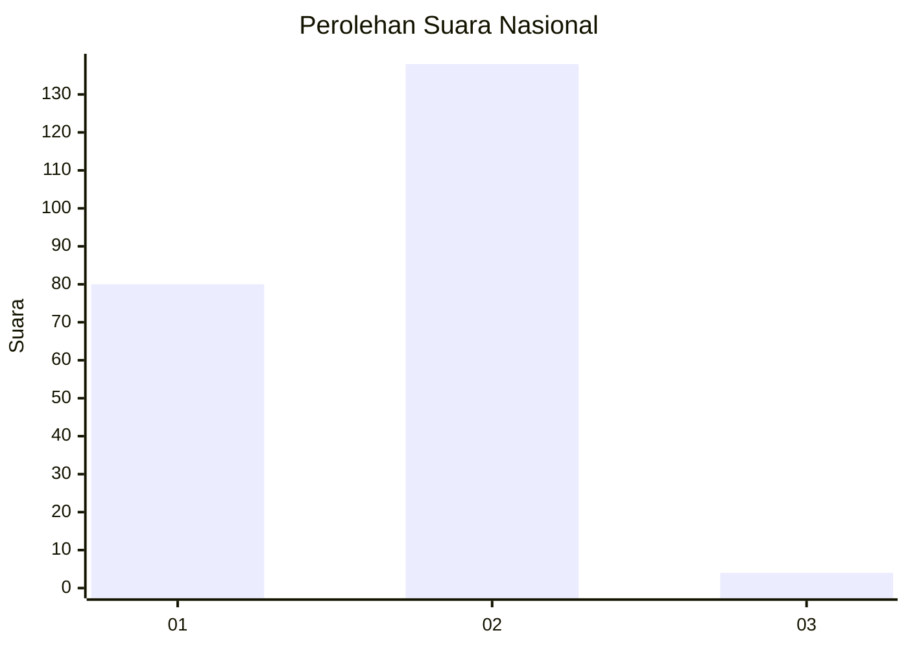
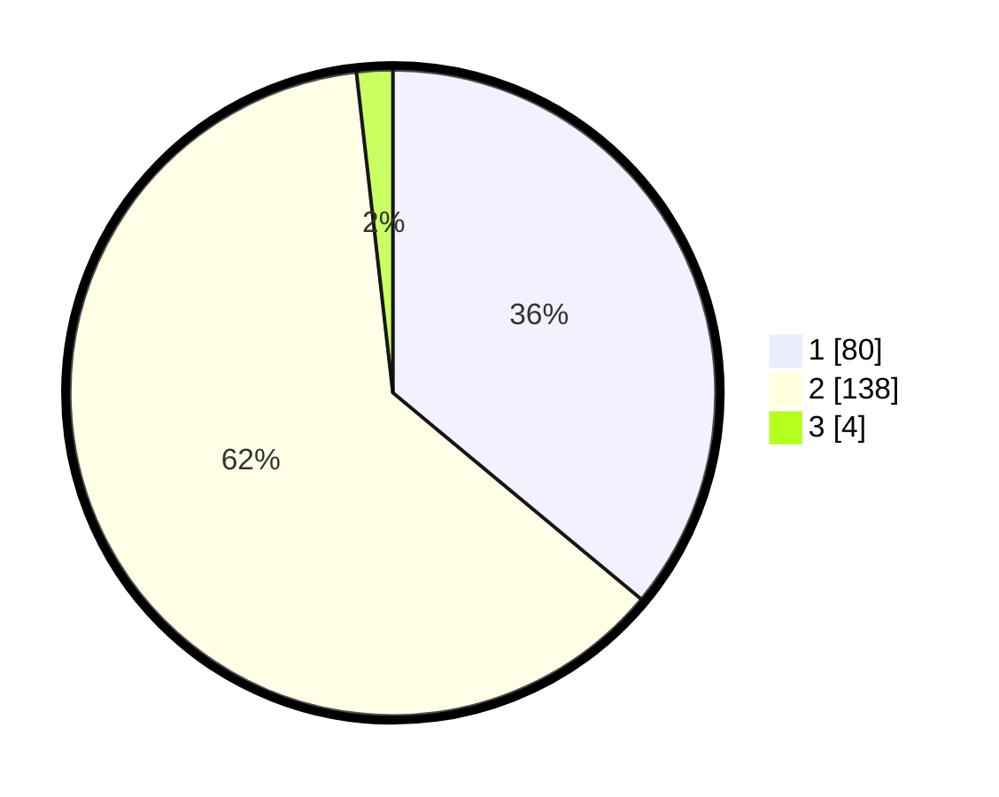

# Hasil

## Grafik

## Tabel

| No. | Nama Paslon    | Suara | Suara (raw) | Persentase |
|:--- |:-------------- | -----:| -----------:| ----------:|
| 1   | ANIES MUHAIMIN | 80    | [80][p-1]   | 36,04      |
| 2   | PRABOWO GIBRAN | 138   | [138][p-2]  | 62,16      |
| 3   | GANJAR MAHFUD  | 4     | [4][p-3]    | 1,80       |

[p-1]: https://github.com/gigit-pemilu/pemilu-2024/blob/main/pilpres/hitung-suara/sub/73-sulawesi-selatan/sub/09-maros/sub/05-bontoa/sub/1001-bontoa/sub/002-tps/sub/paslon-1.txt
[p-2]: https://github.com/gigit-pemilu/pemilu-2024/blob/main/pilpres/hitung-suara/sub/73-sulawesi-selatan/sub/09-maros/sub/05-bontoa/sub/1001-bontoa/sub/002-tps/sub/paslon-2.txt
[p-3]: https://github.com/gigit-pemilu/pemilu-2024/blob/main/pilpres/hitung-suara/sub/73-sulawesi-selatan/sub/09-maros/sub/05-bontoa/sub/1001-bontoa/sub/002-tps/sub/paslon-3.txt

## Foto C Plano

https://sirekap-obj-formc.kpu.go.id/889e/pemilu/ppwp/73/09/05/10/01/7309051001002-20240217-072833--4d5fecc1-3c28-404c-8fdf-585b815653df.jpg

https://sirekap-obj-formc.kpu.go.id/889e/pemilu/ppwp/73/09/05/10/01/7309051001002-20240217-075610--0282be28-e7b2-423d-8f81-ab9cc6bb54d6.jpg

https://sirekap-obj-formc.kpu.go.id/889e/pemilu/ppwp/73/09/05/10/01/7309051001002-20240217-075830--759581c0-7297-448e-af1a-3e8e7ae178d0.jpg

## Metadata

| Key        | Value               |
| ---------- | ------------------- |
| Time Stamp | 2024-02-17 16:00:02 |

