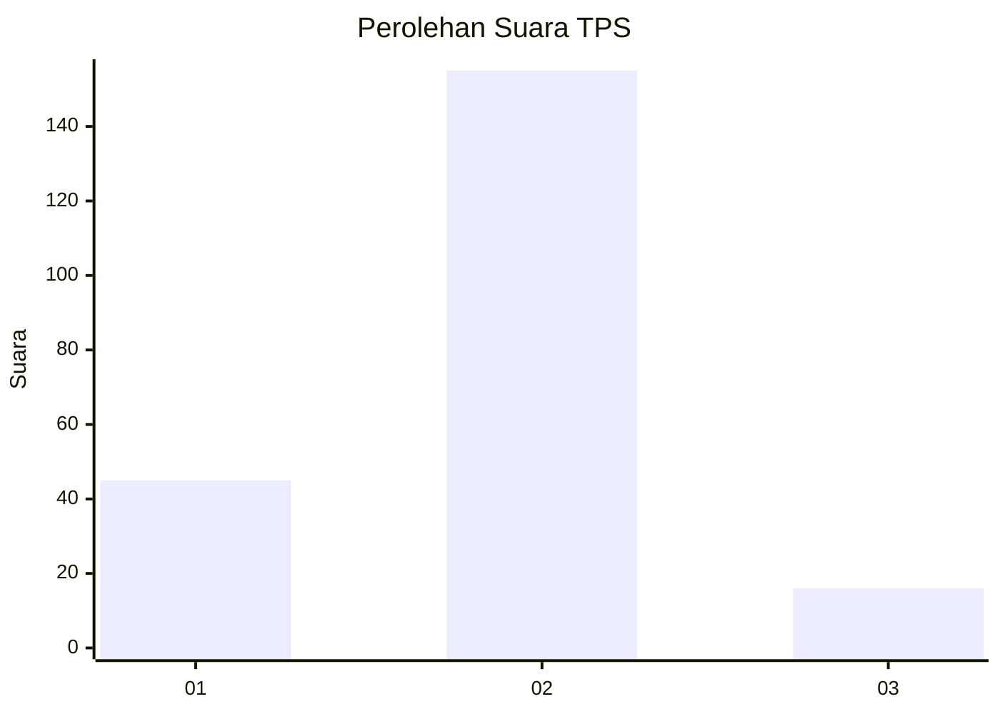
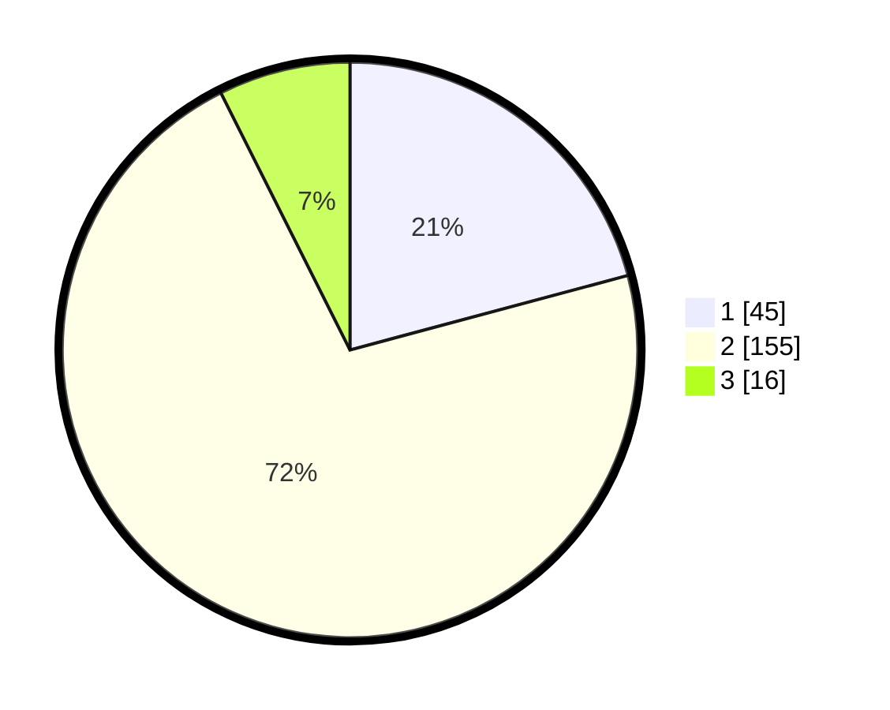

# Hasil

## Grafik

## Tabel

| No. | Nama Paslon    | Suara | Suara (raw) | Persentase |
|:--- |:-------------- | -----:| -----------:| ----------:|
| 1   | ANIES MUHAIMIN | 45    | [45][p-1]   | 20,83      |
| 2   | PRABOWO GIBRAN | 155   | [155][p-2]  | 71,76      |
| 3   | GANJAR MAHFUD  | 16    | [16][p-3]   | 7,41       |

[p-1]: https://github.com/gigit-pemilu/pemilu-2024-73-sulawesi-selatan/blob/main/pilpres/hitung-suara/sub/73-sulawesi-selatan/sub/09-maros/sub/08-marusu/sub/2005-bonto-mate'ne/sub/001-tps/sub/paslon-1.txt
[p-2]: https://github.com/gigit-pemilu/pemilu-2024-73-sulawesi-selatan/blob/main/pilpres/hitung-suara/sub/73-sulawesi-selatan/sub/09-maros/sub/08-marusu/sub/2005-bonto-mate'ne/sub/001-tps/sub/paslon-2.txt
[p-3]: https://github.com/gigit-pemilu/pemilu-2024-73-sulawesi-selatan/blob/main/pilpres/hitung-suara/sub/73-sulawesi-selatan/sub/09-maros/sub/08-marusu/sub/2005-bonto-mate'ne/sub/001-tps/sub/paslon-3.txt

## Foto C Plano

https://sirekap-obj-formc.kpu.go.id/207c/pemilu/ppwp/73/09/08/20/05/7309082005001-20240218-100920--7f5c4bd3-3065-4c83-8476-81a0d3a5ebf2.jpg

https://sirekap-obj-formc.kpu.go.id/207c/pemilu/ppwp/73/09/08/20/05/7309082005001-20240218-101133--dc909b76-daa8-46ac-ad03-ac9bc0d1370b.jpg

https://sirekap-obj-formc.kpu.go.id/207c/pemilu/ppwp/73/09/08/20/05/7309082005001-20240218-101441--510b3516-3f9b-4ae1-8ada-2741134b253a.jpg

## Metadata

| Key        | Value               |
| ---------- | ------------------- |
| Time Stamp | 2024-02-19 06:16:00 |

## DATA PEMILIH TETAP

Jumlah pemilih dalam DPT: **557**.
 * L: **0**.
 * P: **57**.

## DATA PENGGUNA HAK PILIH

Jumlah pengguna hak pilih dalam DPT: **557**.
 * L: **77**.
 * P: **777**.

Jumlah pengguna hak pilih dalam DPTb: **570**.
 * L: **777**.
 * P: **775**.

Jumlah pengguna hak pilih dalam DPK: **1**.
 * L: **777**.
 * P: **557**.

Jumlah pengguna hak pilih: **104**.
 * L: **777**.
 * P: **551**.

## JUMLAH SUARA SAH DAN TIDAK SAH

JUMLAH SELURUH SUARA SAH: **216**.

JUMLAH SUARA TIDAK SAH: **9**.

JUMLAH SELURUH SUARA SAH DAN SUARA TIDAK SAH: **225**.

