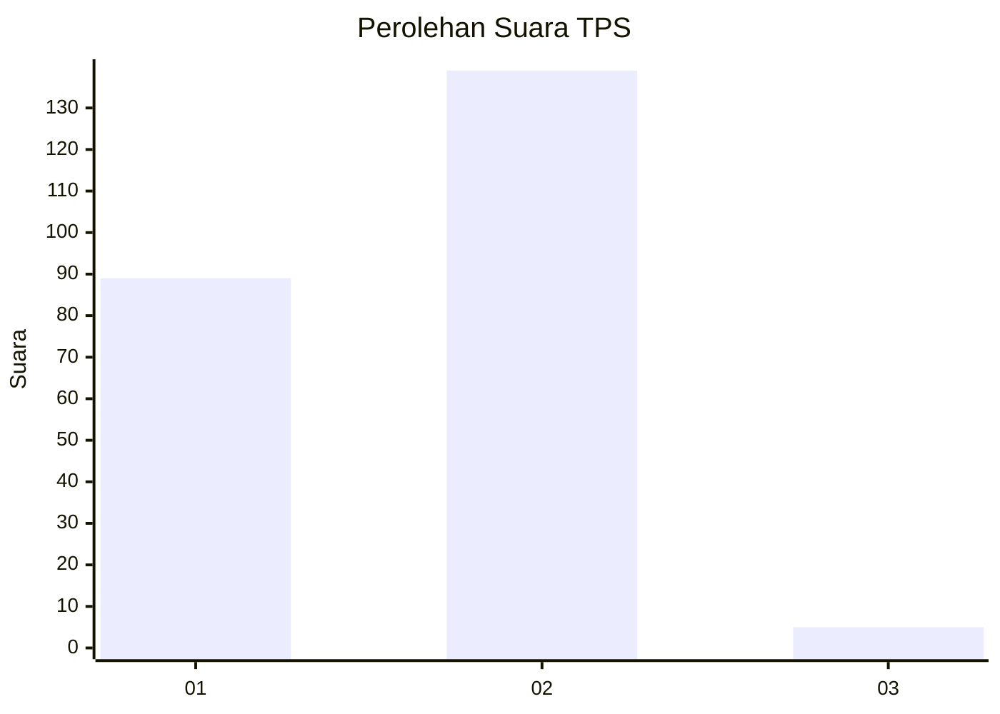
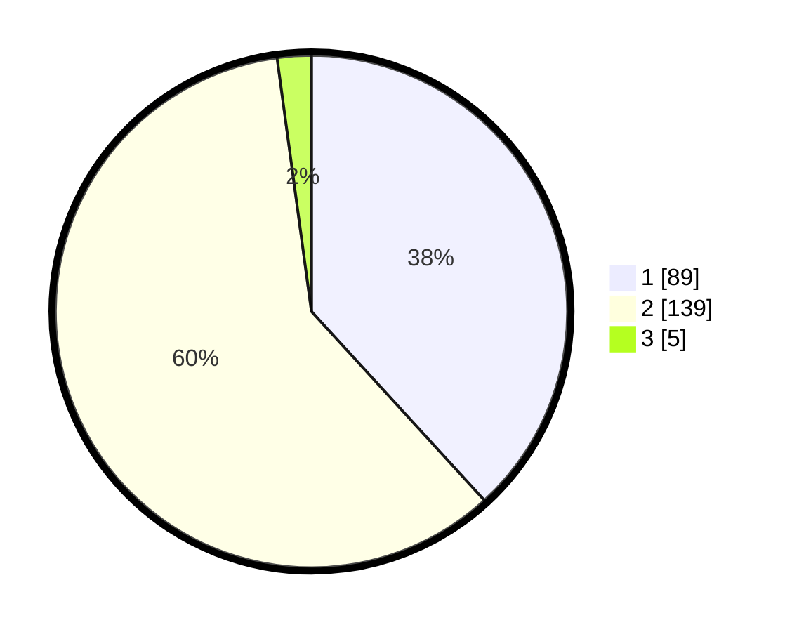

# Hasil

## Grafik

## Tabel

| No. | Nama Paslon    | Suara | Suara (raw) | Persentase |
|:--- |:-------------- | -----:| -----------:| ----------:|
| 1   | ANIES MUHAIMIN | 89    | [89][p-1]   | 38,20      |
| 2   | PRABOWO GIBRAN | 139   | [139][p-2]  | 59,66      |
| 3   | GANJAR MAHFUD  | 5     | [5][p-3]    | 2,15       |

[p-1]: https://github.com/gigit-pemilu/pemilu-2024-73-sulawesi-selatan/blob/main/pilpres/hitung-suara/sub/73-sulawesi-selatan/sub/09-maros/sub/11-tompobulu/sub/2001-tompobulu/sub/001-tps/sub/paslon-1.txt
[p-2]: https://github.com/gigit-pemilu/pemilu-2024-73-sulawesi-selatan/blob/main/pilpres/hitung-suara/sub/73-sulawesi-selatan/sub/09-maros/sub/11-tompobulu/sub/2001-tompobulu/sub/001-tps/sub/paslon-2.txt
[p-3]: https://github.com/gigit-pemilu/pemilu-2024-73-sulawesi-selatan/blob/main/pilpres/hitung-suara/sub/73-sulawesi-selatan/sub/09-maros/sub/11-tompobulu/sub/2001-tompobulu/sub/001-tps/sub/paslon-3.txt

## Foto C Plano

https://sirekap-obj-formc.kpu.go.id/3d3b/pemilu/ppwp/73/09/11/20/01/7309112001001-20240218-153306--e339a440-5b01-42f7-ab0f-61157f1bf971.jpg

https://sirekap-obj-formc.kpu.go.id/3d3b/pemilu/ppwp/73/09/11/20/01/7309112001001-20240218-152932--8cc56461-28d2-44b1-9d07-b9c7aff356e5.jpg

https://sirekap-obj-formc.kpu.go.id/3d3b/pemilu/ppwp/73/09/11/20/01/7309112001001-20240218-153033--dcf7acad-3a2a-4666-96b9-e60972f64314.jpg

## Metadata

| Key        | Value               |
| ---------- | ------------------- |
| Time Stamp | 2024-02-21 13:00:00 |

