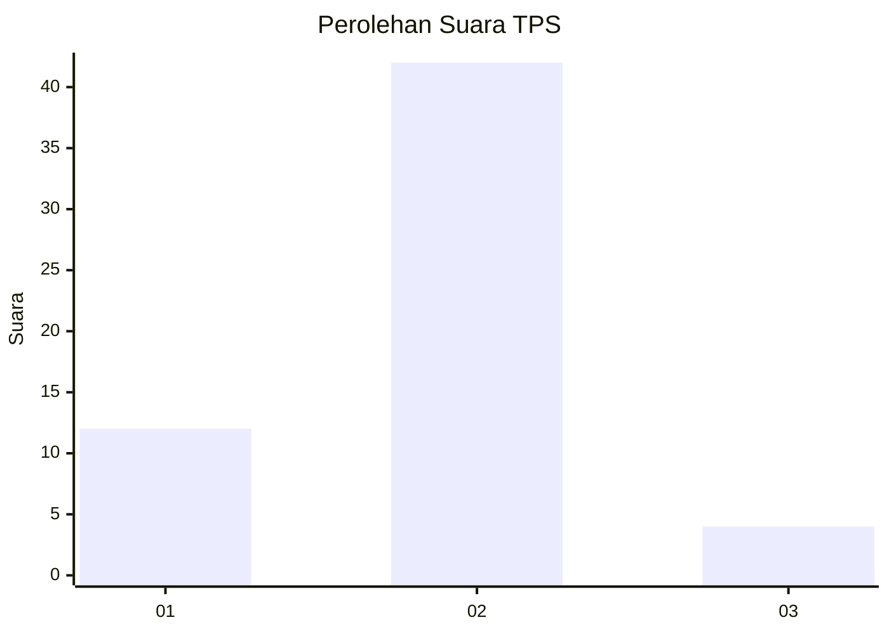

# Hasil

## Grafik

## Tabel

| No. | Nama Paslon    | Suara | Suara (raw) | Persentase |
|:--- |:-------------- | -----:| -----------:| ----------:|
| 1   | ANIES MUHAIMIN | 12    | [12][p-1]   | 20,69      |
| 2   | PRABOWO GIBRAN | 42    | [42][p-2]   | 72,41      |
| 3   | GANJAR MAHFUD  | 4     | [4][p-3]    | 6,90       |

[p-1]: https://github.com/gigit-pemilu/pemilu-2024-73-sulawesi-selatan/blob/main/pilpres/hitung-suara/sub/73-sulawesi-selatan/sub/10-pangkajene-dan-kepulauan/sub/01-liukang-tangaya/sub/2003-balo-baloang/sub/007-tps/sub/paslon-1.txt
[p-2]: https://github.com/gigit-pemilu/pemilu-2024-73-sulawesi-selatan/blob/main/pilpres/hitung-suara/sub/73-sulawesi-selatan/sub/10-pangkajene-dan-kepulauan/sub/01-liukang-tangaya/sub/2003-balo-baloang/sub/007-tps/sub/paslon-2.txt
[p-3]: https://github.com/gigit-pemilu/pemilu-2024-73-sulawesi-selatan/blob/main/pilpres/hitung-suara/sub/73-sulawesi-selatan/sub/10-pangkajene-dan-kepulauan/sub/01-liukang-tangaya/sub/2003-balo-baloang/sub/007-tps/sub/paslon-3.txt

## Foto C Plano

https://sirekap-obj-formc.kpu.go.id/4cc7/pemilu/ppwp/73/10/01/20/03/7310012003007-20240216-153100--7c48fde9-e441-4454-afec-3b84b5b4e848.jpg

https://sirekap-obj-formc.kpu.go.id/4cc7/pemilu/ppwp/73/10/01/20/03/7310012003007-20240216-153101--8873192c-20ab-4fbb-880d-1556bf438b4d.jpg

https://sirekap-obj-formc.kpu.go.id/4cc7/pemilu/ppwp/73/10/01/20/03/7310012003007-20240216-153100--2d32b840-590a-416b-9488-92b560cf92c4.jpg

## Metadata

| Key        | Value               |
| ---------- | ------------------- |
| Time Stamp | 2024-02-16 21:01:00 |

## DATA PEMILIH TETAP

Jumlah pemilih dalam DPT: **75**.
 * L: **39**.
 * P: **36**.

## DATA PENGGUNA HAK PILIH

Jumlah pengguna hak pilih dalam DPT: **59**.
 * L: **29**.
 * P: **30**.

Jumlah pengguna hak pilih dalam DPTb: **1**.
 * L: **0**.
 * P: **1**.

Jumlah pengguna hak pilih dalam DPK: **0**.
 * L: **0**.
 * P: **0**.

Jumlah pengguna hak pilih: **60**.
 * L: **29**.
 * P: **31**.

## JUMLAH SUARA SAH DAN TIDAK SAH

JUMLAH SELURUH SUARA SAH: **58**.

JUMLAH SUARA TIDAK SAH: **2**.

JUMLAH SELURUH SUARA SAH DAN SUARA TIDAK SAH: **60**.

