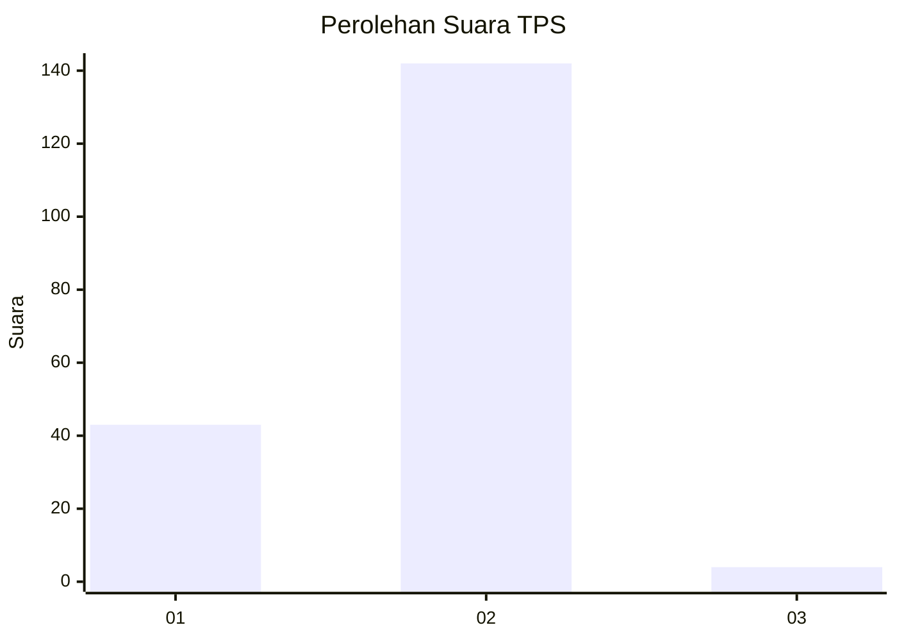
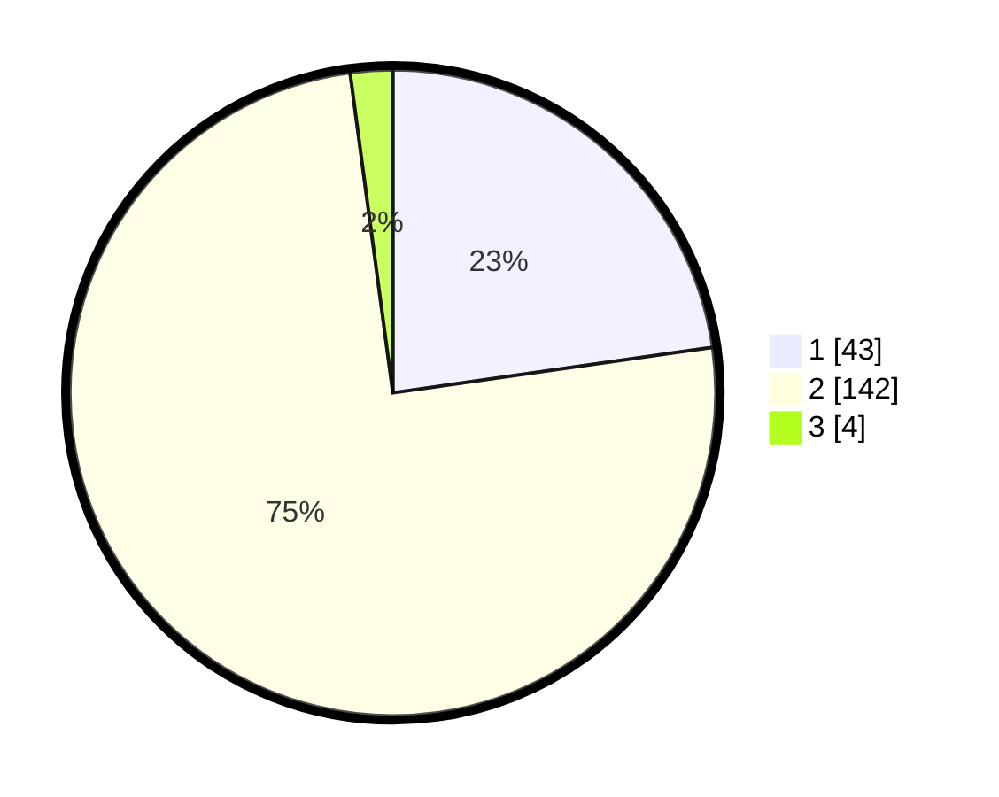

# Hasil

## Grafik

## Tabel

| No. | Nama Paslon    | Suara | Suara (raw) | Persentase |
|:--- |:-------------- | -----:| -----------:| ----------:|
| 1   | ANIES MUHAIMIN | 43    | [43][p-1]   | 22,75      |
| 2   | PRABOWO GIBRAN | 142   | [142][p-2]  | 75,13      |
| 3   | GANJAR MAHFUD  | 4     | [4][p-3]    | 2,12       |

[p-1]: https://github.com/gigit-pemilu/pemilu-2024-73-sulawesi-selatan/blob/main/pilpres/hitung-suara/sub/73-sulawesi-selatan/sub/10-pangkajene-dan-kepulauan/sub/02-liukang-kalmas/sub/2002-pammas/sub/001-tps/sub/paslon-1.txt
[p-2]: https://github.com/gigit-pemilu/pemilu-2024-73-sulawesi-selatan/blob/main/pilpres/hitung-suara/sub/73-sulawesi-selatan/sub/10-pangkajene-dan-kepulauan/sub/02-liukang-kalmas/sub/2002-pammas/sub/001-tps/sub/paslon-2.txt
[p-3]: https://github.com/gigit-pemilu/pemilu-2024-73-sulawesi-selatan/blob/main/pilpres/hitung-suara/sub/73-sulawesi-selatan/sub/10-pangkajene-dan-kepulauan/sub/02-liukang-kalmas/sub/2002-pammas/sub/001-tps/sub/paslon-3.txt

## Foto C Plano

https://sirekap-obj-formc.kpu.go.id/f4db/pemilu/ppwp/73/10/02/20/02/7310022002001-20240215-151347--dda33c24-5902-42ee-a6bf-7cddb866603d.jpg

https://sirekap-obj-formc.kpu.go.id/f4db/pemilu/ppwp/73/10/02/20/02/7310022002001-20240215-154136--5927fc5c-ed8a-4091-a32b-d3d6729691a0.jpg

https://sirekap-obj-formc.kpu.go.id/f4db/pemilu/ppwp/73/10/02/20/02/7310022002001-20240215-154256--e26d501f-9235-4d1e-a569-033b9c03b2e8.jpg

## Metadata

| Key        | Value               |
| ---------- | ------------------- |
| Time Stamp | 2024-02-17 00:00:00 |

