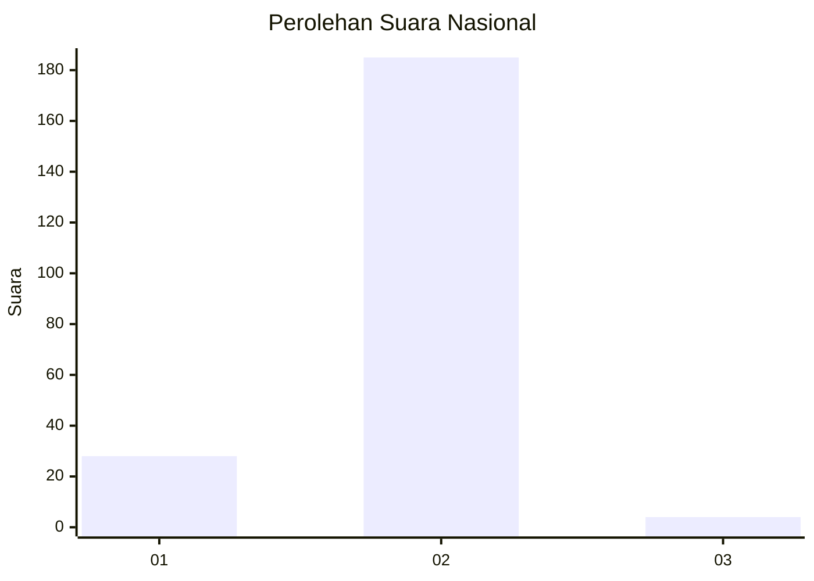
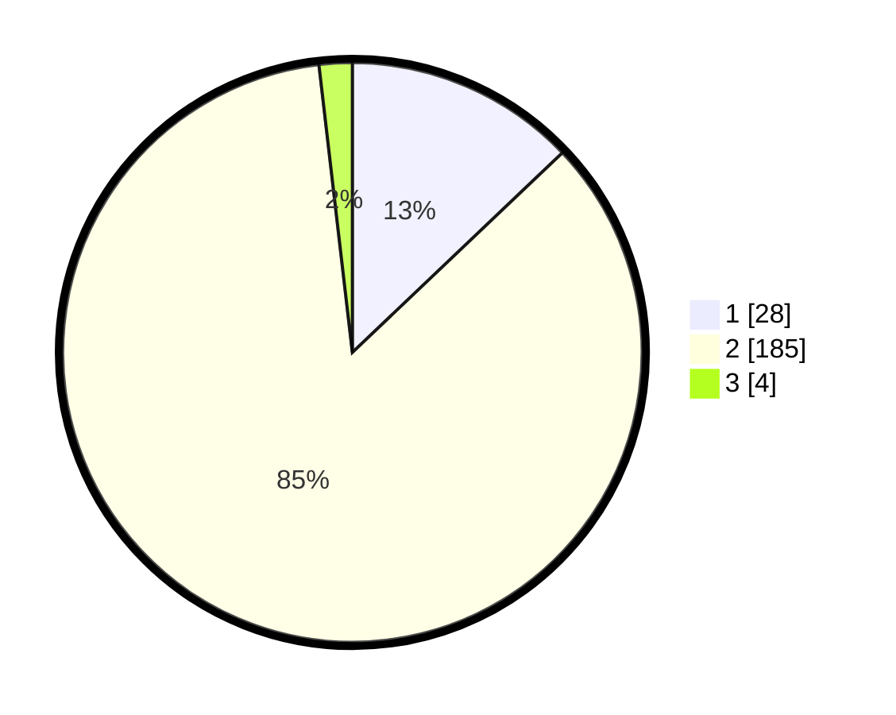

# Hasil

## Grafik

## Tabel

| No. | Nama Paslon    | Suara | Suara (raw) | Persentase |
|:--- |:-------------- | -----:| -----------:| ----------:|
| 1   | ANIES MUHAIMIN | 28    | [28][p-1]   | 12,90      |
| 2   | PRABOWO GIBRAN | 185   | [185][p-2]  | 85,25      |
| 3   | GANJAR MAHFUD  | 4     | [4][p-3]    | 1,84       |

[p-1]: https://github.com/gigit-pemilu/pemilu-2024/blob/main/pilpres/hitung-suara/sub/73-sulawesi-selatan/sub/10-pangkajene-dan-kepulauan/sub/02-liukang-kalmas/sub/2002-pammas/sub/003-tps/sub/paslon-1.txt
[p-2]: https://github.com/gigit-pemilu/pemilu-2024/blob/main/pilpres/hitung-suara/sub/73-sulawesi-selatan/sub/10-pangkajene-dan-kepulauan/sub/02-liukang-kalmas/sub/2002-pammas/sub/003-tps/sub/paslon-2.txt
[p-3]: https://github.com/gigit-pemilu/pemilu-2024/blob/main/pilpres/hitung-suara/sub/73-sulawesi-selatan/sub/10-pangkajene-dan-kepulauan/sub/02-liukang-kalmas/sub/2002-pammas/sub/003-tps/sub/paslon-3.txt

## Foto C Plano

https://sirekap-obj-formc.kpu.go.id/064f/pemilu/ppwp/73/10/02/20/02/7310022002003-20240215-214707--d80aeebf-0b71-4d42-8299-cafb96ef6d03.jpg

https://sirekap-obj-formc.kpu.go.id/064f/pemilu/ppwp/73/10/02/20/02/7310022002003-20240215-214925--b95df473-596a-4eaa-b1c7-65ec7fd5f28e.jpg

https://sirekap-obj-formc.kpu.go.id/064f/pemilu/ppwp/73/10/02/20/02/7310022002003-20240215-215428--45bd7059-b277-43ea-9eb7-17c38863a4ab.jpg

## Metadata

| Key        | Value               |
| ---------- | ------------------- |
| Time Stamp | 2024-02-16 04:00:27 |

