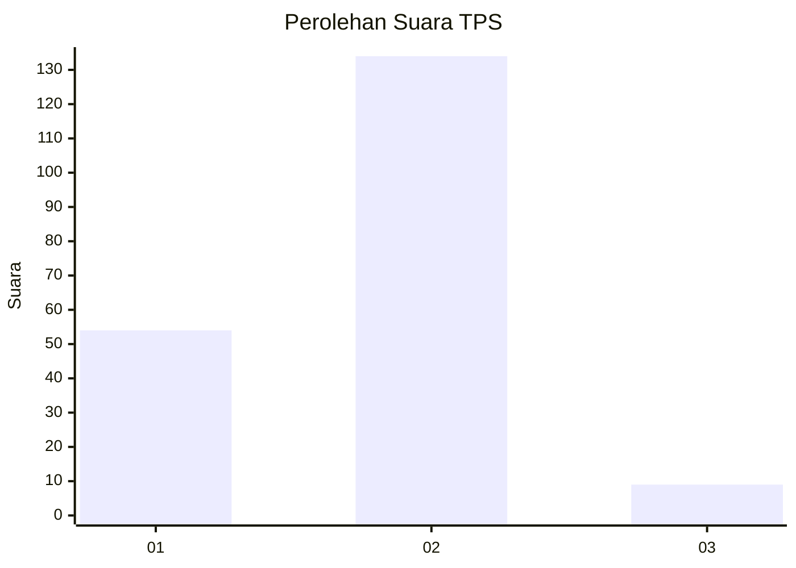
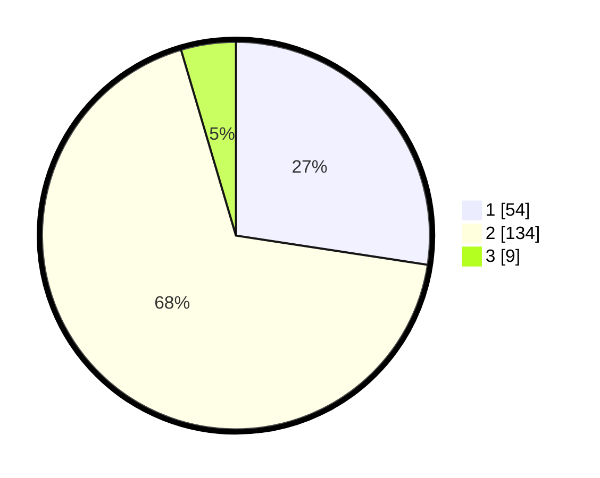

# Hasil

## Grafik

## Tabel

| No. | Nama Paslon    | Suara | Suara (raw) | Persentase |
|:--- |:-------------- | -----:| -----------:| ----------:|
| 1   | ANIES MUHAIMIN | 54    | [54][p-1]   | 27,41      |
| 2   | PRABOWO GIBRAN | 134   | [134][p-2]  | 68,02      |
| 3   | GANJAR MAHFUD  | 9     | [9][p-3]    | 4,57       |

[p-1]: https://github.com/gigit-pemilu/pemilu-2024-73-sulawesi-selatan/blob/main/pilpres/hitung-suara/sub/73-sulawesi-selatan/sub/10-pangkajene-dan-kepulauan/sub/03-liukang-tupabbiring/sub/1001-mattiro-sompe/sub/001-tps/sub/paslon-1.txt
[p-2]: https://github.com/gigit-pemilu/pemilu-2024-73-sulawesi-selatan/blob/main/pilpres/hitung-suara/sub/73-sulawesi-selatan/sub/10-pangkajene-dan-kepulauan/sub/03-liukang-tupabbiring/sub/1001-mattiro-sompe/sub/001-tps/sub/paslon-2.txt
[p-3]: https://github.com/gigit-pemilu/pemilu-2024-73-sulawesi-selatan/blob/main/pilpres/hitung-suara/sub/73-sulawesi-selatan/sub/10-pangkajene-dan-kepulauan/sub/03-liukang-tupabbiring/sub/1001-mattiro-sompe/sub/001-tps/sub/paslon-3.txt

## Foto C Plano

https://sirekap-obj-formc.kpu.go.id/82f6/pemilu/ppwp/73/10/03/10/01/7310031001001-20240214-220259--1fbd01f5-6fe7-4fe8-a7c6-5816057fe329.jpg

https://sirekap-obj-formc.kpu.go.id/82f6/pemilu/ppwp/73/10/03/10/01/7310031001001-20240214-234423--35c5f1f0-2ab6-47e8-82de-0b2e05a969f6.jpg

https://sirekap-obj-formc.kpu.go.id/82f6/pemilu/ppwp/73/10/03/10/01/7310031001001-20240214-234828--83e7e41f-613a-406f-9a51-95f918fc3a4f.jpg

## Metadata

| Key        | Value               |
| ---------- | ------------------- |
| Time Stamp | 2024-02-16 03:30:26 |

