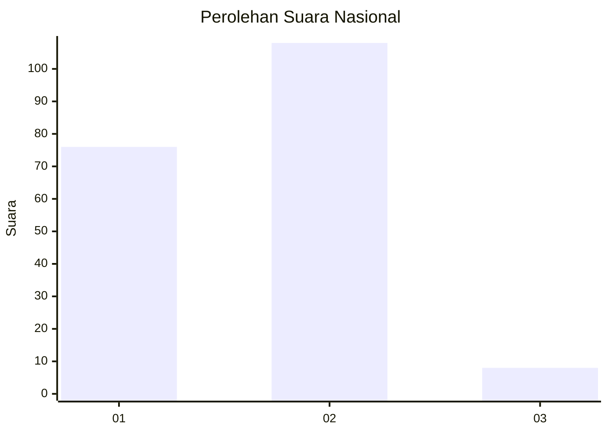
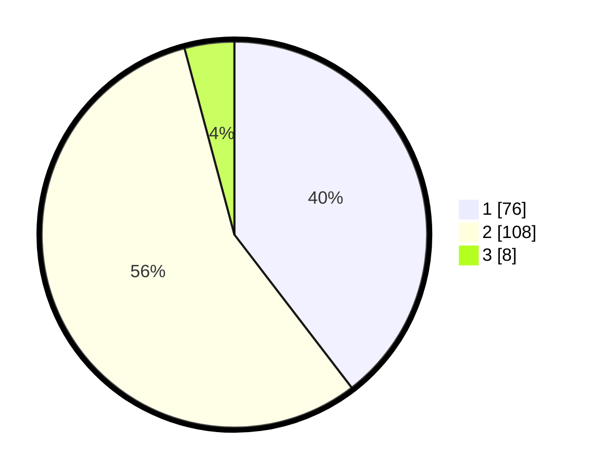

# Hasil

## Grafik

## Tabel

| No. | Nama Paslon    | Suara | Suara (raw) | Persentase |
|:--- |:-------------- | -----:| -----------:| ----------:|
| 1   | ANIES MUHAIMIN | 76    | [76][p-1]   | 39,58      |
| 2   | PRABOWO GIBRAN | 108   | [108][p-2]  | 56,25      |
| 3   | GANJAR MAHFUD  | 8     | [8][p-3]    | 4,17       |

[p-1]: https://github.com/gigit-pemilu/pemilu-2024/blob/main/pilpres/hitung-suara/sub/73-sulawesi-selatan/sub/10-pangkajene-dan-kepulauan/sub/03-liukang-tupabbiring/sub/1001-mattiro-sompe/sub/002-tps/sub/paslon-1.txt
[p-2]: https://github.com/gigit-pemilu/pemilu-2024/blob/main/pilpres/hitung-suara/sub/73-sulawesi-selatan/sub/10-pangkajene-dan-kepulauan/sub/03-liukang-tupabbiring/sub/1001-mattiro-sompe/sub/002-tps/sub/paslon-2.txt
[p-3]: https://github.com/gigit-pemilu/pemilu-2024/blob/main/pilpres/hitung-suara/sub/73-sulawesi-selatan/sub/10-pangkajene-dan-kepulauan/sub/03-liukang-tupabbiring/sub/1001-mattiro-sompe/sub/002-tps/sub/paslon-3.txt

## Foto C Plano

https://sirekap-obj-formc.kpu.go.id/4618/pemilu/ppwp/73/10/03/10/01/7310031001002-20240215-012822--e79f9caf-d6b9-4c08-b994-f5d76f573cef.jpg

https://sirekap-obj-formc.kpu.go.id/4618/pemilu/ppwp/73/10/03/10/01/7310031001002-20240215-013047--0ab0484d-469e-40c9-9b5f-260f22b25b6f.jpg

https://sirekap-obj-formc.kpu.go.id/4618/pemilu/ppwp/73/10/03/10/01/7310031001002-20240215-013312--d1f74425-777d-4ad2-880b-bf591f49d1b3.jpg

## Metadata

| Key        | Value               |
| ---------- | ------------------- |
| Time Stamp | 2024-02-15 15:00:29 |

