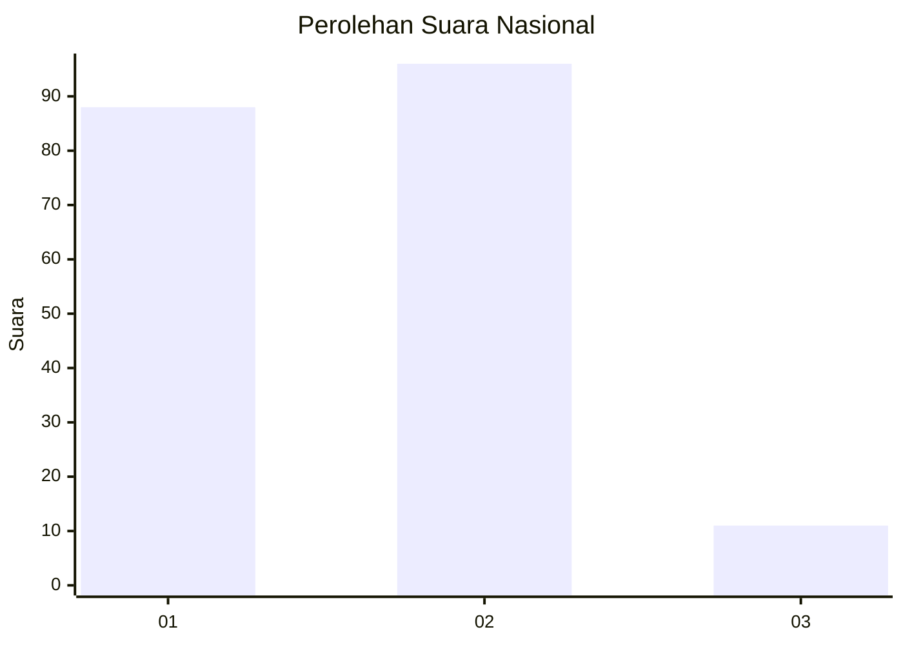
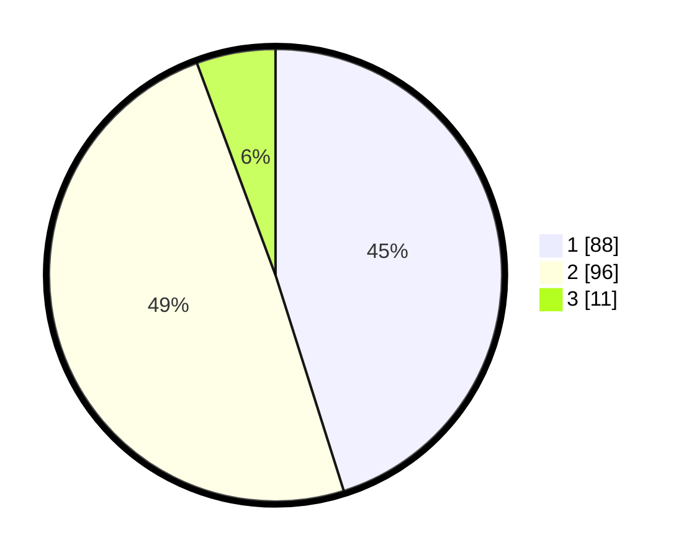

# Hasil

## Grafik

## Tabel

| No. | Nama Paslon    | Suara | Suara (raw) | Persentase |
|:--- |:-------------- | -----:| -----------:| ----------:|
| 1   | ANIES MUHAIMIN | 88    | [88][p-1]   | 45,13      |
| 2   | PRABOWO GIBRAN | 96    | [96][p-2]   | 49,23      |
| 3   | GANJAR MAHFUD  | 11    | [11][p-3]   | 5,64       |

[p-1]: https://github.com/gigit-pemilu/pemilu-2024/blob/main/pilpres/hitung-suara/sub/73-sulawesi-selatan/sub/10-pangkajene-dan-kepulauan/sub/03-liukang-tupabbiring/sub/1001-mattiro-sompe/sub/003-tps/sub/paslon-1.txt
[p-2]: https://github.com/gigit-pemilu/pemilu-2024/blob/main/pilpres/hitung-suara/sub/73-sulawesi-selatan/sub/10-pangkajene-dan-kepulauan/sub/03-liukang-tupabbiring/sub/1001-mattiro-sompe/sub/003-tps/sub/paslon-2.txt
[p-3]: https://github.com/gigit-pemilu/pemilu-2024/blob/main/pilpres/hitung-suara/sub/73-sulawesi-selatan/sub/10-pangkajene-dan-kepulauan/sub/03-liukang-tupabbiring/sub/1001-mattiro-sompe/sub/003-tps/sub/paslon-3.txt

## Foto C Plano

https://sirekap-obj-formc.kpu.go.id/e901/pemilu/ppwp/73/10/03/10/01/7310031001003-20240214-155401--956be774-738a-4843-b7e1-9697e4c350c9.jpg

https://sirekap-obj-formc.kpu.go.id/e901/pemilu/ppwp/73/10/03/10/01/7310031001003-20240215-022919--9516f43d-baa7-4503-a802-8c1e02a811b4.jpg

https://sirekap-obj-formc.kpu.go.id/e901/pemilu/ppwp/73/10/03/10/01/7310031001003-20240215-023431--9f88e80c-88eb-4867-904d-945808367e0a.jpg

## Metadata

| Key        | Value               |
| ---------- | ------------------- |
| Time Stamp | 2024-02-15 15:00:29 |

