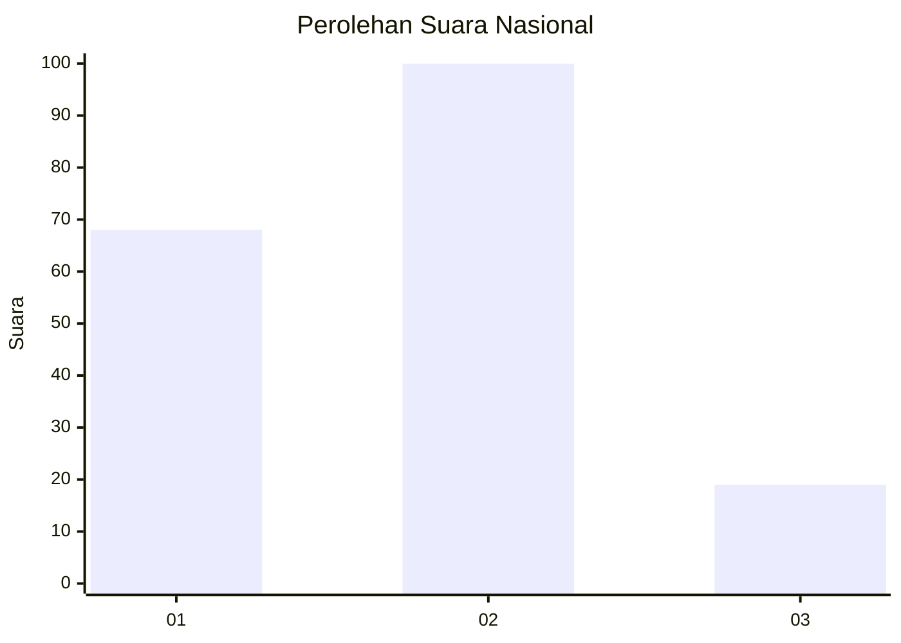

# Hasil

## Grafik

## Tabel

| No. | Nama Paslon    | Suara | Suara (raw) | Persentase |
|:--- |:-------------- | -----:| -----------:| ----------:|
| 1   | ANIES MUHAIMIN | 68    | [68][p-1]   | 36,36      |
| 2   | PRABOWO GIBRAN | 100   | [100][p-2]  | 53,48      |
| 3   | GANJAR MAHFUD  | 19    | [19][p-3]   | 10,16      |

[p-1]: https://github.com/gigit-pemilu/pemilu-2024/blob/main/pilpres/hitung-suara/sub/73-sulawesi-selatan/sub/10-pangkajene-dan-kepulauan/sub/03-liukang-tupabbiring/sub/1001-mattiro-sompe/sub/005-tps/sub/paslon-1.txt
[p-2]: https://github.com/gigit-pemilu/pemilu-2024/blob/main/pilpres/hitung-suara/sub/73-sulawesi-selatan/sub/10-pangkajene-dan-kepulauan/sub/03-liukang-tupabbiring/sub/1001-mattiro-sompe/sub/005-tps/sub/paslon-2.txt
[p-3]: https://github.com/gigit-pemilu/pemilu-2024/blob/main/pilpres/hitung-suara/sub/73-sulawesi-selatan/sub/10-pangkajene-dan-kepulauan/sub/03-liukang-tupabbiring/sub/1001-mattiro-sompe/sub/005-tps/sub/paslon-3.txt

## Foto C Plano

https://sirekap-obj-formc.kpu.go.id/deaa/pemilu/ppwp/73/10/03/10/01/7310031001005-20240222-220545--6743cd05-d93e-4a7c-bd84-4b6d79116b6e.jpg

https://sirekap-obj-formc.kpu.go.id/deaa/pemilu/ppwp/73/10/03/10/01/7310031001005-20240222-220700--311d1e43-cf40-4113-b4dc-27a0118a8bf1.jpg

https://sirekap-obj-formc.kpu.go.id/deaa/pemilu/ppwp/73/10/03/10/01/7310031001005-20240222-220844--4151fe98-bee3-4ec8-9981-cd2a907f714a.jpg

## Metadata

| Key        | Value               |
| ---------- | ------------------- |
| Time Stamp | 2024-02-24 22:31:28 |

