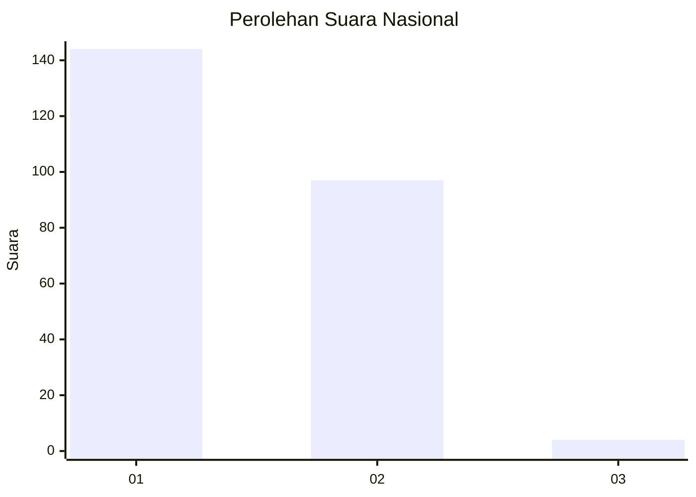
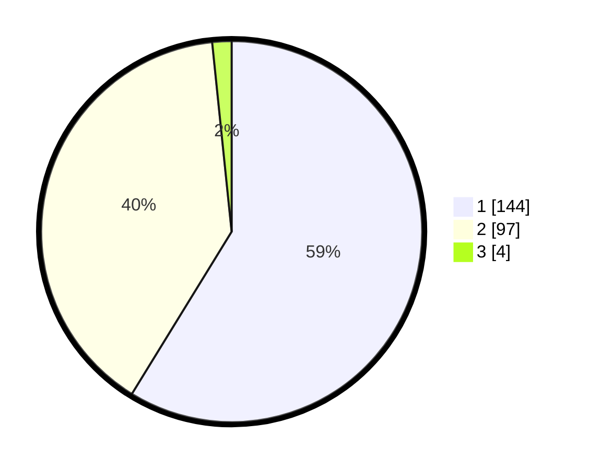

# Hasil

## Grafik

## Tabel

| No. | Nama Paslon    | Suara | Suara (raw) | Persentase |
|:--- |:-------------- | -----:| -----------:| ----------:|
| 1   | ANIES MUHAIMIN | 144   | [144][p-1]  | 58,78      |
| 2   | PRABOWO GIBRAN | 97    | [97][p-2]   | 39,59      |
| 3   | GANJAR MAHFUD  | 4     | [4][p-3]    | 1,63       |

[p-1]: https://github.com/gigit-pemilu/pemilu-2024/blob/main/pilpres/hitung-suara/sub/73-sulawesi-selatan/sub/10-pangkajene-dan-kepulauan/sub/04-pangkajene/sub/1009-bonto-perak/sub/009-tps/sub/paslon-1.txt
[p-2]: https://github.com/gigit-pemilu/pemilu-2024/blob/main/pilpres/hitung-suara/sub/73-sulawesi-selatan/sub/10-pangkajene-dan-kepulauan/sub/04-pangkajene/sub/1009-bonto-perak/sub/009-tps/sub/paslon-2.txt
[p-3]: https://github.com/gigit-pemilu/pemilu-2024/blob/main/pilpres/hitung-suara/sub/73-sulawesi-selatan/sub/10-pangkajene-dan-kepulauan/sub/04-pangkajene/sub/1009-bonto-perak/sub/009-tps/sub/paslon-3.txt

## Foto C Plano

https://sirekap-obj-formc.kpu.go.id/1a2b/pemilu/ppwp/73/10/04/10/09/7310041009009-20240215-012825--0c06c438-51cc-488f-94fe-69c2454f2a51.jpg

https://sirekap-obj-formc.kpu.go.id/1a2b/pemilu/ppwp/73/10/04/10/09/7310041009009-20240215-012608--46e129b9-4ae7-4572-bbd9-db2ea83a7fc1.jpg

https://sirekap-obj-formc.kpu.go.id/1a2b/pemilu/ppwp/73/10/04/10/09/7310041009009-20240215-012714--fb8c791c-a322-4d09-9fb0-0dc5f98929cb.jpg

## Metadata

| Key        | Value               |
| ---------- | ------------------- |
| Time Stamp | 2024-02-15 15:00:29 |

